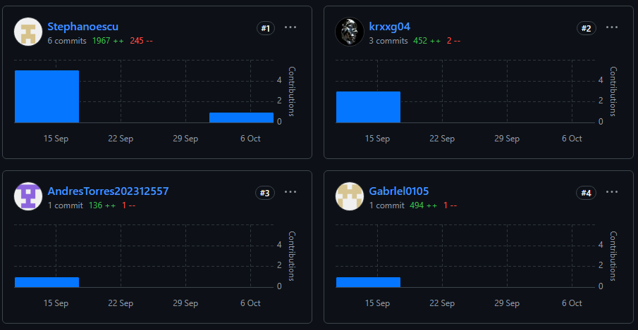
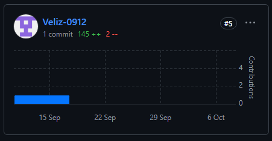
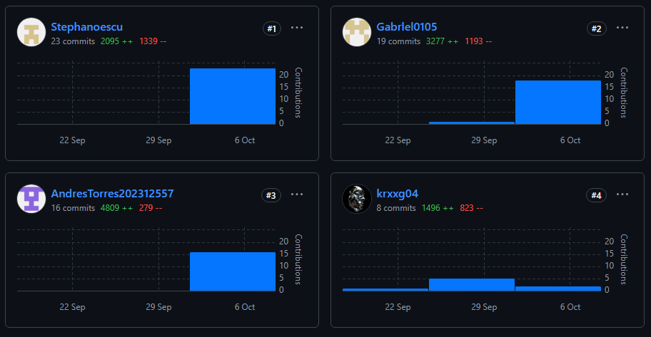
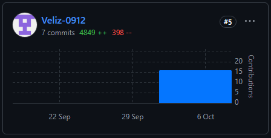
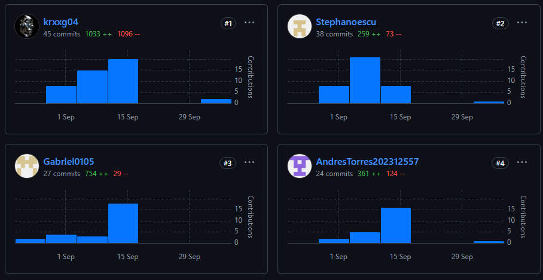
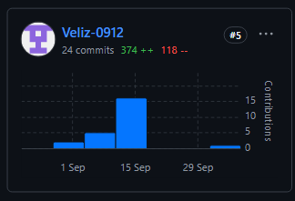

# UNIVERSIDAD PERUANA DE CIENCIAS APLICADAS

### Carrera: Ingeniería de Software

### Aplicaciones Web - Presencial (1ASI0730)

### Profesor: Rafael Oswaldo Castro Veramendi

### NRC: 7470 

## Informe - TB1

## Startup: Devspros

## Producto: Diabelife

### INTEGRANTES

<table>
  <thead>
    <tr>
      <th>Apellidos y Nombres</th>
      <th>Código de Alumno</th>
    </tr>
  </thead>
  <tbody>
    <tr>
      <td>Mamani Marca, Gabriel Cristian</td>
      <td>u202220659</td>
    </tr>
    <tr>    
      <td>Barturén Panéz, Iker Gabriel</td>
      <td>u202312629</td>
    </tr>
    <tr>
      <td>Torres Lavandera, Andrés Rodrigo</td>
      <td>u202312557</td>
    </tr>
    <tr>
      <td>Espinoza Cueva, Stephano Jose</td>
      <td>u202218590</td>
    </tr>
    <tr>
      <td>Veliz Martinez, Diego Alonso</td>
      <td>u20211b564</td>
    </tr>
  </tbody>
</table>

### Ciclo 2025-20

---

# Registro de versiones del informe
| Versión | Fecha      | Autor                                                                                             | Descripción de modificación                                                                                                                                                                                                                                                                |
|---------|------------|---------------------------------------------------------------------------------------------------|--------------------------------------------------------------------------------------------------------------------------------------------------------------------------------------------------------------------------------------------------------------------------------------------
| TB1     | 19/09/2025 | -Iker Barturen   -Gabriel Mamani  - Stephano Espinoza   -Andres Torres   -Diego Veliz | -Capitulo I: Introducción   -Capitulo II: Requirements Elicitation & Analysis   - Capitulo III: Requirements Specification   -Capitulo IV: Product Design   - Avance del Capitulo V: Product Implementation, Validation & Deployment hasta el punto 5.2.1.8   - LandingPage |

# PROJECT REPORT COLLABORATION INSIGHTS

#### 1. URL del repositorio en GitHub

| Repositorio del Informe en GitHub |
|------------------------------|
| https://github.com/orgs/upc-pre-202510-si0730-Grupo-Devspros/repositories |
### 2. Actividades de elaboracion del informe 

### 3. Capturas en imagen de los analíticos de colaboración y commits en GitHub
- Landing Page del proyecto:

- Frontend del proyecto:

- Reporte del proyecto:

### 4. Evidencia de participacion de todos los miembros del equipo

# Contenido

## Tabla de Contenidos
### [Registro de versiones del informe](#registro-de-versiones-del-informe)
### [Project Report Collaboration Insights](#project-report-collaboration-insights)
### [Contenido](#contenido)
### [Student Outcome](#student-outcome-1)
### [Capítulo I: Introducción](#capc3adtulo-i-introduccic3b3n-1)
- [1.1. Startup Profile](#11-startup-profile)
    - [1.1.1. Descripción de la Startup](#111-description-de-la-startup)
    - [1.1.2. Perfiles de integrantes del equipo](#112-perfiles-de-integrantes-del-equipo)
- [1.2. Solution Profile](#12-solution-profile)
    - [1.2.1 Antecedentes y problemática](#121-antecedentes-y-problemática)
    - [1.2.2 Lean UX Process](#122-lean-ux-process)
        - [1.2.2.1. Lean UX Problem Statements](#1221-lean-ux-problem-statements)
        - [1.2.2.2. Lean UX Assumptions](#1222-lean-ux-assumptions)
        - [1.2.2.3. Lean UX Hypothesis Statements](#1223-lean-ux-hypothesis-statements)
        - [1.2.2.4. Lean UX Canvas](#1224-lean-ux-canvas)
- [1.3. Segmentos objetivo](#13-segmentos-objetivo)

### [Capítulo II: Requirements Elicitation & Analysis](#capc3adtulo-ii-requirements-elicitation--analysis-1)
- [2.1. Competidores](#21-competidores)
    - [2.1.1. Análisis competitivo](#211-análisis-competitivo)
    - [2.1.2. Estrategias y tácticas frente a competidores](#212-estrategias-y-tácticas-frente-a-competidores)
- [2.2. Entrevistas](#22-entrevistas)
    - [2.2.1. Diseño de entrevistas](#221-diseño-de-entrevistas)
    - [2.2.2. Registro de entrevistas](#222-registro-de-entrevistas)
    - [2.2.3. Análisis de entrevistas](#223-análisis-de-entrevistas)
- [2.3. Needfinding](#23-needfinding)
    - [2.3.1. User Personas](#231-user-personas)
    - [2.3.2. User Task Matrix](#232-user-task-matrix)
    - [2.3.3. User Journey Mapping](#233-user-journey-mapping)
    - [2.3.4. Empathy Mapping](#234-empathy-mapping)
    - [2.3.5. As-is Scenario Mapping](#235-as-is-scenario-mapping)
    - [2.4. Ubiquitous Language](#24-Ubiquitous-language)
### [Capítulo III: Requirements Specification](#capc3adtulo-iii-requirements-specification-1)
- [3.1. To-Be Scenario Mapping](#31-to-be-scenario-mapping)
- [3.2. User Stories](#32-user-stories)
- [3.3. Impact Mapping](#33-impact-mapping)
- [3.4. Product Backlog](#34-product-backlog)

### [Capítulo IV: Product Design](#capc3adtulo-iv-product-design-1)
- [4.1. Style Guidelines](#41-style-guidelines)
    - [4.1.1. General Style Guidelines](#411-general-style-guidelines)
    - [4.1.2. Web Style Guidelines](#412-web-style-guidelines)
- [4.2. Information Architecture](#42-information-architecture)
    - [4.2.1. Organization Systems](#421-organization-systems)
    - [4.2.2. Labeling Systems](#422-labeling-systems)
    - [4.2.3. SEO Tags and Meta Tags](#423-seo-tags-and-meta-tags)
    - [4.2.4. Searching Systems](#424-searching-systems)
    - [4.2.5. Navigation Systems](#425-navigation-systems)
- [4.3. Landing Page UI Design](#43-landing-page-ui-design)
    - [4.3.1. Landing Page Wireframe](#431-landing-page-wireframe)
    - [4.3.2. Landing Page Mock-up](#432-landing-page-mock-up)
- [4.4. Web Applications UX/UI Design](#44-web-applications-uxui-design)
    - [4.4.1. Web Applications Wireframes](#441-web-applications-wireframes)
    - [4.4.2. Web Applications Wireflow Diagrams](#442-web-applications-wireflow-diagrams)
    - [4.4.3. Web Applications Mock-ups](#443-web-applications-mock-ups)
    - [4.4.4. Web Applications User Flow Diagrams](#444-web-applications-user-flow-diagrams)
- [4.5. Web Applications Prototyping](#45-web-applications-prototyping)
- [4.6. Domain-Driven Software Architecture](#46-domain-driven-software-architecture)
    - [4.6.1. Software Architecture Context Diagram](#461-software-architecture-context-diagram)
    - [4.6.2. Software Architecture Container Diagrams](#462-software-architecture-container-diagrams)
    - [4.6.3. Software Architecture Components Diagrams](#463-software-architecture-components-diagrams)
- [4.7. Software Object-Oriented Design](#47-software-object-oriented-design)
    - [4.7.1. Class Diagrams](#471-class-diagrams)
    - [4.7.2. Class Dictionary](#472-class-dictionary)
- [4.8. Database Design](#48-database-design)
    - [4.8.1. Database Diagram](#481-database-diagram)

### [Capítulo V: Product Implementation, Validation & Deployment](#capc3adtulo-v-product-implementation-validation--deployment-1)
- [5.1. Software Configuration Management](#51-software-configuration-management)
    - [5.1.1. Software Development Environment Configuration](#511-software-development-environment-configuration)
    - [5.1.2. Source Code Management](#512-source-code-management)
    - [5.1.3. Source Code Style Guide & Conventions](#513-source-code-style-guide--conventions)
    - [5.1.4. Software Deployment Configuration](#514-software-deployment-configuration)
- [5.2. Landing Page, Services & Applications Implementation](#52-landing-page-services--applications-implementation)
    - [5.2.1. Sprint 1](#521-sprint-1)
        - [5.2.1.1. Sprint Planning 1](#5211-sprint-planning-1)
        - [5.2.1.2. Sprint Backlog 1](#5212-sprint-backlog-1)
        - [5.2.1.3. Development Evidence for Sprint Review](#5213-development-evidence-for-sprint-review)
        - [5.2.1.4. Testing Suite Evidence for Sprint Review](#5214-testing-suite-evidence-for-sprint-review)
        - [5.2.1.5. Execution Evidence for Sprint Review](#5215-execution-evidence-for-sprint-review)
        - [5.2.1.6. Services Documentation Evidence for Sprint Review](#5216-services-documentation-evidence-for-sprint-review)
        - [5.2.1.7. Software Deployment Evidence for Sprint Review](#5217-software-deployment-evidence-for-sprint-review)
        - [5.2.1.8. Team Collaboration Insights during Sprint](#5218-team-collaboration-insights-during-sprint)
    - [5.2.2. Sprint 1](#521-sprint-2)
        - [5.2.2.1. Sprint Planning 2](#5211-sprint-planning-2)
        - [5.2.2.2. Sprint Backlog 2](#5212-sprint-backlog-2)
        - [5.2.2.3. Development Evidence for Sprint Review](#5213-development-evidence-for-sprint-review)
        - [5.2.2.4. Testing Suite Evidence for Sprint Review](#5214-testing-suite-evidence-for-sprint-review)
        - [5.2.2.5. Execution Evidence for Sprint Review](#5215-execution-evidence-for-sprint-review)
        - [5.2.2.6. Services Documentation Evidence for Sprint Review](#5216-services-documentation-evidence-for-sprint-review)
        - [5.2.2.7. Software Deployment Evidence for Sprint Review](#5217-software-deployment-evidence-for-sprint-review)
        - [5.2.2.8. Team Collaboration Insights during Sprint](#5218-team-collaboration-insights-during-sprint)
    - [5.2.3. Sprint 3](#521-sprint-3)
        - [5.2.2.1. Sprint Planning 3](#5211-sprint-planning-3)
        - [5.2.2.2. Sprint Backlog 3](#5212-sprint-backlog-3)
        - [5.2.2.3. Development Evidence for Sprint Review](#5213-development-evidence-for-sprint-review)
        - [5.2.2.4. Testing Suite Evidence for Sprint Review](#5214-testing-suite-evidence-for-sprint-review)
        - [5.2.2.5. Execution Evidence for Sprint Review](#5215-execution-evidence-for-sprint-review)
        - [5.2.2.6. Services Documentation Evidence for Sprint Review](#5216-services-documentation-evidence-for-sprint-review)
        - [5.2.2.7. Software Deployment Evidence for Sprint Review](#5217-software-deployment-evidence-for-sprint-review)
        - [5.2.2.8. Team Collaboration Insights during Sprint](#5218-team-collaboration-insights-during-sprint)
    - [5.3. Validation Interviews](#523-validation-interviews)
        - [5.3.1. Diseño de Entrevistas](#5231-diseño-de-entrevistas)
        - [5.3.2. Registro de Entrevistas](#5232-registro-de-entrevistas)
        - [5.3.3. Evaluaciones según heurísticas](#5233-evaluaciones-segun-heuristicas)
    - [5.4. Video About-the-Product.](#524-video-about-the-product)
    - <h3>Conclusiones</h3>
      <h3>Bibliografía</h3>
      <h3>Anexos</h3>

# Student Outcome
**ABET – EAC - Student Outcome 5**  
*Criterio: La capacidad de funcionar efectivamente en un equipo cuyos miembros juntos proporcionan liderazgo, crean un entorno de colaboración e inclusivo, establecen objetivos, planifican tareas y cumplen objetivos.*

| Criterio específico | Acciones realizadas                                                                                                                                                                                                                                                                                                                                                                                                                                                                                                                                                                                                                                                                                                                                                                                                                                                                                                                                       | Conclusiones                                                                                                                                                                                                      |
|---------------------|-----------------------------------------------------------------------------------------------------------------------------------------------------------------------------------------------------------------------------------------------------------------------------------------------------------------------------------------------------------------------------------------------------------------------------------------------------------------------------------------------------------------------------------------------------------------------------------------------------------------------------------------------------------------------------------------------------------------------------------------------------------------------------------------------------------------------------------------------------------------------------------------------------------------------------------------------------------|-------------------------------------------------------------------------------------------------------------------------------------------------------------------------------------------------------------------|
| Trabaja en equipo para proporcionar liderazgo en forma conjunta | Tb1:   - Iker Gabriel:   Lideré las reuniones de equipo facilitando la discusión sobre arquitectura del proyecto, creación de ramas de trabajo y procesos de despliegue. Durante las sesiones de análisis competitivo y entrevistas, coordiné la presentación de hallazgos y aseguré que todos los miembros comprendieran las decisiones técnicas tomadas para el desarrollo del Product Backlog y los sistemas de organización   - Gabriel Mamani:   Contribuí al liderazgo del equipo coordinando el desarrollo de los User Personas y User Task Matrix, facilitando las sesiones de análisis de entrevistas y asegurando que las decisiones de diseño estuvieran alineadas con las necesidades identificadas de los usuarios   - Stephano Espinoza:   En este entregable ayude con la organización de los temas para cada integrante e hice la landing Page junto al informe, liderando la coordinación de los aspectos visuales y de presentación del proyecto   - Andres Torres:   Lideré el desarrollo de los diagramas de arquitectura y la documentación técnica, coordinando con el equipo para asegurar la coherencia entre los diferentes componentes del sistema y facilitando la comprensión de la arquitectura propuesta   - Diego Veliz:   Coordiné el desarrollo de los wireframes y mockups de la aplicación web, liderando las sesiones de diseño UX/UI y asegurando que todos los miembros del equipo comprendieran las decisiones de interfaz de usuario   TP   - Iker Gabriel: Coordiné la implementación del frontend y la integración de los bounded contexts, facilitando las reuniones de sprint planning y asegurando la comunicación efectiva entre todos los miembros del equipo   -Gabriel Mamani: Lideré el desarrollo del bounded context de Reports, coordinando con otros miembros para la integración y manteniendo una comunicación constante sobre el progreso y los desafíos técnicos   - Stephano Espinoza: Para este Sprint realice el boundend context que se me designo y a la actualización de la landing page y mantuve comunicación activa con el grupo, coordinando las sesiones de revisión y feedback  - Andres Torres: Lideré el desarrollo del bounded context de Appointments, facilitando la integración con otros módulos y coordinando las sesiones de testing y validación  - Diego Veliz: Coordiné el desarrollo del bounded context de Community, liderando las sesiones de implementación y asegurando la calidad del código desarrollado   | Llegamos a la conclusión de que apesar de ser nuevos conociendonos hubo buena comunicación lo que hizo que podamos realizar todo el informe, pero lo que nos dio una desventaja fue el tiempo de cada integrante. |
| Crea un entorno colaborativo e inclusivo, establece metas, planifica tareas y cumple objetivos. | Tb1:   - Iker Gabriel:   Redacté y estructuré secciones clave del informe, incluyendo la creación del documento inicial en formato markdown, el desarrollo del Product Backlog, los diagramas de Wireflow y el Design-Level Event Storming. Coordiné la documentación técnica del repositorio y las guías para el despliegue de la landing page, asegurando coherencia y calidad en toda la documentación del proyecto   - Gabriel Mamani:   Establecí un ambiente de trabajo inclusivo mediante la organización de sesiones de brainstorming para los User Journey Maps y Empathy Maps, planificando las tareas de investigación de usuarios y cumpliendo con los objetivos de comprensión del segmento objetivo establecidos   - Stephano Espinoza:   Tuve buena comunicación con mis compañeros y estableci las metas del proyecto para la tb1, creando un entorno colaborativo mediante la coordinación de las actividades de diseño visual y desarrollo de la landing page   - Andres Torres:   Planifiqué y ejecuté las tareas relacionadas con el análisis de competidores y la documentación de arquitectura, estableciendo metas claras para cada sprint y cumpliendo con los objetivos técnicos del proyecto   - Diego Veliz:   Creé un entorno inclusivo para las sesiones de diseño, planificando las tareas de prototipado y wireframing, y cumpliendo con los objetivos de usabilidad y experiencia de usuario establecidos para el proyecto   TP    - Iker Gabriel:   Establecí metas claras para el sprint 2, planificando las tareas de integración frontend y cumpliendo con los objetivos de implementación de la aplicación web, manteniendo un ambiente colaborativo durante todo el proceso   -Gabriel Mamani:   Planifiqué las tareas del bounded context de Reports, estableciendo metas específicas de desarrollo y cumpliendo con los objetivos de funcionalidad y calidad establecidos para el módulo  -Stephano Espinoza: Tuve comunicación constante con mis compañeros y estableci metas concretas para el TP, el cual nos ayudo a conseguir el objetivo de un buen entregable, creando un ambiente inclusivo durante las sesiones de desarrollo   - Andres Torres:   Establecí objetivos claros para el desarrollo del bounded context de Appointments, planificando las tareas de implementación y testing, y cumpliendo con las metas de funcionalidad establecidas  -Diego Veliz:   Planifiqué las actividades del bounded context de Community, estableciendo metas de desarrollo colaborativo y cumpliendo con los objetivos de interacción social dentro de la aplicación                                             | Durante este entregable nos dimos cuenta que logramos construir un entorno colaborativo el cual nos ayudo a poder cumplir con la meta de este entregable. Gracias a la organización.                              |
