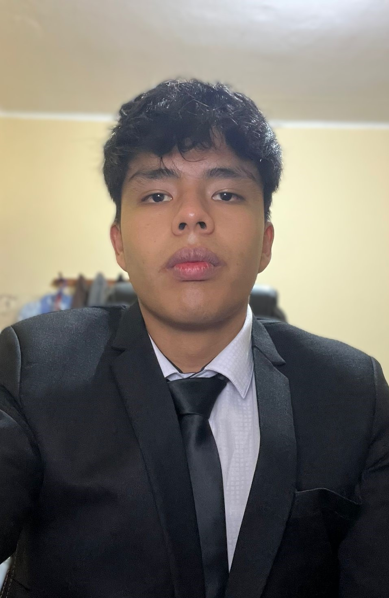
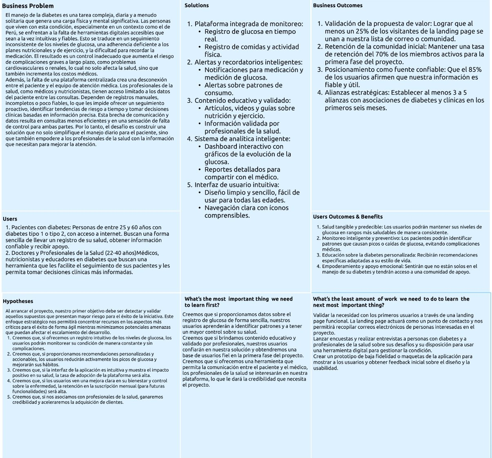

# Capítulo I: Introducción

## 1.1. Startup Profile
Devspros es una startup dedicada a crear soluciones digitales innovadoras enfocadas en el sector salud. Fue creada por un equipo de estudiantes de la Universidad Peruana de Ciencias Aplicadas (UPC) con la visión de generar un impacto positivo en la calidad de vida de las personas.Asimismo, Devspros se compromete a ofrecer soluciones centradas en las necesidades reales de los pacientes, fomentando la autonomía, seguridad y prevención, además de generar un entorno inclusivo y confiable. Finalmente, nuestro propósito es mejorar el bienestar de las personas con enfermedades crónicas a través de la tecnología, contribuyendo a un sistema de salud más humano y accesible.

- Mision: Desarrollar soluciones digitales innovadoras que mejoren la calidad de vida de las personas con enfermedades crónicas, ofreciendo herramientas accesibles, intuitivas y centradas en el usuario para el control y cuidado de su salud.
- Vision: Ser una startup referente en salud digital en América Latina, reconocida por transformar el bienestar de los pacientes mediante la tecnología, promoviendo un sistema de salud más humano, inclusivo y accesible.
- Logo de la Startup:

- Logo de la aplicacion web :

### 1.1.2. Perfiles de integrantes del equipo

| Miembros del equipo                                                                                         | Codigo Estudiante | Carrera | Conocimientos / Habilidades                                                                                                                                                                                                                                                                                                                                                                                                                                                              |
|-------------------------------------------------------------------------------------------------------------|-------------------|-|------------------------------------------------------------------------------------------------------------------------------------------------------------------------------------------------------------------------------------------------------------------------------------------------------------------------------------------------------------------------------------------------------------------------------------------------------------------------------------------| 
| Mamani Marca, Gabriel Cristian   | u202220659        |Ingenieria de software| Soy estudiante de sexto ciclo de la carrera de Ingeniería de Software.Durante el camino aprendi lenguajes como c++,python y java.Tambien,sobre motores de base de datos como MongoDb y MYSQL                                                                                                                                                                                                                                                                                             |
| Barturen Panez, Iker Gabriel   | u202312629        |Ingenieria de software| Soy estudiante de sexto ciclo de la carrera Ingeniería de Software en la Universidad Peruana de Ciencias Aplicadas. Considero que soy alguien responsable, cumple con los trabajos que se me encargan a tiempo y se tengo la posibilidad apoyo a mis compañeros con sus trabajos, trabajó bien en equipo y puedo aportar mis conocimientos con el lenguaje de programación C++, C# y conocimientos basicos de python, también sobre los frameworks de Javascript react, astro y angular. |

## 1.2. Solution Profile

**Product Name:** Diabelife

**Product Description:**: Diabelife es una aplicacion web que tiene como objetivo ayudar a personas que padecen de cualquier tipo de diabetes.Esto se lograra mediante la implementacion de tecnologias de IoT, a través de un glucómetro inteligente que envía automáticamente las mediciones de glucosa en sangre a la aplicación, permitiendo a los usuarios registrar, monitorear y analizar en tiempo real sus niveles de glucosa para un mejor control y prevención de complicaciones. Asimismo, la aplicación web brindará diferentes herramientas a las personas que padecen de diabetes, como un módulo de publicaciones tipo red social, donde los usuarios podrán interactuar mediante posts y compartir experiencias; un sistema de reportes médicos, en el cual los doctores registrarán diagnósticos e información de los pacientes; un módulo de citas, que permitirá agendar y gestionar consultas tanto para pacientes como para doctores; y una funcionalidad de mensajería, que facilitará la comunicación directa entre pacientes y profesionales de la salud.

**Monetización:** Diabelife adopta un modelo de suscripción mensual o anual, ofreciendo acceso a las funcionalidades de la aplicación y, en el caso del plan Premium, la integración con dispositivos IoT especializados, garantizando así un valor agregado en el monitoreo y tratamiento de la enfermedad.

**Plan Básico:**
- Registro manual de niveles de glucosa y hábitos diarios
- Visualización de gráficas básicas de evolución de glucosa
- Recordatorios de medicación y citas médicas
- Acceso al módulo de publicaciones tipo red social para compartir experiencias
- Soporte técnico en horario laboral

**Plan Premium:**
- Integración con glucómetro inteligente IoT (mediciones automáticas en la app)
- Reportes médicos avanzados y exportables (PDF/Excel)
- Historial clínico detallado y actualizado en línea por el doctor
- Módulo completo de citas con recordatorios automáticos
- Funcionalidad de mensajería directa entre paciente y doctor
- Alertas inteligentes ante valores de riesgo (hipoglucemia/hiperglucemia)
- Soporte técnico 24/7

### 1.2.1 Antecedentes y problemática

**Antecedentes:**

En el Perú, la diabetes representa una creciente preocupación de salud pública. Según la Encuesta Demográfica y de Salud Familiar (ENDES) 2021, la prevalencia de personas mayores de 15 años con diagnóstico médico de diabetes ascendió a 4,9 %, frente al 3,3 % registrado en 2017, reflejando un incremento notable en los últimos cinco años. Por otro lado, un reporte del Ministerio de Salud (Minsa) también confirma que aproximadamente 4 de cada 100 peruanos mayores de 15 años padecen diabetes, y según los datos de la ENDES, la incidencia ha aumentado en 2 puntos porcentuales entre 2016 y 2021, con el 71,2 % de los diagnosticados en tratamiento. Finalmente, estimaciones recientes de la Federación Internacional de Diabetes (IDF) señalan que alrededor de 1,3 a 1,7 millones de peruanos conviven actualmente con esta enfermedad, siendo el 96,5 % de los casos correspondientes a diabetes tipo 2, lo que evidencia la urgencia de implementar soluciones innovadoras como aplicaciones web e integración de dispositivos IoT para mejorar el control y reducir las complicaciones asociadas.

**Problemáticas:**

En primer lugar, el registro manual de datos como la glucosa en sangre, la ingesta alimentaria y la actividad física supone una carga considerable para los doctores. Además, este proceso incrementa la probabilidad de errores en la transcripción de información, lo que repercute directamente en la calidad del diagnóstico y en la planificación del tratamiento. En segundo lugar, cuando un profesional de la salud atiende a múltiples pacientes de manera simultánea, resulta complejo detectar de forma oportuna a aquellos que requieren atención inmediata, ya que la falta de alertas inteligentes limita la capacidad de respuesta temprana frente a descompensaciones. Finalmente, la ausencia de un monitoreo en tiempo real influye de manera negativa en el tratamiento, ya que los pacientes no siempre identifican los cambios en sus niveles de glucosa a tiempo y, al no contar con un sistema de alertas automáticas ni con retroalimentación inmediata, aumenta el riesgo de complicaciones como hipoglucemias o hiperglucemias graves. Asimismo, la falta de acompañamiento continuo y motivación afecta la adherencia al tratamiento, reduciendo la efectividad de las intervenciones médicas.

**Técnica de The 5 'W's y 2 'H's**

**What?**  
El problema es la falta de una plataforma que brinde a las personas con diabetes las herramientas necesarias para monitorear sus niveles de glucosa, recibir recordatorios de medicación, contar con planes personalizados de alimentación y ejercicio, así como acceso a orientación profesional y reportes para un mejor control de su salud.

**When?**  
La problemática sucede diariamente y en cualquier momento del día, ya que las personas con diabetes deben llevar un control constante de sus niveles de glucosa, alimentación, medicación y actividad física para evitar problemas futuros.

**Where?**  
La problemática ocurre en todos los espacios donde el paciente desarrolla su vida cotidiana, como el hogar, el trabajo, el centro de estudios o incluso al realizar actividades sociales, debido a que la diabetes requiere atención permanente.

**Who?**  
Los principales afectados son las personas que viven con diabetes y sus familias, así como los profesionales de la salud que necesitan herramientas para dar un seguimiento más cercano y eficiente a cada paciente.

**Why?**  
Esto se debe a la ausencia de herramientas digitales integrales y accesibles que centralicen el control de la diabetes, lo que dificulta la adherencia al tratamiento, la prevención de complicaciones y la comunicación entre pacientes y médicos.

**How?**  
DiabeLife facilitará la gestión de la diabetes mediante una aplicación web que integra el registro de niveles de glucosa, recordatorios de medicación, planes personalizados de alimentación y ejercicio, orientación profesional remota y reportes médicos automatizados.

**How much?**  
DiabeLife tendrá el alcance de resolver esta problemática en toda persona con diabetes que ingrese y se registre en la aplicación web. Asimismo, contará con planes de suscripción que ofrecerán herramientas adicionales de apoyo para un control más completo de la diabetes.

### 1.2.2 Lean UX Process.

Nuestro proceso Lean UX está diseñado para optimizar la eficiencia en el desarrollo de productos, priorizando principios clave como la validación constante, el pensamiento analítico y la acción ágil. Siguiendo esta filosofía, hemos estructurado un enfoque propio de Lean UX compuesto por cuatro elementos fundamentales: identificación de problemas, formulación de suposiciones, creación de hipótesis y el desarrollo de un lienzo estratégico.

#### 1.2.2.1. Lean UX Problem Statements.

Las personas que viven con diabetes, especialmente en el Perú, enfrentan el desafío de manejar su condición de manera efectiva en un entorno con recursos limitados y acceso desigual a información confiable. A menudo, carecen de herramientas intuitivas que les permitan monitorear de cerca su salud, lo que lleva a un control inadecuado de la glucosa, una mala nutrición y un manejo deficiente de su medicación. Además, la carga emocional y la falta de una red de apoyo pueden hacer que el manejo de esta enfermedad sea abrumador.

DiabeLife es una startup que busca abordar estas dificultades ofreciendo una plataforma digital que simplifica la gestión diaria de la diabetes. En nuestra primera fase, la landing page actuará como un punto de contacto para validar el interés en nuestra propuesta de valor. A futuro, planeamos desarrollar una aplicación web que permitirá a los usuarios registrar datos de glucosa, planificar comidas, monitorear su actividad física y recibir recordatorios personalizados. A su vez, los profesionales de la salud podrán acceder a los datos de sus pacientes de forma segura para dar un seguimiento más preciso y eficiente.

El principal desafío es generar confianza entre nuestra audiencia objetivo. Los usuarios con diabetes pueden sentirse abrumados por la cantidad de información no verificada en línea o pueden desconfiar de las soluciones tecnológicas, especialmente si no han sido validadas por profesionales de la salud en el contexto local. Los médicos, por su parte, podrían dudar de la fiabilidad de los datos generados por una herramienta no oficial, o podrían resistirse a adoptar una nueva tecnología en su flujo de trabajo.

¿Cómo podemos construir una plataforma digital que sea percibida como una herramienta confiable, intuitiva y accesible, que no solo simplifique el manejo diario de la diabetes, sino que también fomente la colaboración entre pacientes y profesionales de la salud para mejorar los resultados a largo plazo?

#### 1.2.2.2. Lean UX Assumptions.

### Business Assumptions

- Creemos que nuestros usuarios tienen la necesidad de:
  obtener herramientas digitales que simplifiquen el control de su diabetes, reduciendo el estrés y la complejidad de la gestión diaria de su salud. Buscan una forma práctica y fiable de monitorear su condición y recibir orientación personalizada.

- Estas necesidades se pueden satisfacer con:
  una plataforma digital que ofrezca un registro intuitivo de niveles de glucosa, un módulo de planificación de comidas y recetas adaptadas, un rastreador de actividad física y recordatorios automáticos para medicación y citas médicas.

- Nuestros usuarios iniciales son (o serán):
  personas de entre 25 y 60 años con diabetes tipo 1 o tipo 2, que utilizan smartphones o computadoras regularmente y están dispuestas a adoptar la tecnología para mejorar su calidad de vida. También nos enfocaremos en los médicos que atienden a estos pacientes, buscando una forma más eficiente de monitorear su progreso.

- El valor principal que un usuario quiere obtener de nuestro servicio es:
  tranquilidad y control sobre su salud. Quieren tener la certeza de que están tomando decisiones informadas para prevenir complicaciones, sentirse empoderados y conectados con una comunidad de apoyo.

- Los usuarios también pueden obtener estos beneficios adicionales:
  información educativa validada por profesionales, acceso a una comunidad de apoyo, comunicación más fluida con su médico y planes de acción personalizados que se adapten a sus hábitos y preferencias.

- Adquiriremos a la mayoría de nuestros usuarios a través de:
  estrategias de marketing digital en redes sociales (Facebook e Instagram), colaboraciones con asociaciones de diabetes y clínicas, participación en eventos de salud y campañas de contenido educativo en blogs o podcasts.

- Ganaremos dinero mediante:
  un modelo de negocio freemium donde las funciones básicas de registro son gratuitas, pero el acceso a funcionalidades premium como planes nutricionales personalizados o la integración con profesionales de la salud requerirán una suscripción mensual. A futuro, podríamos considerar una tarifa por usuario para los profesionales de la salud.

- Nuestra competencia principal en el mercado será:
  aplicaciones genéricas de seguimiento de salud, diarios manuales de papel para la diabetes y, a largo plazo, plataformas de telemedicina más grandes que no se especializan exclusivamente en la diabetes.

- Les superaremos debido a:
  nuestra propuesta de valor especializada y holística. No solo rastreamos datos, sino que ofrecemos un ecosistema completo que integra el bienestar físico y mental, conectando a los usuarios con la comunidad y los profesionales de la salud de forma fluida.

- El mayor riesgo para nuestro producto es:
  la falta de adopción por parte de los profesionales de la salud, que son clave para la credibilidad y la retención de usuarios. También enfrentamos el riesgo de una baja tasa de conversión del modelo freemium, si los usuarios no ven suficiente valor en las funciones premium.

### User Assumptions

- ¿Quién es el usuario?
  Pacientes con diabetes tipo 1 y tipo 2, principalmente en Perú, que buscan un manejo más efectivo y menos estresante de su condición. También, profesionales de la salud (médicos, nutricionistas) interesados en una herramienta que les facilite el seguimiento de sus pacientes de manera remota.

- ¿Dónde encaja nuestro producto en su vida?
  Se integra en la rutina diaria del paciente como un asistente personal de salud, que les permite llevar un registro de su glucosa y alimentación. Para los médicos, se convierte en una herramienta de monitoreo que complementa las consultas presenciales, permitiendo un seguimiento más proactivo.

- ¿Qué problemas resuelve nuestro producto?
  Falta de control sobre los niveles de glucosa, dificultad para seguir un plan de alimentación adecuado, olvido de medicamentos o citas, y la sensación de soledad o aislamiento que a menudo acompaña a la enfermedad. Para los médicos, resuelve el problema de la falta de datos consistentes y fiables entre consultas.

- ¿Cuándo y cómo se utiliza nuestro producto?
  El paciente lo utiliza varias veces al día: al registrar su glucosa (antes y después de las comidas), al planificar sus comidas, al recibir recordatorios de medicamentos y al revisar su progreso semanal. El médico lo utiliza para revisar el historial del paciente antes de una consulta o en momentos clave para un seguimiento proactivo.

- ¿Qué características son importantes?
  Registro de glucosa intuitivo, base de datos de alimentos con valores nutricionales, planificador de comidas personalizado, alertas y recordatorios de medicación, y un dashboard con gráficos claros que muestren la evolución del control de la diabetes. Para los médicos, es crucial la visualización de datos históricos y reportes detallados.

- ¿Cómo debería verse y comportarse nuestro producto?
  Interfaz simple, limpia y fácil de usar para personas de todas las edades. La aplicación debe ser no intrusiva, ofreciendo recordatorios y sugerencias en momentos clave sin abrumar al usuario. Debe inspirar confianza y calma, no estrés.

- El valor principal que un usuario quiere obtener es:
  Empoderamiento para tomar el control de su salud, reducción de la carga mental y emocional del manejo diario de la diabetes, y la tranquilidad de saber que están mejorando su bienestar a largo plazo.

- Los usuarios también pueden obtener estos beneficios adicionales:
  Mejor comunicación con su equipo médico, acceso a información validada por profesionales, motivación a través de una comunidad de apoyo y la posibilidad de optimizar el tiempo de sus consultas médicas.

- El mayor riesgo para el usuario es:
  Que la aplicación sea percibida como una carga más en su rutina diaria, que la información y las recomendaciones no sean percibidas como fiables, o que no logren ver un beneficio tangible en la mejora de su salud, lo que llevaría al abandono de la plataforma.

### User Outcomes

- Salud tangible y predecible: Los usuarios podrán mantener sus niveles de glucosa en rangos más saludables de manera consistente, obteniendo un control real sobre su condición desde su dispositivo móvil. Esto se traduce en una reducción de los riesgos a largo plazo y una mayor tranquilidad.

- Monitoreo inteligente y preventivo: Los pacientes podrán identificar patrones que causan picos o caídas de glucosa antes de que impacten significativamente en su bienestar, evitando complicaciones médicas y sorpresas en su salud.

- Educación sobre la diabetes personalizada: Recibirán recomendaciones específicas adaptadas a su estilo de vida y preferencias de alimentación, lo que facilitará la adopción de hábitos saludables de forma más efectiva y sostenible.

- Empoderamiento y apoyo emocional: Sentirán que no están solos en el manejo de su diabetes, ya que tendrán acceso a una comunidad y herramientas que los motivarán a seguir sus planes de tratamiento y a compartir sus experiencias.

### Business Outcomes

- Validación de la propuesta de valor : Lograr que al menos un 25% de los visitantes únicos de la landing page se suscriban a nuestra lista de correo o se unan a nuestra comunidad digital (por ejemplo, un grupo de WhatsApp o Telegram) en los primeros tres meses. Esto validará el interés inicial en la solución.

- Retención y feedback de la comunidad inicial: Mantener una tasa de retención del 70% de los miembros de nuestra comunidad durante el primer trimestre. Buscaremos feedback activo de este grupo para entender sus necesidades y priorizar las funcionalidades que se desarrollarán en la futura aplicación web.

- Posicionamiento como fuente de información confiable: Que el 85% de los miembros de la comunidad inicial afirmen que la información y los consejos proporcionados por DiabeLife son fiables y han influido positivamente en la gestión de su diabetes. Esto construirá la confianza necesaria para la siguiente fase del proyecto.

- Alianzas estratégicas iniciales: Establecer al menos 3 a 5 alianzas con asociaciones de diabetes, nutricionistas o clínicas locales en los primeros seis meses. Estas alianzas nos permitirán co-crear contenido, obtener validación profesional y ganar credibilidad en el mercado peruano.

### Features Assumptions

- Registro de niveles de glucosa en tiempo real.
- Captura de comidas (con fotos y descripciones) y su impacto en la glucosa.
- Seguimiento de actividad física.
- Registro de medicamentos y dosis.
- Dashboard interactivo con gráficos de la evolución de la glucosa.
- Historial de mediciones con tendencias diarias, semanales y mensuales.
- Análisis del impacto de alimentos específicos, ejercicio y medicamentos en el control de la glucosa.
- Reportes exportables para análisis personal o profesional. 
- Sugerencias de planes de alimentación personalizados.
- Consejos sobre qué alimentos y ejercicios funcionan mejor para el usuario.
- Educación sobre la diabetes, como la lectura de etiquetas nutricionales.
- Información sobre la enfermedad validada por profesionales de la salud.
- Alertas automáticas para medicación y medición de glucosa.
- Recordatorios para citas médicas programadas.
- Funcionalidad para que el paciente comparta sus datos con el médico o nutricionista.
- Planes de acción recomendados por profesionales de la salud.

#### 1.2.2.3. Lean UX Hypothesis Statements.
- Creemos que lograremos una mayor adopción inicial y retención de usuarios si ofrecemos acceso gratuito a las funcionalidades de registro básico de glucosa y alimentos. Al permitir que los pacientes exploren el valor de un seguimiento constante y vean el impacto en su salud sin compromiso, aumentaremos la conversión a planes futuros que incluyan funcionalidades premium, como planes de nutrición personalizados.

- Creemos que aumentaremos la satisfacción del usuario y reduciremos las cancelaciones si los planes futuros están claramente diferenciados y alineados con las necesidades reales de cada tipo de paciente. Mediante el análisis del comportamiento del usuario y entrevistas, podremos ajustar las funcionalidades y las alertas de cada plan para maximizar su percepción de valor, ya sea en el manejo de diabetes tipo 1 o tipo 2.

- Creemos que fortaleceremos la confianza de los usuarios y la credibilidad de la plataforma si mostramos claramente los avales de profesionales de la salud, datos de precisión del registro y testimonios verificables de mejoras en la calidad de vida. Al mejorar la transparencia y accesibilidad de esta información, facilitaremos la toma de decisiones informadas y reduciremos la fricción en la adopción del servicio.

- Creemos que aumentaremos la fidelidad y el uso recurrente si personalizamos las recomendaciones según los patrones específicos de comportamiento de cada paciente. A través de algoritmos de aprendizaje automático y alertas contextuales inteligentes, podemos generar una experiencia percibida como relevante y efectiva para cada usuario individual.

- Creemos que incrementaremos la conversión al plan premium si destacamos el beneficio del análisis avanzado y la comunicación directa con profesionales de la salud. Esto se validará mediante pruebas A/B con mensajes de valor enfocados en el control de su bienestar y la tranquilidad de tener un equipo médico de apoyo.

- Creemos que lograremos una expansión sostenida de nuestra base de usuarios si implementamos campañas de marketing específicas dirigidas a comunidades de diabetes, redes sociales de salud y colaboraciones con asociaciones de pacientes. Con estas acciones y la medición de tasas de adquisición, podremos ajustar la estrategia para optimizar el retorno por canal y mejorar la conversión entre personas conscientes del manejo de su diabetes.

#### 1.2.2.4. Lean UX Canvas.

## 1.3. Segmentos objetivo.

### Segmento objetivo #1: Personas que padecen de diabetes

**Descripción:**
Este segmento está compuesto por personas diagnosticadas con diabetes tipo 1 o tipo 2, que requieren un control constante de sus niveles de glucosa, alimentación, medicación y actividad física. Son los principales usuarios de la plataforma, ya que buscan herramientas digitales que les faciliten la gestión de su condición y mejoren su calidad de vida.

**Aspectos demográficos:**
Hombres y mujeres de entre 18 y 65 años, de diferentes niveles socioeconómicos (principalmente B y C). En su mayoría cuentan con educación secundaria o superior. Este grupo incluye tanto a personas que se autogestionan como a aquellas que reciben apoyo de familiares en su cuidado diario.

**Aspectos geográficos:**
Personas que residen en zonas urbanas y periurbanas del Perú, con mayor concentración en Lima, Arequipa, Trujillo y Chiclayo, donde la prevalencia de enfermedades crónicas es más alta y el acceso a servicios de salud es desigual.

**Aspectos psicográficos:**
Valoran la salud, el bienestar y la prevención de complicaciones. Son pacientes responsables que buscan herramientas fáciles de usar y confiables para llevar un registro ordenado de su condición. Muchos de ellos sienten la carga emocional y social de la enfermedad, por lo que aprecian el apoyo comunitario.

**Necesidades:**
Desean monitorear sus niveles de glucosa de manera sencilla y en tiempo real, contar con recordatorios de medicación y alimentación, y acceder a información confiable sobre hábitos saludables para la diabetes.

**Requisitos:**
Buscan una plataforma intuitiva, accesible desde cualquier dispositivo y con soporte técnico disponible. Asimismo, requieren que la aplicación sea confiable, segura y que garantice la protección de su información personal.

**Objetivo:**
Prevenir complicaciones, optimizar el tratamiento y llevar una vida más saludable y controlada gracias a herramientas digitales integrales.**Sustento estadístico:**

**Sustento estadístico:**
Según la Encuesta Demográfica y de Salud Familiar (ENDES, 2021), la prevalencia de diabetes en personas mayores de 15 años en el Perú alcanzó el 4,9 %, frente al 3,3 % en 2017. Esto significa que aproximadamente 1,6 millones de peruanos padecen esta enfermedad, con una tendencia creciente en los últimos cinco años.

### Segmento objetivo #2: Doctores y Profesionales de la Salud

**Descripción:**
Este segmento está compuesto por médicos endocrinólogos, médicos generales, nutricionistas y otros profesionales de la salud que atienden a pacientes con diabetes. Son usuarios secundarios que requieren acceder a información clara y actualizada para dar seguimiento efectivo a sus pacientes.

**Aspectos demográficos:**
Hombres y mujeres de entre 28 y 55 años, con estudios universitarios en medicina o nutrición. Pertenecen principalmente a niveles socioeconómicos B y A, y trabajan en clínicas privadas, hospitales públicos o consultorios independientes.

**Aspectos geográficos:**
Principalmente ubicados en Lima Metropolitana y capitales de región, donde existe una mayor concentración de servicios de salud especializados. También, se incluyen médicos de provincias que buscan apoyo digital para gestionar pacientes a distancia.

**Aspectos psicográficos:**
Valoran la precisión de la información, la eficiencia en la gestión de pacientes y la innovación tecnológica que les permita optimizar su tiempo y mejorar la calidad de la atención.

**Necesidades:**
Necesitan contar con acceso a reportes médicos avanzados y exportables, recibir alertas inteligentes sobre los riesgos de sus pacientes, mantener comunicación directa con ellos a través de la aplicación y disponer de una herramienta confiable que apoye tanto el diagnóstico como el seguimiento continuo.

**Requisitos:**
Buscan una plataforma profesional, segura y validada. Necesitan facilidad para acceder desde cualquier dispositivo y compatibilidad con otros sistemas de gestión clínica.

**Objetivo:**
Optimizar la atención médica, reducir riesgos en pacientes diabéticos y mejorar la calidad de los tratamientos mediante el uso de información actualizada en tiempo real.

**Sustento estadístico:**
De acuerdo con el Colegio Médico del Perú (2022), existen más de 72,000 médicos colegiados en el país, de los cuales cerca del 15% ejercen en áreas vinculadas al manejo de enfermedades crónicas como la diabetes. A su vez, el Ministerio de Salud ha señalado que la diabetes es la séptima causa de muerte en el Perú, lo que incrementa la demanda de profesionales especializados y de herramientas tecnológicas de apoyo.
