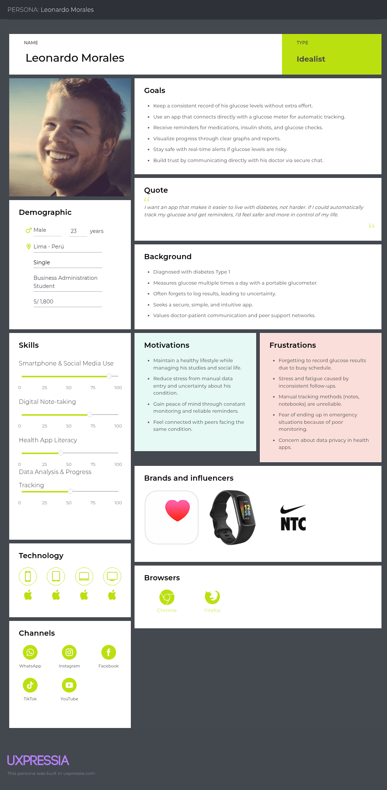
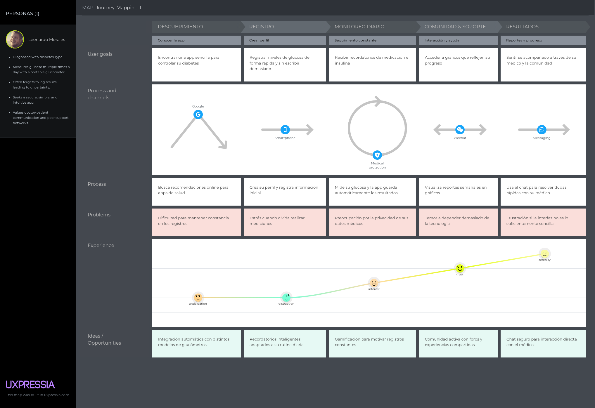

# Capítulo 2: IRequirements Elicitation & Analysis

## 2.1 Competidores

# Competidor 1: MySugr

MySugr es una app global de control de diabetes que permite registrar manualmente niveles de glucosa, alimentación y actividad física. Ofrece reportes gráficos y se integra con algunos dispositivos IoT (como Accu-Chek). Tiene versión gratuita y premium.

---

# Competidor 2: GlucoTrack

Plataforma enfocada en dispositivos no invasivos de medición de glucosa. Su fortaleza está en el hardware, aunque depende de aplicaciones externas para reportes avanzados y comunicación con doctores.

---

# Competidor 3: SocialDiabetes

Startup española que combina control de glucosa con comunidad de pacientes. Ofrece registro manual y conexión con dispositivos, reportes para médicos y recordatorios. Está certificada como dispositivo médico en la UE.

---

### 2.1.1 Análisis Competitivo

<table> <tr> <th colspan="6">Competitive Analysis Landscape</th> </tr> <tr> <td colspan="2" rowspan="2">¿Por qué llevar a cabo este análisis?</td> <td colspan="4">Pregunta</td> </tr> <tr> <td colspan="4">Para identificar cómo otras soluciones ayudan a pacientes diabéticos a monitorear su glucosa, compartir información con doctores y fomentar adherencia al tratamiento. El análisis muestra dónde Diabelife puede diferenciarse mediante IoT, comunidad y servicios locales.</td> </tr> <tr> <td colspan="2">Productos</td> <td>Diabelife </td></td> <td>MySugr </td> </td> <td>GlucoTrack </td></td> <td>SocialDiabetes </td></td> </tr> <tr> <td rowspan="2">Perfil</td> <td>Overview</td> <td>Web app con glucómetro IoT, comunidad tipo red social, reportes médicos, citas y mensajería.</td> <td>App móvil para registro manual, gráficos básicos y exportación de datos.</td> <td>Hardware no invasivo con app complementaria para lectura.</td> <td>App móvil con registro manual, conexión con dispositivos y comunidad activa.</td> </tr> <tr> <td>Ventaja competitiva</td> <td>Integración total: IoT + comunidad + reportes médicos + comunicación paciente-doctor.</td> <td>Reconocimiento global y compatibilidad con Accu-Chek.</td> <td>Tecnología no invasiva pionera en hardware.</td> <td>Certificación médica en UE y foco en comunidad.</td> </tr> <tr> <td rowspan="2">Perfil de Marketing</td> <td>Mercado Objetivo</td> <td>Pacientes diabéticos en Perú y LATAM, médicos y clínicas locales.</td> <td>Pacientes jóvenes/adultos con smartphones y acceso a planes premium.</td> <td>Pacientes con recursos que buscan alternativas no invasivas.</td> <td>Usuarios europeos, principalmente España y LATAM.</td> </tr> <tr> <td>Estrategias de Marketing</td> <td>Alianzas con clínicas, seguros de salud y campañas de concientización en redes sociales.</td> <td>Publicidad digital global, partnerships con Roche.</td> <td>Promoción centrada en ferias médicas y distribución especializada.</td> <td>Difusión en comunidades de pacientes y certificación médica como garantía.</td> </tr> <tr> <td rowspan="3">Perfil de Producto</td> <td>Productos & Servicios</td> <td>Glucómetro IoT, reportes médicos avanzados, citas, comunidad social y mensajería.</td> <td>App con registros, gráficos y exportación PDF/Excel.</td> <td>Dispositivo físico con app básica.</td> <td>App con comunidad, alertas y compatibilidad con wearables.</td> </tr> <tr> <td>Precios & Costos</td> <td>Plan Básico: gratis / Plan Premium: desde  15-24 soles/mes.</td> <td>Freemium + Premium desde USD 3–5/mes.</td> <td>Hardware > USD 200 + app gratuita.</td> <td>Suscripción mensual desde USD 5–10/mes.</td> </tr> <tr> <td>Canales de distribución</td> <td>Web + App móvil (iOS/Android), alianzas con clínicas.</td> <td>App móvil en stores globales.</td> <td>Venta de hardware + app asociada.</td> <td>App móvil en stores + comunidad online.</td> </tr> <tr> <td rowspan="4">Análisis SWOT</td> <td>Fortalezas</td> <td>IoT integrado con app + red social de pacientes + conexión directa con médicos.</td> <td>Base global de usuarios y respaldo corporativo.</td> <td>Tecnología innovadora no invasiva.</td> <td>Certificación médica oficial + comunidad activa.</td> </tr> <tr> <td>Debilidades</td> <td>Startup emergente con recursos limitados y poca validación inicial.</td> <td>Dependencia del registro manual (propenso a errores).</td> <td>Costo elevado del hardware y dependencia de dispositivos físicos.</td> <td>Menor penetración en LATAM.</td> </tr> <tr> <td>Oportunidades</td> <td>Expandir a otros países de LATAM, alianzas con seguros de salud y hospitales.</td> <td>Integrarse con más dispositivos IoT.</td> <td>Bajar costos y escalar distribución global.</td> <td>Expandirse fuera de Europa y LATAM.</td> </tr> <tr> <td>Amenazas</td> <td>Competidores globales con más capital y regulaciones de salud estrictas.</td> <td>Nuevas apps más completas e integradas.</td> <td>Avances en tecnologías invasivas más baratas.</td> <td>Startups locales con mayor adaptación cultural.</td> </tr> </table>

### 2.1.2 Estrategisas y tacticas frente a competidores

## **Comunidad y Apoyo Mutuo**
**• Estrategia:** Diferenciarse al fomentar una comunidad activa y empática que ofrezca apoyo emocional, algo que las aplicaciones de seguimiento de datos a menudo no hacen.  
**• Táctica:** Integrar testimonios en la landing page de personas que ya han mejorado su calidad de vida gracias a recursos similares, y más adelante, crear foros o grupos de apoyo en la web app.

## **Personalización y Enfoque Holístico**
**• Estrategia:** Contrastar DiabeLife con soluciones genéricas que solo rastrean datos. Nosotros ofrecemos una experiencia personalizada que aborda el bienestar integral del paciente.  
**• Táctica:** Resaltar en la landing page la futura funcionalidad de planes de alimentación y rutinas de ejercicio adaptadas al perfil individual del usuario.

## **Monitoreo y Alertas Inteligentes**
**• Estrategia:** Usar el seguimiento de datos clave (niveles de glucosa, actividad física) para generar valor inmediato y proactivo.  
**• Táctica:** Prometer alertas personalizadas en la web app que ayuden a los usuarios a prevenir picos o caídas de glucosa, actuando como un asistente personal.

## **Simplicidad de Uso para Todas las Edades**
**• Estrategia:** Demostrar que DiabeLife es una herramienta intuitiva y accesible, diseñada para ser utilizada por personas de todas las edades, incluso aquellas menos familiarizadas con la tecnología.  
**• Táctica:** Usar un diseño limpio y una navegación sencilla en la landing page, con videos cortos o animaciones que demuestren lo fácil que será usar la web app.

## **Medición del Interés y Tráfico**
**• Estrategia:** Usar métricas digitales para validar el interés en la propuesta de valor y tomar decisiones informadas para el futuro desarrollo.  
**• Táctica:** Implementar herramientas como Google Analytics para medir el tráfico de la landing page y usar el formulario de "contáctanos" para recopilar correos electrónicos de personas interesadas. Esto nos dará una base de datos para futuras comunicaciones.

## **Enfoque en el Mercado Local**
**• Estrategia:** Aprovechar el contexto peruano para conectar de manera más efectiva con la audiencia y mostrar que el proyecto está diseñado para ellos.  
**• Táctica:** Utilizar un lenguaje y ejemplos que resuenen con la realidad peruana. Además, podríamos mencionar que la web app está pensada para ser compatible con los métodos de control de la diabetes más comunes en el país.

## 2.2 Entrevistas 

Las entrevistas estarán dirigidas a pacientes con diabetes y profesionales de la salud, con el objetivo de comprender sus necesidades específicas en el acceso a información sobre medicamentos, tratamientos, citas y servicios extras, así como conocer más sobre sus experincias con respecto a la diabetes.

### 2.2.1. Diseño de Entrevistas

##  Segmento 1: Pacientes con Diabetes
**Objetivo**: entender hábitos, problemas, necesidades y percepción de utilidad de una solución como Diabelife.

1. ¿Cuál es tu edad, ocupación y desde cuándo fuiste diagnosticado con diabetes?  
2. ¿Qué tipo de diabetes tienes y cómo afecta tu día a día?  
3. ¿Con qué frecuencia mides tus niveles de glucosa en sangre?  
4. ¿Qué dispositivo o método utilizas actualmente para medir tu glucosa?  
5. ¿Dónde sueles registrar tus niveles de glucosa (cuaderno, aplicación, memoria personal, etc.)?  
6. ¿Qué tan fácil o difícil te resulta llevar un registro constante de tus mediciones?  
7. ¿Alguna vez olvidaste medir tu glucosa o registrar tus resultados? ¿Qué consecuencias tuvo?  
8. ¿Qué tan importante es para ti contar con alertas o recordatorios automáticos relacionados con tu salud?  
9. ¿Recibes actualmente acompañamiento o seguimiento digital de tu doctor?  
10. ¿Qué tan cómodo te sientes compartiendo tus datos médicos en una aplicación?  
11. ¿Te interesaría interactuar con otros pacientes para compartir experiencias o consejos?  
12. ¿Qué opinas de tener un sistema de mensajería directa con tu doctor?  
13. ¿Qué características valoras más en una aplicación de salud (simplicidad, rapidez, seguridad, soporte, etc.)?  
14. ¿Estarías dispuesto a pagar una suscripción mensual/anual por una aplicación que integre estas funciones?  
15. Si pudieras diseñar la aplicación ideal para manejar tu diabetes, ¿qué tendría sí o sí?  

##  Segmento 2: Doctores y Profesionales de la Salud
**Objetivo**: entender su carga laboral, dificultades con pacientes diabéticos y cómo una app como Diabelife podría apoyarlos.

1. ¿Cuál es tu especialidad y cuántos pacientes con diabetes atiendes aproximadamente?  
2. ¿Qué tan frecuente es el seguimiento a pacientes diabéticos en tu práctica?  
3. ¿De qué manera registras y revisas actualmente la información clínica de tus pacientes?  
4. ¿Qué tan confiables consideras los registros manuales que los pacientes llevan?  
5. ¿Qué problemas enfrentas cuando la información del paciente no está actualizada o es incompleta?  
6. ¿Cuánto tiempo dedicas semanalmente a revisar reportes y diagnósticos de pacientes con diabetes?  
7. ¿Qué tan útil te resultaría contar con un sistema que te alerte automáticamente de valores de riesgo?  
8. ¿En qué casos sería más importante recibir alertas inmediatas (ejemplo: hipoglucemia)?  
9. ¿Qué opinas sobre que los pacientes puedan agendar y gestionar sus citas a través de una aplicación?  
10. ¿Consideras que la mensajería directa con pacientes es viable y beneficiosa en tu práctica?  
11. ¿Qué funcionalidades médicas consideras indispensables en un software de este tipo (reportes, historial, gráficas, exportación)?  
12. ¿Qué preocupaciones tendrías respecto a la seguridad y privacidad de los datos médicos?  
13. ¿Qué tipo de soporte técnico o capacitación necesitarías para usar una aplicación así?  
14. ¿Estarías dispuesto a recomendar el uso de una aplicación como Diabelife a tus pacientes? ¿Por qué sí o por qué no?  
15. Si pudieras sugerir una sola mejora para este tipo de plataformas digitales, ¿cuál sería?  

### 2.2.2 Registro de entrevistas

PACIENTES DIABETICOS

ENTREVISTA 1

Inicia: 0:01

Duración: 5:55

Nombre: Victor Snayder Damian Inga

Edad: 25

Distrito: La Victoria

Resumen: Victor Damian es un contador de 25 años. Según sus propias palabras, se le diagnosticó diabetes tipo 2 hace 3 años aproximadamente. Esto, le afecta de manera significativa en su vida, ya que tiene que seguir una rutina para consumir sus medicamentos y se tiene que limitar con respecto a los alimentos en las reuniones a las que asiste. Generalmente, mide su glucosa diariamente con un glucómetro portatil con tiras reactivas. Además, suele registrar su nivel de glucosa en su aplicación de notas. Asimismo, se le complica ser constante en registrar sus niveles de glucosa por temas de trabajo. Las veces que esto sucede, siente mareos o cansancio, incluso, puede terminar en una clínica. Victor está interesado en recibir notificaciones para que pueda registrar el progreso que lleva. Además, considera buena la idea de interactuar con otros pacientes para compartir sus ideas o experiencias. También, menciona que está de acuerdo en tener un sistema de mensajería con su doctor, ya que tendría más confianza. Él valora que el sistema sea seguro y fácil de utilizar. Finalmente, piensa que una aplicación debería tener un registro automático de glucosa con conexión a un glucómetro, recordatorios, gráficas del progreso, comunidad de pacientes, alertas para notificar si hay peligro con respecto a la fiabetes.

Información extra:

    Medicamentos:
    - Metformina.
    - Sulfonilureas.
    - Inhibidores DPP-4.
    
    Personalidad:
    - Ocupación: Contador.
    - Preocupado por no siempre poder medir el nivel de su glucosa y ver su progreso.
    - Desea una plataforma en la que pueda compartir experiencias con otros pacientes con diabetes.

ENTREVISTA 2

Inicia:

Duración: 8:19

Nombre: Juan David Saldaña De Souza

Edad: 20

Distrito: Santa Anita

Resumen: Juan David es un estudiante de ingeniería de 20 años, diagnosticado con diabetes tipo 1 hace aproximadamente un año, lo que ha supuesto un cambio significativo en su vida. Su principal dificultad radica en el seguimiento constante de su condición; aunque se mide la glucosa de 4 a 5 veces al día con un glucómetro tradicional, le resulta muy difícil y estresante registrar sus resultados en un cuaderno, olvidándose con frecuencia y generando incertidumbre sobre sus niveles. Está muy interesado en una aplicación que sea sencilla y rápida, que le envíe recordatorios automáticos para sus mediciones e inyecciones, y que le permita registrar sus datos sin necesidad de escribirlos. Además, considera de gran valor poder comunicarse directamente con su doctor a través de un chat para dudas puntuales y conectar con una comunidad de otros jóvenes con diabetes para compartir experiencias y sentirse menos solo.

Información extra:

    Medicamentos:
    - Iphone (uso constante).
    - Laptop (para estudios).
    
    Personalidad:
    - Carrera: Ingeniería de Software.
    - Estres al momento de tener que registrar sus resultados.
    - Prefiere una plataforma facil de usar e intuitiva.

ENTREVISTA 3

Inicia:

Duración:

Nombre:

Edad:

Distrito:

Resumen:

Información extra:

    Medicamentos:
    - Samsung (uso constante).
    - Computadora (para estudios).
    
    Personalidad:
    - Carrera: Ingeniería de Sistemas.
    - Estresado por las facturas elevadas, quiere reducir ese gasto.
    - Prefiere una plataforma en la cual pueda monitorear el consumo de energía.

PROFESIONALES DE LA SALUD

ENTREVISTA 1

Inicia:

Duración: 10:40

Nombre: Gustavo Arturo Espinoza Mucha

Edad: 53

Distrito: La Victoria

Resumen: Gustavo es un cirujano dentista (53 años) que trabaja en un consultorio, nos comenta que durante sus turnos de trabajo atiende aproximadamente de 3 a 4 personas con diabetes, nos comenta que todos sus registros lo hace de forma manual y que eso le genera un poco de complejidad porque aveces se pierde entre tantos registros, esta interesdo en usar la aplicación aunque no parezca que un cirujano denstista sea relevante, el tambien necesita información al momento de tratar a un paciente con diabetes, nos recomendó que la aplicación sea fácil de usar, que cuente con un chat para poder comunicarse con sus pacientes y que también guarde archivos y sean faciles de poder localizar.

Información extra:

    Registro medico:
    - Samsung (uso constante).
    - Computadora (para trabajo).
    
    Personalidad:
    - Carrera: Cirujano Dentista.
    - Incomodida de no tener todos los datos necesarios de un paciente con diabetes y conflicto al buscar y guardad sus resultados de los apcientes.
    - Prefiere una plataforma Facil de usar e intuitica y que cuente con herramientas extras con el tema de salud.

ENTREVISTA 2

Inicia:

Duración: 7:38

Nombre: Camila Barturen Del Villar

Edad: 25

Distrito: Jesús María

Resumen: Camila Barturen (25 años) que trabaja actualmente como medico general, nos comenta que durante sus turnos de trabajo atiende a por lo menos 19 pacientes con diabetes cada semana. También nos comento que actualmente el registro es de forma manual, lo que a la vez genera problemas cuando la información o esta actualiza, ella dedica 2 horas de su día a estudiar los reportes de su pacientes para estar informada. Estaría muy interesada en una plataforma que le ayude a gestionar sus pacientes de forma más directa y que le alerte cuando un paciente este en riesgo, aunque le preocupa que haya fallos en la seguridad y privacidad de los datos médicos, también recomendo que el uso de esta sea fácil e intuitiva,.

Información extra:

    Registro medico:
    - Tablet (uso diario).
    - Cuaderno de apuntes (para resgistros médicos).
    
    Personalidad:
    - Carrera: Medicina.
    - Prefiere una plataforma que monitore en tiempo real los niveles de glucosa y signos vitales de su paciente.

ENTREVISTA 3

Inicia: 

Duración: 7:18

Nombre: Hedid Lucero Barturen Panéz

Edad: 23

Distrito: Rio Negro

Resumen: Heidi Barturen (23 años) que trabaja actualmente como medico general, nos comenta que durante sus turnos de trabajo atiende entre 20-40 pacientes con diabetes al mes. También nos comento que actualmente el registro es de forma manual todos los datos ya que por la zona en la que se enceuntran el acceso fácil a una red de internet es un poco limitada, ella dedica una hora de su día a estudiar los reportes de su pacientes. Con respecto a la aplicación web, estaría muy interesada en una plataforma que le ayude a gestionar los datos y la información de sus pacientes, nos recomendo que la aplicación funciona de manera offline y que cuando tenga acceso a internet todos los datos se actualicen con los nuevos registros o con los que ya existen.

Información extra:

    Registro medico:
    - Cuaderno de apuntes (para resgistros médicos).
    - Computadora (para cargar datos al sistema).
    
    Personalidad:
    - Carrera: Medicina.
    - Prefiere una plataforma que la ayude a gestionar mejor losreportes de sus pacientes y que se accesible en zonas remotas.

### 2.2.3 Análisis de entrevistas

## 2.3. Needfinding

### 2.3.1. User Personas.

En esta sección se definieron User Personas como representaciones de los principales usuarios identificados. Estos perfiles condensan sus objetivos, hábitos, dificultades y expectativas frente al uso de herramientas digitales. La construcción de estos arquetipos permitió comprender mejor a los profesionales de la salud y a las personas con diabetes, brindando una guía clara para diseñar soluciones más útiles, seguras e intuitivas.

#### **Segmento 1:** Pacientes con diabetes

#### **Segmento 2:** Doctores y Profesionales de la Salud

### 2.3.2. User Task Matrix.

<table>
  <thead>
    <tr>
      <th rowspan="2">Nº</th>
      <th rowspan="2">Task</th>
      <th colspan="2">Leonardo Morales</th>
      <th colspan="2">Valeria Ramos</th>
    </tr>
    <tr>
      <th>Frecuencia</th>
      <th>Importancia</th>
      <th>Frecuencia</th>
      <th>Importancia</th>
    </tr>
  </thead>
  <tbody>
    <tr>
      <td>1</td>
      <td>Registrar información de salud</td>
      <td>A veces</td>
      <td>Media</td>
      <td>Frecuente</td>
      <td>Alta</td>
    </tr>
    <tr>
      <td>2</td>
      <td>Revisar reportes y gráficos de progreso</td>
      <td>Frecuente</td>
      <td>Alta</td>
      <td>Diaria</td>
      <td>Alta</td>
    </tr>
    <tr>
      <td>3</td>
      <td>Monitorear niveles de glucosa</td>
      <td>Diaria</td>
      <td>Alta</td>
      <td>A veces</td>
      <td>Media</td>
    </tr>
    <tr>
      <td>4</td>
      <td>Recibir recordatorios y alertas de riesgo</td>
      <td>Frecuente</td>
      <td>Alta</td>
      <td>Frecuente</td>
      <td>Alta</td>
    </tr>
    <tr>
      <td>5</td>
      <td>Comunicarse por chat (paciente–médico)</td>
      <td>Frecuente</td>
      <td>Alta</td>
      <td>A veces</td>
      <td>Media</td>
    </tr>
    <tr>
      <td>6</td>
      <td>Almacenar y acceder a datos clínicos seguros</td>
      <td>A veces</td>
      <td>Media</td>
      <td>Frecuente</td>
      <td>Alta</td>
    </tr>
    <tr>
      <td>7</td>
      <td>Usar la aplicación sin conexión (offline)</td>
      <td>A veces</td>
      <td>Media</td>
      <td>Frecuente</td>
      <td>Alta</td>
    </tr>
    <tr>
      <td>8</td>
      <td>Participar en comunidad/apoyo</td>
      <td>A veces</td>
      <td>Media</td>
      <td>A veces</td>
      <td>Media</td>
    </tr>
  </tbody>
</table>

Luego del cuadro se realiza una explicación resaltando las tareas con mayor frecuencia e importancia, principales diferencias y coincidencias entre lo realizado por los User Personas:

#### **Tareas con mayor frecuencia e importancia en ambos segmentos:**

- Para pacientes: registrar y monitorear niveles de glucosa, recibir recordatorios de medicación y alertas de riesgo son actividades críticas que se realizan de manera constante.

- Para médicos: registrar datos clínicos, revisar reportes y recibir alertas de riesgo destacan como tareas prioritarias en su práctica diaria.

#### **Diferencias clave entre segmentos:**

- Los pacientes valoran la simplicidad y automatización del registro, así como el acompañamiento mediante gráficos de progreso y comunidades de apoyo.

- Los médicos ponen énfasis en la seguridad de los datos, la organización de expedientes y la posibilidad de trabajar en entornos con conexión limitada.

#### **Coincidencias entre segmentos:**

- Ambos consideran fundamentales las alertas de riesgo oportunas.

- La comunicación por chat es una necesidad compartida: para el paciente representa confianza y cercanía, y para el médico es una herramienta de seguimiento.

Este análisis realizado facilita la identificación de las funciones que aportan mayor valor a cada grupo de usuario. De esta manera, la solución puede orientarse hacia tareas prioritarias que promuevan un manejo más seguro, eficiente y sencillo tanto para los pacientes como para los profesionales de la salud.

### 2.3.3. User Journey Mapping.

#### **Segmento 1:** Pacientes con diabetes

#### **Segmento 2:** Doctores y Profesionales de la Salud

### 2.3.4. Empathy Mapping.
## 2.4. Big Picture EventStorming.

## 2.5. Ubiquitous Language.

- **Patient (Paciente)**: Persona con diagnóstico de diabetes que utiliza la plataforma para registrar sus niveles de glucosa, acceder a reportes, recibir recordatorios y participar en la comunidad.

- **Doctor (Doctor)**: Profesional de la salud encargado del seguimiento de pacientes diabéticos. Puede revisar reportes, enviar recomendaciones, gestionar citas y comunicarse mediante mensajería directa.

- **Glucose Meter (Glucómetro)**: Dispositivo IoT o manual utilizado para medir los niveles de glucosa en sangre. Puede estar integrado con la plataforma para registro automático.

- **Glucose Record (Registro de Glucosa)**: Dato puntual o histórico sobre los niveles de glucosa del paciente, almacenado en la plataforma y accesible para el paciente y su doctor.

- **Medical Report (Reporte Médico)**: Documento generado automáticamente o por el doctor, que resume la evolución del paciente, tendencias y alertas relevantes.

- **Appointment (Cita)**: Espacio programado para la atención entre paciente y doctor, presencial o virtual, gestionado desde la plataforma.

- **Community (Comunidad)**: Espacio digital donde los pacientes pueden interactuar, compartir experiencias, consejos y apoyo emocional.

- **Reminder (Recordatorio)**: Notificación automática para medir glucosa, tomar medicamentos, asistir a citas o realizar actividades recomendadas.

- **Alert (Alerta)**: Mensaje proactivo generado por el sistema ante valores de glucosa fuera de rango o eventos críticos detectados.

- **User Profile (Perfil de Usuario)**: Información personal, médica y de contacto del paciente o doctor, utilizada para personalizar la experiencia y los servicios.

- **Messaging (Mensajería)**: Canal de comunicación directa entre paciente y doctor, o entre miembros de la comunidad, para resolver dudas y dar seguimiento.

- **Diet Plan (Plan de Alimentación)**: Recomendaciones personalizadas sobre alimentación saludable, adaptadas al perfil y necesidades del paciente.

- **Exercise Routine (Rutina de Ejercicio)**: Sugerencias de actividad física personalizadas para mejorar el control de la diabetes.

- **Medical History (Historial Médico)**: Registro acumulativo de datos clínicos, reportes, citas, medicamentos y eventos relevantes del paciente.

- **Subscription (Suscripción)**: Plan de acceso a funcionalidades premium de la plataforma, con diferentes niveles de servicio y precios.
