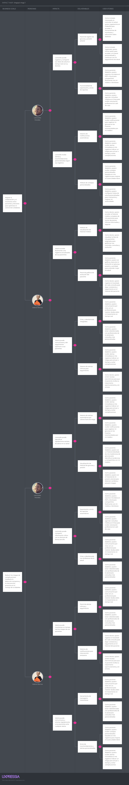

# Capitulo 3: Requirements specification.

## 3.1 To-Be Scenario Mapping 

Durante el desarrollo del mapa "To Be" de Diabelife, se realizó una lluvia de ideas para proponer mejoras orientadas a optimizar la experiencia de los pacientes diabéticos y profesionales de la salud. A partir de esta dinámica, se identificaron soluciones viables para el proceso futuro. Posteriormente, se definieron las etapas del proceso como columnas dentro del mapa "To Be", integrando en cada una las mejoras sugeridas. Entre estas mejoras destacan la incorporación de un sistema de mensajería entre el paciente y el profesional de la salud, la implementación de un plan semanal de monitoreo de salud (glucosa, presión, actividad física, etc.), y la opción para que el paciente pueda compartir reportes de síntomas y registros directamente con su médico tratante.

**Segmento objetivo** 1: Pacientes diabéticos:

**Segmento objetivo** 2: Doctores y profesionales de la salud:

## 3.2 User Stories

| **Story ID** | **Título**                                 | **Descripción**                                                                                                   | **Acceptance Criteria**                                                                                                                                                                                                 | **Relacionado con (Epic ID)** |
|--------------|--------------------------------------------|-------------------------------------------------------------------------------------------------------------------|------------------------------------------------------------------------------------------------------------------------------------------------------------------------------------------------------------------------|-------------------------------|
| US1          | Registro de usuario                        | Como invitado interesado en controlar mi salud, quiero registrarme en Diabelife para acceder a herramientas de monitoreo y educación sobre diabetes. | Escenario 1: Dado que los datos son válidos Cuando envío el formulario Entonces se crea la cuenta Escenario 2: Dado que los datos son inválidos Cuando intento registrarme Entonces se muestra un error  | EP1                           |
| US2          | Inicio de sesión                           | Como invitado registrado, quiero iniciar sesión para acceder a mi panel personalizado y continuar con mi seguimiento de salud. | Escenario 1: Dado que las credenciales son correctas Cuando inicio sesión Entonces accedo al panel Escenario 2: Dado que las credenciales son incorrectas Cuando intento iniciar sesión Entonces se muestra un error  | EP1                           |
| US3          | Recuperación de contraseña                 | Como invitado registrado que olvidó su contraseña, quiero recuperarla para no perder acceso a mi información y registros. | Escenario 1: Dado que el correo es válido Cuando solicito recuperación Entonces recibo un correo Escenario 2: Dado que el correo es inválido Cuando solicito recuperación Entonces se muestra un error  | EP1                           |
| US4          | Cierre de sesión                           | Como paciente diabético, quiero cerrar sesión para asegurar que nadie más acceda a mis datos médicos y personales. | Escenario 1: Dado que estoy autenticado Cuando cierro sesión Entonces salgo de la plataforma  | EP1                           |
| US5          | Visualización de perfil                    | Como paciente diabético, quiero ver mi perfil con mis datos personales, médicos y de contacto para verificar que estén correctos. | Escenario 1: Dado que accedo a mi perfil Cuando lo visualizo Entonces se muestra la información Escenario 2: Dado que hay un error Cuando accedo Entonces se muestra el aria-label  | EP2                           |
| US6          | Edición de perfil                          | Como paciente diabético, quiero editar mis datos personales, médicos y de contacto para mantener mi información actualizada. | Escenario 1: Dado que los datos son válidos Cuando guardo cambios Entonces se actualiza la información Escenario 2: Dado que los datos son inválidos Cuando intento guardar Entonces se muestra un error  | EP2                           |
| US7          | Subida de foto de perfil                   | Como paciente diabético, quiero subir una foto reciente para que los profesionales de salud puedan identificarme fácilmente. | Escenario 1: Dado que la imagen es válida Cuando la subo Entonces se actualiza la foto Escenario 2: Dado que la imagen es inválida Cuando intento subirla Entonces se muestra un error  | EP2                           |
| US8          | Eliminación de cuenta                      | Como paciente diabético, quiero eliminar mi cuenta y todos mis datos si decido dejar de usar Diabelife.           | Escenario 1: Dado que confirmo la eliminación Cuando la solicito Entonces la cuenta se elimina  | EP2                           |
| US9          | Registro de glucosa                        | Como paciente diabético, quiero registrar mis niveles de glucosa varias veces al día para llevar un control preciso de mi enfermedad. | Escenario 1: Dado que los datos son válidos Cuando los ingreso Entonces se guardan Escenario 2: Dado que los datos son inválidos Cuando intento guardar Entonces se muestra un error  | EP3                           |
| US10         | Visualización de historial de glucosa      | Como paciente diabético, quiero ver un historial detallado de mis mediciones de glucosa para identificar tendencias y compartirlas con mi médico. | Escenario 1: Dado que existen registros Cuando accedo al historial Entonces se muestran los datos Escenario 2: Dado que no hay registros Cuando accedo Entonces se muestra el aria-label  | EP3                           |
| US11         | Registro de insulina                       | Como paciente diabético insulinodependiente, quiero registrar cada dosis de insulina administrada para controlar mi tratamiento. | Escenario 1: Dado que los datos son válidos Cuando los ingreso Entonces se guardan Escenario 2: Dado que los datos son inválidos Cuando intento guardar Entonces se muestra un error  | EP3                           |
| US12         | Visualización de historial de insulina     | Como paciente diabético, quiero ver el historial de mis dosis de insulina para revisar mi adherencia y ajustar mi tratamiento si es necesario. | Escenario 1: Dado que existen registros Cuando accedo al historial Entonces se muestran los datos Escenario 2: Dado que no hay registros Cuando accedo Entonces se muestra el aria-label  | EP3                           |
| US13         | Registro de presión arterial               | Como paciente diabético, quiero registrar mis valores de presión arterial para monitorear posibles complicaciones cardiovasculares. | Escenario 1: Dado que los datos son válidos Cuando los ingreso Entonces se guardan Escenario 2: Dado que los datos son inválidos Cuando intento guardar Entonces se muestra un error  | EP3                           |
| US14         | Visualización de historial de presión      | Como paciente diabético, quiero ver el historial de mi presión arterial para detectar cambios y prevenir riesgos. | Escenario 1: Dado que existen registros Cuando accedo al historial Entonces se muestran los datos Escenario 2: Dado que no hay registros Cuando accedo Entonces se muestra el aria-label  | EP3                           |
| US15         | Registro de alimentos                      | Como paciente diabético, quiero registrar los alimentos que consumo para llevar un control nutricional y evitar descompensaciones. | Escenario 1: Dado que los datos son válidos Cuando los ingreso Entonces se guardan Escenario 2: Dado que los datos son inválidos Cuando intento guardar Entonces se muestra un error  | EP4                           |
| US16         | Visualización de historial alimenticio     | Como paciente diabético, quiero ver mi historial de alimentos para analizar mis hábitos y mejorar mi dieta.       | Escenario 1: Dado que existen registros Cuando accedo al historial Entonces se muestran los datos Escenario 2: Dado que no hay registros Cuando accedo Entonces se muestra el aria-label  | EP4                           |
| US17         | Registro de actividad física               | Como paciente diabético, quiero registrar mis actividades físicas diarias para evaluar su impacto en mi salud.    | Escenario 1: Dado que los datos son válidos Cuando los ingreso Entonces se guardan Escenario 2: Dado que los datos son inválidos Cuando intento guardar Entonces se muestra un error  | EP4                           |
| US18         | Visualización de historial de actividad    | Como paciente diabético, quiero ver el historial de mi actividad física para motivarme y ajustar mis rutinas.     | Escenario 1: Dado que existen registros Cuando accedo al historial Entonces se muestran los datos Escenario 2: Dado que no hay registros Cuando accedo Entonces se muestra el aria-label  | EP4                           |
| US19         | Registro de síntomas                       | Como paciente diabético, quiero registrar síntomas como mareos o visión borrosa para llevar un control detallado y alertar a mi médico. | Escenario 1: Dado que los datos son válidos Cuando los ingreso Entonces se guardan Escenario 2: Dado que los datos son inválidos Cuando intento guardar Entonces se muestra un error  | EP5                           |
| US20         | Visualización de historial de síntomas     | Como paciente diabético, quiero ver el historial de mis síntomas para identificar patrones y prevenir complicaciones. | Escenario 1: Dado que existen registros Cuando accedo al historial Entonces se muestran los datos Escenario 2: Dado que no hay registros Cuando accedo Entonces se muestra el aria-label  | EP5                           |
| US21         | Registro de medicamentos                   | Como paciente diabético, quiero registrar todos mis medicamentos para llevar un control integral de mi tratamiento. | Escenario 1: Dado que los datos son válidos Cuando los ingreso Entonces se guardan Escenario 2: Dado que los datos son inválidos Cuando intento guardar Entonces se muestra un error  | EP5                           |
| US22         | Visualización de historial de medicamentos | Como paciente diabético, quiero ver el historial de mis medicamentos para revisar mi adherencia y evitar omisiones. | Escenario 1: Dado que existen registros Cuando accedo al historial Entonces se muestran los datos Escenario 2: Dado que no hay registros Cuando accedo Entonces se muestra el aria-label  | EP5                           |
| US23         | Recordatorio de medicación                 | Como paciente diabético, quiero recibir recordatorios automáticos para no olvidar tomar mis medicamentos.         | Escenario 1: Dado que hay medicación registrada Cuando se acerca la hora Entonces recibo un recordatorio Escenario 2: Dado que no hay medicación Cuando espero un recordatorio Entonces no se envía notificación  | EP6                           |
| US24         | Notificaciones de control de glucosa       | Como paciente diabético, quiero recibir notificaciones para registrar mi glucosa en los horarios recomendados por mi médico. | Escenario 1: Dado que hay horarios configurados Cuando se acerca la hora Entonces recibo una notificación Escenario 2: Dado que no hay horarios Cuando espero una notificación Entonces no se envía  | EP6                           |
| US25         | Notificaciones de actividad física         | Como paciente diabético, quiero recibir notificaciones para realizar actividad física y mantenerme activo.        | Escenario 1: Dado que hay recordatorios configurados Cuando se acerca la hora Entonces recibo una notificación Escenario 2: Dado que no hay recordatorios Cuando espero una notificación Entonces no se envía  | EP6                           |
| US26         | Visualización de gráficos de evolución     | Como paciente diabético, quiero ver gráficos claros de mi evolución en glucosa, presión y actividad para entender mejor mi salud. | Escenario 1: Dado que existen datos Cuando accedo a la sección Entonces se muestran los gráficos Escenario 2: Dado que no hay datos Cuando accedo Entonces se muestra el aria-label  | EP7                           |
| US27         | Exportación de reportes                    | Como paciente diabético, quiero exportar mis datos en PDF o Excel para compartirlos fácilmente con mi médico o familiares. | Escenario 1: Dado que existen datos Cuando solicito exportar Entonces se genera el archivo Escenario 2: Dado que no hay datos Cuando solicito exportar Entonces se muestra un error  | EP7                           |
| US28         | Consulta médica en línea                   | Como paciente diabético, quiero agendar consultas médicas en línea para recibir orientación profesional sin salir de casa. | Escenario 1: Dado que hay disponibilidad Cuando agendo Entonces se confirma la cita Escenario 2: Dado que no hay disponibilidad Cuando intento agendar Entonces se muestra un error  | EP8                           |
| US29         | Chat con profesional de la salud           | Como paciente diabético, quiero comunicarme por chat con un profesional para resolver dudas sobre mi tratamiento en tiempo real. | Escenario 1: Dado que el chat está disponible Cuando inicio la conversación Entonces puedo enviar y recibir mensajes Escenario 2: Dado que el chat no está disponible Cuando intento acceder Entonces se muestra un error  | EP8                           |
| US30         | Videollamada con profesional               | Como paciente diabético, quiero tener videollamadas con profesionales de la salud para consultas más personalizadas. | Escenario 1: Dado que la videollamada está disponible Cuando la inicio Entonces puedo comunicarme Escenario 2: Dado que no está disponible Cuando intento acceder Entonces se muestra un error  | EP8                           |
| US31         | Visualización de consejos personalizados   | Como paciente diabético, quiero recibir consejos personalizados basados en mis registros para mejorar mi autocuidado diario. | Escenario 1: Dado que existen datos Cuando accedo a la sección Entonces se muestran los consejos Escenario 2: Dado que no hay datos Cuando accedo Entonces se muestra el aria-label  | EP7                           |
| US32         | Acceso a recursos educativos               | Como invitado, quiero acceder a recursos educativos sobre diabetes, síntomas y prevención para informarme antes de registrarme. | Escenario 1: Dado que existen recursos Cuando accedo a la sección Entonces se muestran Escenario 2: Dado que no hay recursos Cuando accedo Entonces se muestra el aria-label  | EP7                           |
| US33         | Configuración de metas de salud            | Como paciente diabético, quiero configurar metas de salud personalizadas para motivarme y mejorar mi autocuidado. | Escenario 1: Dado que los datos son válidos Cuando los guardo Entonces se actualizan las metas Escenario 2: Dado que los datos son inválidos Cuando intento guardar Entonces se muestra un error  | EP7                           |
| US34         | Visualización de progreso de metas         | Como paciente diabético, quiero ver mi progreso respecto a mis metas de salud para mantenerme motivado y enfocado. | Escenario 1: Dado que existen metas Cuando accedo a la sección Entonces se muestra el progreso Escenario 2: Dado que no hay metas Cuando accedo Entonces se muestra el aria-label  | EP7                           |
| US35         | Integración con dispositivos de medición   | Como paciente diabético, quiero integrar dispositivos médicos (glucómetro, tensiómetro) para registrar automáticamente mis datos. | Escenario 1: Dado que el dispositivo está conectado Cuando se realiza una medición Entonces los datos se registran Escenario 2: Dado que el dispositivo no está conectado Cuando intento medir Entonces se muestra un error  | EP7                           |
| US36         | Visualización de alertas de salud          | Como paciente diabético, quiero recibir alertas inmediatas si mis registros indican un riesgo para actuar a tiempo y evitar complicaciones. | Escenario 1: Dado que los datos superan umbrales Cuando se detecta el riesgo Entonces recibo una alerta Escenario 2: Dado que los datos son normales Cuando se registra Entonces no se envía alerta  | EP7                           |
| US37         | Visualización de pacientes                 | Como doctor, quiero visualizar la lista de mis pacientes asignados para gestionar sus controles, consultas y evolución. | Escenario 1: Dado que tengo pacientes asignados Cuando accedo a la sección Entonces veo la lista Escenario 2: Dado que no tengo pacientes Cuando accedo Entonces se muestra el aria-label  | EP8                           |
| US38         | Acceso a historial médico                  | Como doctor, quiero acceder al historial médico completo de mis pacientes para tomar decisiones clínicas informadas y seguras. | Escenario 1: Dado que el paciente tiene historial Cuando accedo Entonces veo los registros Escenario 2: Dado que no hay historial Cuando accedo Entonces se muestra el aria-label  | EP8                           |
| US39         | Registro de consulta médica                | Como doctor, quiero registrar el resultado de cada consulta para dejar constancia y seguimiento en el historial del paciente. | Escenario 1: Dado que los datos son válidos Cuando los registro Entonces se guardan Escenario 2: Dado que los datos son inválidos Cuando intento guardar Entonces se muestra un error  | EP8                           |
| US40         | Emisión de receta médica                   | Como doctor, quiero emitir recetas electrónicas para que el paciente reciba su tratamiento oportunamente y sin errores. | Escenario 1: Dado que los datos son válidos Cuando emito la receta Entonces se notifica al paciente Escenario 2: Dado que los datos son inválidos Cuando intento emitir Entonces se muestra un error  | EP8                           |

## 3.3 Impact Mapping.

Impact Mapping es una técnica visual que facilita la definición clara de los objetivos que queremos alcanzar y cómo estos se relacionan con nuestros usuarios. Esta herramienta nos permite mantener el enfoque y orientar nuestros esfuerzos hacia el cumplimiento del objetivo principal. Al finalizar el mapa, se identifican las funcionalidades y acciones necesarias para desarrollar el proyecto de forma eficiente.

## 3.4 Product Backlog.

| # Orden | User Story Id | Título                                 | Descripción                                                                                                   | Story Points (1 / 2 / 3 / 5 / 8) |
|---------|---------------|----------------------------------------|---------------------------------------------------------------------------------------------------------------|----------------------------------|
| 1       | US01          | Registro de usuario                    | Como invitado deseo registrarme en Diabelife para acceder a herramientas de monitoreo y educación sobre diabetes. | 3                                |
| 2       | US02          | Inicio de sesión                       | Como invitado registrado deseo iniciar sesión para acceder a mi panel personalizado y continuar con mi seguimiento de salud. | 1                                |
| 3       | US03          | Recuperación de contraseña             | Como invitado registrado deseo recuperar mi contraseña para no perder acceso a mi información y registros. | 1                                |
| 4       | US04          | Cierre de sesión                       | Como paciente deseo cerrar sesión para asegurar que nadie más acceda a mis datos médicos y personales. | 2                                |
| 5       | US05          | Visualización de perfil                | Como paciente deseo ver mi perfil para verificar que mis datos personales, médicos y de contacto estén correctos. | 1                                |
| 6       | US06          | Edición de perfil                      | Como paciente deseo editar mis datos personales, médicos y de contacto para mantener mi información actualizada. | 2                                |
| 7       | US07          | Subida de foto de perfil               | Como paciente deseo subir una foto reciente para que los profesionales de salud puedan identificarme fácilmente. | 1                                |
| 8       | US08          | Eliminación de cuenta                  | Como paciente deseo eliminar mi cuenta y todos mis datos para dejar de usar Diabelife. | 3                                |
| 9       | US09          | Registro de glucosa                    | Como paciente deseo registrar mis niveles de glucosa varias veces al día para llevar un control preciso de mi enfermedad. | 5                                |
| 10      | US10          | Visualización de historial de glucosa  | Como paciente deseo ver un historial detallado de mis mediciones de glucosa para identificar tendencias y compartirlas con mi médico. | 3                                |
| 11      | US11          | Registro de insulina                   | Como paciente insulinodependiente deseo registrar cada dosis de insulina administrada para controlar mi tratamiento. | 3                                |
| 12      | US12          | Visualización de historial de insulina | Como paciente deseo ver el historial de mis dosis de insulina para revisar mi adherencia y ajustar mi tratamiento si es necesario. | 1                                |
| 13      | US13          | Registro de presión arterial           | Como paciente deseo registrar mis valores de presión arterial para monitorear posibles complicaciones cardiovasculares. | 3                                |
| 14      | US14          | Visualización de historial de presión  | Como paciente deseo ver el historial de mi presión arterial para detectar cambios y prevenir riesgos. | 1                                |
| 15      | US15          | Registro de alimentos                  | Como paciente deseo registrar los alimentos que consumo para llevar un control nutricional y evitar descompensaciones. | 3                                |
| 16      | US16          | Visualización de historial alimenticio | Como paciente deseo ver mi historial de alimentos para analizar mis hábitos y mejorar mi dieta. | 1                                |
| 17      | US17          | Registro de actividad física           | Como paciente deseo registrar mis actividades físicas diarias para evaluar su impacto en mi salud. | 3                                |
| 18      | US18          | Visualización de historial de actividad| Como paciente deseo ver el historial de mi actividad física para motivarme y ajustar mis rutinas. | 1                                |
| 19      | US19          | Registro de síntomas                   | Como paciente deseo registrar síntomas como mareos o visión borrosa para llevar un control detallado y alertar a mi médico. | 3                                |
| 20      | US20          | Visualización de historial de síntomas | Como paciente deseo ver el historial de mis síntomas para identificar patrones y prevenir complicaciones. | 1                                |
| 21      | US21          | Registro de medicamentos               | Como paciente deseo registrar todos mis medicamentos para llevar un control integral de mi tratamiento. | 2                                |
| 22      | US22          | Visualización de historial de medicamentos | Como paciente deseo ver el historial de mis medicamentos para revisar mi adherencia y evitar omisiones. | 1                                |
| 23      | US23          | Recordatorio de medicación             | Como paciente deseo recibir recordatorios automáticos para no olvidar tomar mis medicamentos. | 5                                |
| 24      | US24          | Notificaciones de control de glucosa   | Como paciente deseo recibir notificaciones para registrar mi glucosa en los horarios recomendados por mi médico. | 1                                |
| 25      | US25          | Notificaciones de actividad física     | Como paciente deseo recibir notificaciones para realizar actividad física y mantenerme activo. | 1                                |
| 26      | US26          | Visualización de gráficos de evolución | Como paciente deseo ver gráficos claros de mi evolución en glucosa, presión y actividad para entender mejor mi salud. | 5                                |
| 27      | US27          | Exportación de reportes                | Como paciente deseo exportar mis datos en PDF o Excel para compartirlos fácilmente con mi médico o familiares. | 3                                |
| 28      | US28          | Consulta médica en línea               | Como paciente deseo agendar consultas médicas en línea para recibir orientación profesional sin salir de casa. | 8                                |
| 29      | US29          | Chat con profesional de la salud       | Como paciente deseo comunicarme por chat con un profesional para resolver dudas sobre mi tratamiento en tiempo real. | 8                                |
| 30      | US30          | Videollamada con profesional           | Como paciente deseo tener videollamadas con profesionales de la salud para consultas más personalizadas. | 8                                |
| 31      | US31          | Visualización de consejos personalizados| Como paciente deseo recibir consejos personalizados basados en mis registros para mejorar mi autocuidado diario. | 3                                |
| 32      | US32          | Acceso a recursos educativos           | Como invitado deseo acceder a recursos educativos sobre diabetes, síntomas y prevención para informarme antes de registrarme. | 1                                |
| 33      | US33          | Configuración de metas de salud        | Como paciente deseo configurar metas de salud personalizadas para motivarme y mejorar mi autocuidado. | 3                                |
| 34      | US34          | Visualización de progreso de metas     | Como paciente deseo ver mi progreso respecto a mis metas de salud para mantenerme motivado y enfocado. | 2                                |
| 35      | US35          | Integración con dispositivos de medición| Como paciente deseo integrar dispositivos médicos para registrar automáticamente mis datos. | 8                                |
| 36      | US36          | Visualización de alertas de salud      | Como paciente deseo recibir alertas inmediatas si mis registros indican un riesgo para actuar a tiempo y evitar complicaciones. | 5                                |
| 37      | US37          | Visualización de pacientes             | Como doctor deseo visualizar la lista de mis pacientes asignados para gestionar sus controles, consultas y evolución. | 5                                |
| 38      | US38          | Acceso a historial médico              | Como doctor deseo acceder al historial médico completo de mis pacientes para tomar decisiones clínicas informadas y seguras. | 5                                |
| 39      | US39          | Registro de consulta médica            | Como doctor deseo registrar el resultado de cada consulta para dejar constancia y seguimiento en el historial del paciente. | 3                                |
| 40      | US40          | Emisión de receta médica               | Como doctor deseo emitir recetas electrónicas para que el paciente reciba su tratamiento oportunamente y sin errores. | 5                                |

