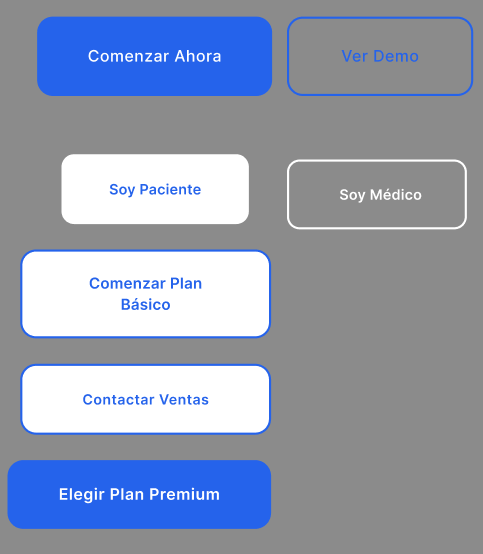
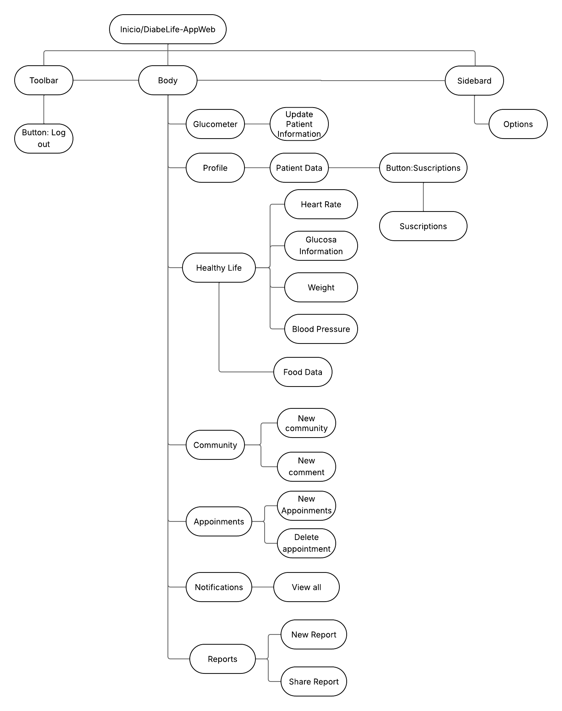
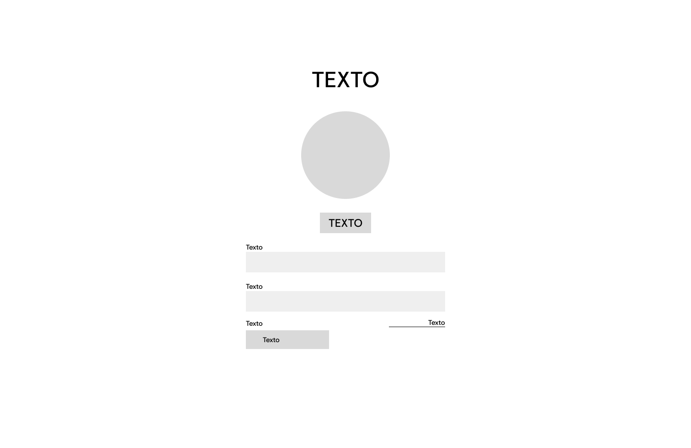
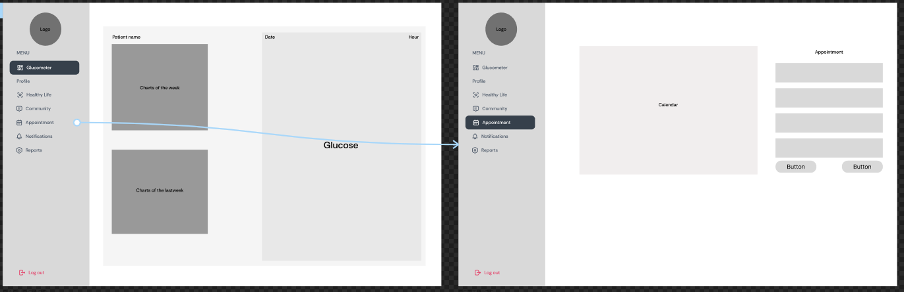
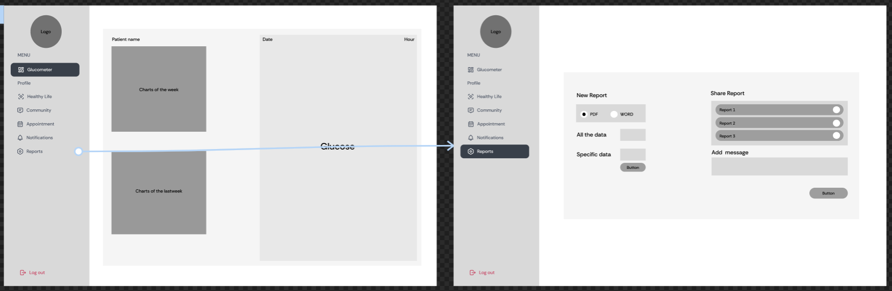
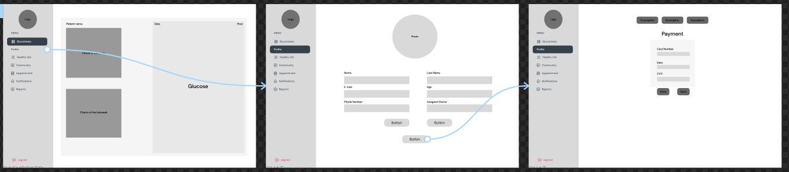
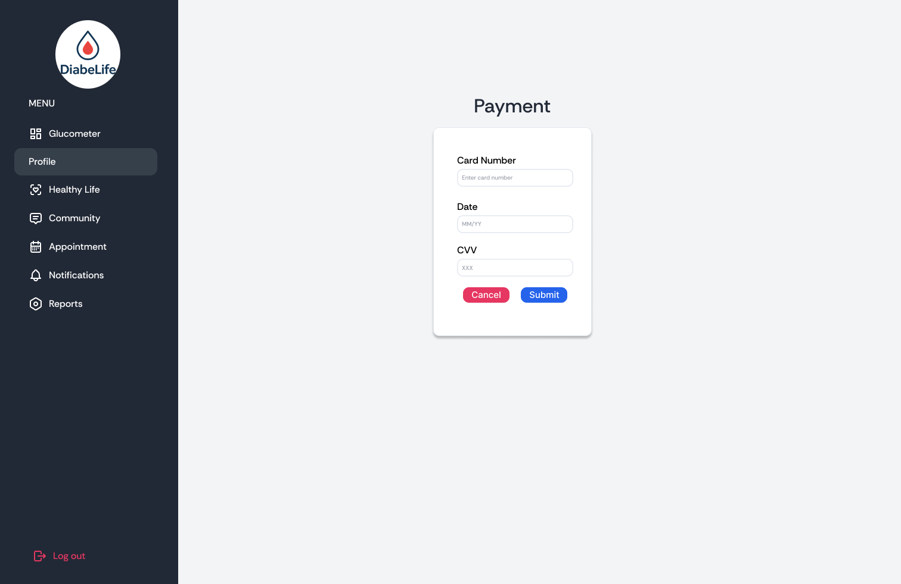
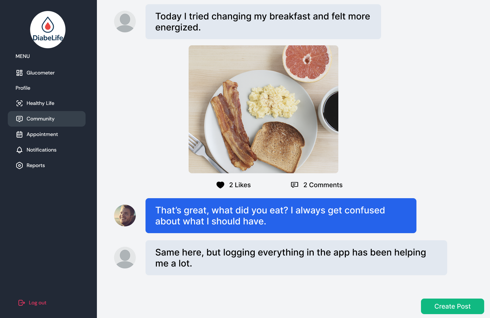

# Capítulo IV: Product Design

## 4.1. Style Guidelines.

En esta seccion se establecen las bases con las que realizaremos y organizaremos la presentacion de nuestro proyecto. Se incluyen los General Style Guidelines y los Web Style Guidelines.

### 4.1.1. General Style Guidelines.

Esta sección define los lineamientos visuales fundamentales del proyecto, incluyendo la paleta de colores, tipografías y elementos gráficos.

#### Colores Cromáticos:

Nuestra paleta de colores se ha seleccionado para proyectar serenidad, salud y confianza, elementos clave en una plataforma de salud. Los tonos se eligen para ser suaves a la vista, manteniendo un entorno claro y profesional, al mismo tiempo que guían las acciones del usuario.

- #2563EB (Azul Principal - Confianza y Profesionalismo): Este color es el pilar de nuestra identidad. Un azul vibrante que representa confianza, estabilidad, profesionalismo y tecnología. Se utiliza como color principal en elementos interactivos, fondos de secciones clave y componentes destacados para reforzar la seriedad y fiabilidad de la plataforma.

- #10B981 (Verde de Éxito - Vitalidad y Acción): Este tono de verde es enérgico y fresco, evocando vitalidad, salud y crecimiento. Se usa para botones principales y llamados a la acción, aportando dinamismo y señalando interacciones positivas o de confirmación, como "Contact Doctor" o "Subscribe". Su brillo lo hace altamente visible y atractivo.

#### Colores Acromáticos: 

Los colores neutros son la base de la legibilidad y la estructura de la aplicación. Su uso garantiza que el contenido sea el protagonista, permitiendo que la interfaz sea funcional y no cause fatiga visual.

- #FFFFFF (Blanco Puro): El fondo principal de la interfaz y de los campos de entrada de texto. Aporta limpieza visual, claridad y ligereza, permitiendo que el contenido respire y se mantenga fácilmente legible. Es crucial para el contraste.

- #36404B (Gris Profundo - Texto Primario / Fondo Secundario): Este gris oscuro se utiliza para títulos o elementos de texto que requieren mayor jerarquía visual, como los nombres de los campos y los datos del usuario. También puede servir como un fondo secundario oscuro en paneles o barras de navegación (como el menú lateral), aportando un contraste fuerte y elegante. Permite contraste sin recurrir al negro absoluto, manteniendo la estética moderna y legible.

- #222936 (Gris Muy Oscuro - Elementos de Navegación / Contraste Fuerte): Este es un tono de gris casi negro, aún más profundo que el anterior. Ideal para fondos de elementos de navegación (como el menú lateral completo), iconos inactivos o texto secundario en el menú. Aporta una base sólida y un contraste muy alto, garantizando la legibilidad de elementos claros sobre él.

#### Tipografia 

Para la tipografía, se han elegido fuentes sans-serif que son conocidas por su excelente legibilidad en pantalla. Las fuentes seleccionadas proyectan un tono profesional y accesible, crucial para la confianza en una aplicación de salud.

- Open Sans: Una fuente muy legible y versátil, ideal para el cuerpo de texto. Su diseño neutro y limpio garantiza que la información se transmita de manera clara y directa, desde reportes médicos hasta posts de la comunidad.

- Roboto: Una fuente moderna y amigable que combina la legibilidad con un toque técnico. Es perfecta para encabezados, títulos y botones de acción, donde su estructura geométrica aporta un estilo limpio y organizado.

#### Icono/Logotipo:

El logo de DiabeLife presenta una gota estilizada con un contorno azul y un centro rojo, evocando de inmediato la temática de la salud y el control de la diabetes. La forma de la gota simboliza la importancia de la sangre en el monitoreo y cuidado de esta condición, mientras que el trazo limpio y moderno transmite confianza y profesionalismo.

Significado: La unión del contorno azul y el centro rojo representa el equilibrio entre la tecnología, el autocuidado y la vida saludable, integrando en un solo símbolo la vigilancia y el bienestar de las personas con diabetes.

Color: El azul transmite tranquilidad, seguridad y confianza, mientras que el rojo central refuerza la vitalidad y la atención a la salud.

Este logo no solo identifica visualmente a la plataforma, sino que también comunica su propósito esencial: acompañar y empoderar a las personas con diabetes en cada etapa de su vida, brindando apoyo, información y herramientas para una vida plena y saludable.

### 4.1.2. Web Style Guidelines

Esta sección describe los lineamientos visuales aplicados a los componentes web interactivos de la landing page de DiabeLife, asegurando coherencia, claridad y accesibilidad, alineados a la identidad visual de la marca y a un diseño centrado en el usuario.

**Botones Principales**
  - **Color de fondo:** Azul vibrante (#2563EB, #2525EB, gradientes lineales).
  - **Tipografía:** Sans-serif moderna, peso medio a bold, tamaño 16px.
  - **Color de texto:** Blanco puro (#FFFFFF) para máximo contraste.
  - **Forma:** Esquinas redondeadas (border-radius 15px), estilo cápsula.

**Tono comunicacional:** Directo, profesional y motivador, invita a la acción con claridad y confianza.

  - **Color de fondo:** Azul vibrante (#2563EB), transmite dinamismo, confianza y modernidad.
  - **Color de texto:** Blanco puro (#FFFFFF), máximo contraste y legibilidad.
  - **Tipografía:** Sans serif, peso medio o bold, tamaño 16px, centrado.
  - **Forma:** Esquinas completamente redondeadas (999px), estilo cápsula.
  - **Estilo:** Plano, sin sombras ni decoraciones.
  - **Tono comunicacional:** Profesional, directo y entusiasta. Invita a la acción de forma clara y accesible, sin agresividad.

**Enlaces de Navegación**

  - **Texto:** Negro absoluto (#000000) sobre fondo blanco en el header; blanco (#FFFFFF) sobre fondo oscuro en el footer.
  - **Tipografía:** Sans-serif, 16px para navegación principal, 14px para enlaces secundarios.
  - **Estilo:** Sin subrayado, alineación limpia, espaciado generoso.
  - **Tono:** Profesional, moderno y claro.

**Header**
  - **Elementos:** Logotipo a la izquierda, menú de navegación a la derecha.
  - **Fondo:** Blanco puro (#FFFFFF).
  - **Estilo:** Barra fija, sombra sutil para separación.
  - **Tono:** Estructurado, accesible y confiable.

**Footer**
  - **Fondo:** Gradiente azul-verde (#2563EB a #10B981) en la sección superior; negro absoluto (#131826) en la inferior.
  - **Texto:** Blanco puro (#FFFFFF).
  - **Íconos:** Grises claros o azulados, tamaño 24px.
  - **Tono:** Respetuoso, confiable y sereno, con cierre visual ordenado.

**Secciones**
  - **Fondo:** Blanco (#FFFFFF) con bordes y sombras sutiles (#DDDDDD).
  - **Bordes:** Redondeados, separación clara entre secciones.
  - **Tono:** Limpio, profesional y accesible.

**Iconografía**
  - **Estilo:** Lineal, minimalista, flat, tamaño estándar 24px.
  - **Colores:** Azul (#2563EB), verde (#10B981), gris claro (#9EA3AE) según contexto.
  - **Tono:** Funcional, claro y coherente.

**Paleta de Colores Principal**
  - **Azul:** #2563EB, #2525EB, gradientes lineales (acción, confianza).
  - **Verde:** #10B981 (éxito, salud).
  - **Negro:** #000000, #131826 (texto principal, fondo footer).
  - **Blanco:** #FFFFFF, #F9FAFB (fondos, tarjetas).
  - **Gris:** #9EA3AE, #DDDDDD (bordes, iconos secundarios).
  - **Morado:** #7B61FF (acentos sutiles).

Tono Comunicacional General
Profesional, claro y empático.
Directo y motivador, sin perder cercanía.
Respetuoso y confiable, transmitiendo seguridad y apoyo.
Estos lineamientos aseguran una experiencia visual coherente, moderna y accesible, alineada con la misión de DiabeLife de acompañar y empoderar a las personas con diabetes.

## 4.2. Information Architecture

En esta seccion mostramos las decisiones de Arquitectura de Informacion para organizar el contenido de nuestra aplicacion de tal manera que los usuarios puedan tener una experiencia eficiente. Se incluyen las secciones de Organization Systems, Labeling Systems, Navigation Systems y Searching Systems.

### 4.2.1. Organization Systems

En este punto se mostraran los tipos de estructura visual que tendra cada grupo de informacion con respecto al segmento objetivo y al tipo de categorización que se usará

**Segmento Objetivo 1: Pacientes con Diabetes**

### 4.2.2. Labeling Systems

Al acceder a la plataforma web de Diabelife, los usuarios (pacientes y profesionales de la salud) pueden iniciar sesión, registrarse para crear una nueva cuenta, o recuperar su contraseña. La página principal y sus secciones están diseñadas para informar sobre los beneficios de la aplicación y convertir a los visitantes en suscriptores.

#### Navbar (Menú Principal):

- "Inicio": Redirige a la página principal de bienvenida.

- "Características": Muestra en detalle las funcionalidades clave de Diabelife (monitoreo IoT, comunidad, reportes, etc.).

- "Cómo Funciona": Explica el proceso desde la suscripción hasta la sincronización del glucómetro y el seguimiento.

- "Planes y Precios": Detalla los planes de suscripción (Básico y Premium) y sus beneficios correspondientes.

- "Para Profesionales": Una sección dedicada a los médicos, explicando cómo pueden usar la plataforma para gestionar a sus pacientes.

- "Contacto": Proporciona acceso directo a los canales de comunicación.

#### Secciones Principales:

- "Inicio": Página de bienvenida con un mensaje claro y un llamado a la acción, como "Toma el control de tu diabetes hoy".

- "Características": Descripción detallada del monitoreo automático con IoT, la red social de apoyo, la mensajería directa con doctores y el sistema de citas.

- "Cómo Funciona": Guía paso a paso, visual y sencilla, sobre la configuración de la cuenta y el uso de la aplicación y el glucómetro.

- "Planes y Precios": Tabla comparativa de los planes de suscripción, destacando las ventajas del plan Premium como la integración IoT y las alertas inteligentes.

- "Para Profesionales": Información sobre los beneficios para endocrinólogos y médicos generales, como el acceso a datos en tiempo real y la optimización del seguimiento de pacientes.

- "Contacto": Formulario y datos de contacto para resolver dudas sobre el servicio o el producto.

#### Formulario de Contacto:

- "Nombre Completo": Campo para ingresar el nombre del usuario.

- "Correo Electrónico": Espacio para la dirección de email.

- "Soy": Menú desplegable para seleccionar el perfil (Paciente, Profesional de la Salud, Otro).

- "Mensaje": Área para escribir la consulta o comentario.

- "Enviar Consulta": Botón para submitir el formulario.

#### Pie de Página:

- "Sobre Diabelife": Enlace a una sección que hable de la misión de la empresa.

- "Características": Acceso rápido a las funcionalidades.

- "Prensa": Sección para noticias y apariciones en medios.

- "Términos y Condiciones": Condiciones legales del uso del servicio.

- "Política de Privacidad": Política de protección y manejo de datos de salud.

- "Soporte / FAQ": Redirección a una página de preguntas frecuentes.

### 4.2.3. SEO Tags and Meta Tags

En esta seccion se mostraran los Meta Tags a usar dentro de nuestra landing page y web application.

<pre>
<code>
<title> Diabelife | Tu comunidad de Diabetes </title>
<meta name="description" data-i18n="meta.description" content="Plataforma integral para el manejo de diabetes. Conecta con médicos, otros pacientes y gestiona tu salud de manera inteligente.">
meta name="author" content="Iker Barturen, Stephano Espinoza, Gabriel Mamani, Andres Torres, Diego Véliz">
</code>
</pre>

### 4.2.4. Searching Systems

Esta sección presenta el sistema de búsqueda implementado en la plataforma Diabelife, diseñado para ser accesible y centrado en las necesidades del usuario.

1. ¿Qué se busca?

   Tiene como objetivo proporcionar una solución tecnológica integral y eficiente para personas que viven con cualquier tipo de diabetes. La búsqueda está orientada a empoderar a los usuarios en la autogestión de su condición, brindándoles herramientas para un control preciso de la glucosa, prevención de complicaciones, y un canal de comunicación directo con sus profesionales de la salud, todo a través de una aplicación web que sea intuitiva y fácil de usar.

2. ¿Qué resultados se mostrarán?

   Diabelife busca ofrecer un control detallado y simplificado de la diabetes, permitiendo a los usuarios visualizar su historial de glucosa, entender tendencias a través de gráficas y acceder a sus reportes médicos para tomar decisiones informadas sobre su salud, todo en una plataforma intuitiva y fácil de usar.

3. Interfaz de búsqueda

   La interfaz de búsqueda está diseñada para ser accesible e intuitiva, permitiendo a los usuarios encontrar rápidamente lo que necesitan. Dentro del módulo de comunidad, se incluirán sugerencias automáticas mientras se escribe y filtros para ordenar los resultados por categorías como temas de interés (dieta, ejercicio, tipo 1, tipo 2), fecha o relevancia. En los registros personales, se permitirá buscar mediciones por rango de fechas o etiquetas específicas.

### 4.2.5. Navigation Systems

Hemos decidido aplicar para un navigation system con un enfoque centrado en las tareas del usuario dentro de la aplicación. A continuación se muestra las tareas que serán accesibles desde la navegación.

### Dentro del perfil de Paciente:

- Monitoreo de Glucosa

- Comunidad

- Mis Reportes

- Chat con Doctor

- Citas

### Dentro del perfil de Doctor:

- Lista de Pacientes

- Añadir Paciente

- Reportes Médicos

- Chat

- Agenda de Citas

- Monitoreo de Paciente

## 4.3. Landing Page UI Design

En esta seccion se indicaran los bocetos iniciales de media y alta fidelidad de nuestra landing page usando las herramientas de Wireframes y Mock-ups. Para este boceto hemos considerado las elecciones de color conforme a nuestro Landing. Ademas, hemos considerado dentro de nuestra seccion de Productos las distintas funciones a las que se puede acceder segun los Organization y Navigation Systems.

### 4.3.1. Landing Page Wireframe

Esta sección presenta el esquema visual inicial de la landing page en baja fidelidad, definiendo la disposición básica de los elementos clave como encabezado, secciones informativas, navegación y llamado a la acción, alineados con la identidad del proyecto.

### 4.3.2. Landing Page Mock-up

La estructura del mockup destaca un encabezado claro con el logo y menú de navegación, seguido de una sección principal con mensaje de bienvenida y llamado a la acción. Se incluyen bloques informativos sobre los servicios, testimonios y beneficios, todos organizados en tarjetas o secciones bien diferenciadas. Los botones y elementos interactivos emplean el verde para resaltar acciones importantes. El diseño prioriza la legibilidad, el espacio en blanco y la accesibilidad, asegurando una experiencia de usuario amigable y profesional tanto en escritorio como en dispositivos móviles.

## 4.4. Web Applications UX/UI Design

En esta seccion se indicaran los bocetos iniciales de media y alta fidelidad de nuestra Web Application usando las herramientas de Wireframes y Mock-ups. Ademas, hemos considerado como funcionalidades a las que puede acceder cada segmento la separacion indicada en los Organization y Navigation Systems.

### 4.4.1. Web Applications Wireframes

User goal: Como madre quiero ver los signos vitales de mi bebe para comprobar su estado de salud.

### 4.4.2. Web Applications Wireflow Diagrams

Tomando en cuenta cada objetivo de cada segmento, se han creado los siguientes wireflows para cada uno de ellos.

User Goal: Como paciente con diabetes quiero iniciar sesión en la aplicación para acceder a mis datos de salud y funcionalidades personalizadas.

User Goal: Como paciente con diabetes quiero editar mi perfil personal para mantener actualizada mi información médica y datos de contacto.

User Goal: Como paciente con diabetes quiero crear y leer publicaciones en el foro comunitario para conectar con otros pacientes y compartir experiencias

User Goal: Como paciente con diabetes quiero agendar una cita con mi médico especialista para recibir seguimiento profesional de mi condición.

User Goal: Como paciente con diabetes quiero acceder a mis reportes médicos y análisis para revisar mi historial clínico y evolución de la enfermedad.

User Goal: Como paciente con diabetes quiero actualizar mi plan de suscripción para acceder a funcionalidades premium y mejorar mi experiencia en la gestión de la enfermedad.

### 4.4.2. Web Applications Mock-ups

### 4.4.3. Web Applications User Flow Diagrams

Tomando en cuenta cada objetivo de cada segmento, se han creado los siguientes user flow diagrams para cada uno de ellos.

User Goal: Como paciente con diabetes quiero iniciar sesión en la aplicación para acceder a mis datos de salud y funcionalidades personalizadas.

User Goal: Como paciente con diabetes quiero editar mi perfil personal para mantener actualizada mi información médica y datos de contacto.

User Goal: Como paciente con diabetes quiero crear y leer publicaciones en el foro comunitario para conectar con otros pacientes y compartir experiencias

User Goal: Como paciente con diabetes quiero agendar una cita con mi médico especialista para recibir seguimiento profesional de mi condición.

User Goal: Como paciente con diabetes quiero acceder a mis reportes médicos y análisis para revisar mi historial clínico y evolución de la enfermedad.

User Goal: Como paciente con diabetes quiero actualizar mi plan de suscripción para acceder a funcionalidades premium y mejorar mi experiencia en la gestión de la enfermedad.

## 4.5. Web Applications Prototyping

**1. Navegación Principal Consistente:**

Se implementó una barra de navegación lateral izquierda persistente que concentra las secciones principales: Glucometer, Profile, Healthy Life, Community, Appointment, Notifications y Reports. Esta estructura asegura que el usuario tenga siempre acceso rápido y visible a todas las áreas relevantes de la aplicación, evitando la desorientación y favoreciendo un flujo de navegación continuo y coherente. La ubicación fija de la barra respalda la accesibilidad y la organización lógica de las funcionalidades, adaptándose a distintos escenarios de uso.

**2. Pantallas de Registro y Acceso:**

La pantalla de Log in presenta un diseño minimalista y centrado en la tarea, con campos simples para correo/usuario y contraseña, complementados con la opción Remember me. El estilo sobrio y enfocado en la acción principal ayuda a reducir fricciones en el ingreso, manteniendo la identidad visual clara gracias al logotipo centrado.

**3. Seguimiento de Salud en "Healthy Life"**

La sección Healthy Life permite registrar datos clave de salud: Heart Rate, Glucose, Weight y Blood Pressure. Cada campo está claramente diferenciado y acompañado de su respectiva unidad de medida. Al guardar los registros, el sistema genera un cuadro de resumen y ofrece recomendaciones de alimentación. Esta retroalimentación inmediata da soporte al usuario en la interpretación de sus datos, aportando valor más allá del simple almacenamiento.

**4. Monitoreo Gráfico en "Glucometer"**

El módulo de Glucometer integra visualizaciones semanales mediante gráficos de línea que muestran las variaciones de la glucosa. Además, incluye un panel derecho con el valor actual (ejemplo: 145 mg/dL), una etiqueta de estado (High/Normal/Low) y una tendencia proyectada. Esta representación combina datos numéricos y visuales, otorgando claridad y fomentando decisiones rápidas y basadas en evidencia.

**5. Interacción Comunitaria en "Community"**

La sección Community se ha diseñado como un espacio colaborativo. Los usuarios pueden unirse o crear comunidades, y dentro de ellas compartir experiencias mediante mensajes. El diseño de conversación estilo chat replica una interacción social real, reforzando el sentido de acompañamiento. Se privilegia la claridad de roles (usuario vs. comunidad) y se fomenta la participación activa con mensajes directos, acompañados de botones de acción claros como Join Community o Create Community.

**6. Gestión de Citas en "Appointment"**

El módulo de Appointment incluye un calendario central y un panel derecho con la lista de citas confirmadas. Cada cita muestra fecha, hora y médico asignado, con la posibilidad de Add o Edit. Esta disposición permite tanto la visualización global (días disponibles) como la gestión puntual de compromisos, facilitando la organización personal.

**7. Notificaciones Claras y Accionables**

La sección de Notifications presenta un listado cronológico de mensajes provenientes de distintas fuentes: doctores, el sistema, nutricionistas o la comunidad. Cada notificación muestra el remitente, el contenido resumido, la fecha y opciones rápidas de interacción (marcar como leído o eliminar). Se incluye un botón destacado See All Messages, que concentra la gestión completa de alertas.

**8. Reportes Personalizados en "Reports"**

En este apartado, los usuarios pueden generar reportes en PDF o Word, ya sea con toda la información o con datos específicos (glucosa, peso, presión, frecuencia cardíaca). Asimismo, los reportes pueden compartirse con mensajes personalizados, quedando un historial visible con el estado de cada uno (compartido/no compartido). Esta flexibilidad responde tanto a necesidades personales como a contextos médicos de colaboración.

**9. Gestión de Perfil y Suscripciones**

El perfil del usuario muestra información personal básica junto con datos médicos relevantes, y ofrece botones de acción como Update Profile, Contact Doctor y Subscribe. Además, se integró un módulo de pago con formulario sencillo (número de tarjeta, fecha y CVV) que facilita la suscripción sin distraer al usuario de su flujo principal.

**Link del video:** https://upcedupe-my.sharepoint.com/:v:/g/personal/u202312557_upc_edu_pe/EVBxhai5JehDpv-_3AJ3IyYBoA3mmjO3h-Dmj-zAGamQIg?e=J8jtde

## 4.6. Domain-Driven Software Architecture
### 4.6.1. Design-Level Event Storming

### 4.6.2. Software Architecture Context Diagram

### 4.6.3. Software Architecture Container Diagrams

### 4.6.4. Software Architecture Components Diagrams

## 4.7. Software Object-Oriented Design

### 4.7.1. Class Diagrams

En esta sección se presentan los diagramas de clases del sistema Diabelife, una aplicación web orientada a la gestión integral de la diabetes. Cada diagrama corresponde a un Bounded Context (BC) identificado en el dominio del sistema, representando las principales entidades, servicios y componentes involucrados en su funcionamiento. Los diagramas permiten visualizar de manera estructurada cómo se relacionan los elementos dentro de cada contexto, facilitando la comprensión del modelo de datos y la lógica de negocio.

El BC Appointments modela la gestión de citas médicas. Doctores y pacientes se relacionan a través de citas con fecha, hora y estado. El servicio administra la programación y cancelación, y los componentes permiten visualizar el calendario y registrar nuevas citas.

El diagrama de clases del BC Community modela la interacción social entre pacientes y doctores. Incluye usuarios que pueden crear publicaciones y comentarios. El servicio gestiona las operaciones de creación y consulta, mientras que los componentes permiten la visualización y participación en el foro.

En el BC Glucometro se gestiona la conexión IoT con los dispositivos de medición de glucosa. Los pacientes reciben sus mediciones automáticamente desde el dispositivo. El servicio procesa y analiza los valores, mientras que los componentes permiten mostrar gráficas e historial de mediciones.

El BC Reports representa el registro y gestión de reportes médicos. Los doctores pueden generar diagnósticos vinculados a pacientes, los cuales se almacenan como reportes. El servicio centraliza la lógica de creación y exportación, mientras que los componentes permiten la administración y consulta de los informes.

El BC Subscriptions representa la administración de planes y pagos de la aplicación. Incluye suscripciones activas, métodos de pago e historial de facturas. Los servicios gestionan la creación de suscripciones y el procesamiento de pagos, y los componentes permiten seleccionar planes, registrar información de pago y consultar facturas.

El BC HealthyLife modela la planificación de la vida saludable del paciente. Permite registrar medicamentos, planes de alimentación y visitas médicas. El servicio gestiona estas rutinas y los componentes facilitan la organización semanal mediante formularios y planificadores visuales.

## 4.8. Database Design
En esta seccion especificaremos la especificacion de la organizacion para la base de datos de nuestra solucion.

### 4.8.1. Database Diagrams

