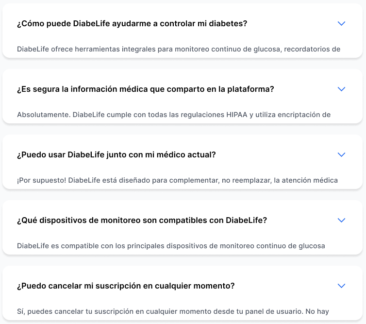
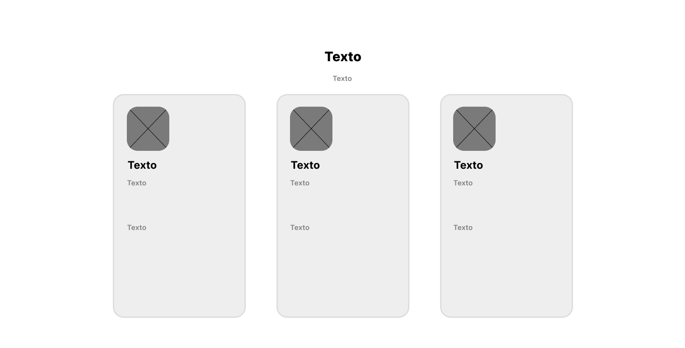

# Capítulo IV: Product Design

## 4.1. Style Guidelines.

En esta seccion se establecen las bases con las que realizaremos y organizaremos la presentacion de nuestro proyecto. Se incluyen los General Style Guidelines y los Web Style Guidelines.

### 4.1.1. General Style Guidelines.

Esta sección define los lineamientos visuales fundamentales del proyecto, incluyendo la paleta de colores, tipografías y elementos gráficos.

#### Colores Cromáticos:

Nuestra paleta de colores se ha seleccionado para proyectar serenidad, salud y confianza, elementos clave en una plataforma de salud. Los tonos se eligen para ser suaves a la vista, manteniendo un entorno claro y profesional.

- #3498DB (Azul de Confianza - Principal): Este color es el pilar de nuestra identidad visual. Un azul medio y profesional que evoca confianza, estabilidad y seriedad. Es perfecto para fondos, encabezados y componentes principales, creando un ambiente de seguridad y fiabilidad para el usuario.

- #6CB7B0 (Verde Aqua Suave - Acento / Diabetes-friendly): Este tono de verde es un verde azulado suave, que evoca frescura, calma y limpieza. Es un color que se asocia con el bienestar y la gestión de la salud, y su matiz lo hace un excelente complemento para el azul principal. Se usará estratégicamente para botones de acción principales, iconos de éxito, gráficos de progreso y elementos que representen la gestión de la salud o la conciencia de la diabetes.
#### Colores Acromáticos: 

Los colores neutros son la base de la legibilidad y la estructura de la aplicación. Su uso garantiza que el contenido sea el protagonista, permitiendo que la interfaz sea funcional y no cause fatiga visual.

- #FFFFFF (Blanco Puro): El color de fondo principal de la plataforma. Proporciona una sensación de limpieza, amplitud y claridad, permitiendo que el contenido y los datos de salud sean fácilmente legibles.

- #F5F8F9 (Gris Claro de Fondo): Utilizado para fondos de tarjetas, contenedores de información y áreas que necesitan una diferenciación sutil. Su objetivo es segmentar visualmente el contenido sin crear un contraste brusco.

- #95A5A6 (Gris de Referencia): Un gris medio que se usa para textos secundarios, iconos inactivos y descripciones. Ofrece un contraste adecuado sin ser tan dominante como el texto principal.

- #2C3E50 (Gris Oscuro de Contenido): Un gris casi negro que se utiliza para títulos, textos de gran importancia y elementos que requieren la máxima legibilidad. Proporciona un contraste óptimo para el cuerpo de texto, reduciendo la tensión en la vista.

#### Tipografía

Para la tipografía, se han elegido fuentes sans-serif que son conocidas por su excelente legibilidad en pantalla. Las fuentes seleccionadas proyectan un tono profesional y accesible, crucial para la confianza en una aplicación de salud.

- Open Sans: Una fuente muy legible y versátil, ideal para el cuerpo de texto. Su diseño neutro y limpio garantiza que la información se transmita de manera clara y directa, desde reportes médicos hasta posts de la comunidad.

- Roboto: Una fuente moderna y amigable que combina la legibilidad con un toque técnico. Es perfecta para encabezados, títulos y botones de acción, donde su estructura geométrica aporta un estilo limpio y organizado.

#### Icono/Logotipo:

El logo de DiabeLife presenta una gota estilizada con un contorno azul y un centro rojo, evocando de inmediato la temática de la salud y el control de la diabetes. La forma de la gota simboliza la importancia de la sangre en el monitoreo y cuidado de esta condición, mientras que el trazo limpio y moderno transmite confianza y profesionalismo.

Significado: La unión del contorno azul y el centro rojo representa el equilibrio entre la tecnología, el autocuidado y la vida saludable, integrando en un solo símbolo la vigilancia y el bienestar de las personas con diabetes.

Color: El azul transmite tranquilidad, seguridad y confianza, mientras que el rojo central refuerza la vitalidad y la atención a la salud.

Este logo no solo identifica visualmente a la plataforma, sino que también comunica su propósito esencial: acompañar y empoderar a las personas con diabetes en cada etapa de su vida, brindando apoyo, información y herramientas para una vida plena y saludable.

### 4.1.2. Web Style Guidelines

Esta sección describe los lineamientos visuales aplicados a los componentes web interactivos de la landing page de DiabeLife, asegurando coherencia, claridad y accesibilidad, alineados a la identidad visual de la marca y a un diseño centrado en el usuario.

Botones Principales (CTA)

Color de fondo: Azul vibrante (#2563EB, #2525EB, gradientes lineales).
Tipografía: Sans-serif moderna, peso medio a bold, tamaño 16px.
Color de texto: Blanco puro (#FFFFFF) para máximo contraste.
Forma: Esquinas redondeadas (border-radius 15px), estilo cápsula.

Tono comunicacional: Directo, profesional y motivador, invita a la acción con claridad y confianza.

Color de fondo: Azul vibrante (#2563EB), transmite dinamismo, confianza y modernidad.
Color de texto: Blanco puro (#FFFFFF), máximo contraste y legibilidad.
Tipografía: Sans serif, peso medio o bold, tamaño 16px, centrado.
Forma: Esquinas completamente redondeadas (999px), estilo cápsula.
Estilo: Plano, sin sombras ni decoraciones.
Tono comunicacional: Profesional, directo y entusiasta. Invita a la acción de forma clara y accesible, sin agresividad.

Enlaces de Navegación

Texto: Negro absoluto (#000000) sobre fondo blanco en el header; blanco (#FFFFFF) sobre fondo oscuro en el footer.
Tipografía: Sans-serif, 16px para navegación principal, 14px para enlaces secundarios.
Estilo: Sin subrayado, alineación limpia, espaciado generoso.
Tono: Profesional, moderno y claro.

Header
Elementos: Logotipo a la izquierda, menú de navegación a la derecha.
Fondo: Blanco puro (#FFFFFF).
Estilo: Barra fija, sombra sutil para separación.
Tono: Estructurado, accesible y confiable.

Footer
Fondo: Gradiente azul-verde (#2563EB a #10B981) en la sección superior; negro absoluto (#131826) en la inferior.
Texto: Blanco puro (#FFFFFF).
Íconos: Grises claros o azulados, tamaño 24px.
Tono: Respetuoso, confiable y sereno, con cierre visual ordenado.

Secciones
Fondo: Blanco (#FFFFFF) con bordes y sombras sutiles (#DDDDDD).
Bordes: Redondeados, separación clara entre secciones.
Tono: Limpio, profesional y accesible.

Iconografía
Estilo: Lineal, minimalista, flat, tamaño estándar 24px.
Colores: Azul (#2563EB), verde (#10B981), gris claro (#9EA3AE) según contexto.
Tono: Funcional, claro y coherente.

Paleta de Colores Principal
Azul: #2563EB, #2525EB, gradientes lineales (acción, confianza).
Verde: #10B981 (éxito, salud).
Negro: #000000, #131826 (texto principal, fondo footer).
Blanco: #FFFFFF, #F9FAFB (fondos, tarjetas).
Gris: #9EA3AE, #DDDDDD (bordes, iconos secundarios).
Morado: #7B61FF (acentos sutiles).

Tono Comunicacional General
Profesional, claro y empático.
Directo y motivador, sin perder cercanía.
Respetuoso y confiable, transmitiendo seguridad y apoyo.
Estos lineamientos aseguran una experiencia visual coherente, moderna y accesible, alineada con la misión de DiabeLife de acompañar y empoderar a las personas con diabetes.

## 4.2. Information Architecture

En esta seccion mostramos las decisiones de Arquitectura de Informacion para organizar el contenido de nuestra aplicacion de tal manera que los usuarios puedan tener una experiencia eficiente. Se incluyen las secciones de Organization Systems, Labeling Systems, Navigation Systems y Searching Systems.

### 4.2.1. Organization Systems

En este punto se mostraran los tipos de estructura visual que tendra cada grupo de informacion con respecto al segmento objetivo y al tipo de categorización que se usará

Segmento Objetivo 1: Usuarios con Diabetes 

### 4.2.2. Labeling Systems

Al acceder a la plataforma web de Diabelife, los usuarios (pacientes y profesionales de la salud) pueden iniciar sesión, registrarse para crear una nueva cuenta, o recuperar su contraseña. La página principal y sus secciones están diseñadas para informar sobre los beneficios de la aplicación y convertir a los visitantes en suscriptores.

#### Navbar (Menú Principal):

- "Inicio": Redirige a la página principal de bienvenida.

- "Características": Muestra en detalle las funcionalidades clave de Diabelife (monitoreo IoT, comunidad, reportes, etc.).

- "Cómo Funciona": Explica el proceso desde la suscripción hasta la sincronización del glucómetro y el seguimiento.

- "Planes y Precios": Detalla los planes de suscripción (Básico y Premium) y sus beneficios correspondientes.

- "Para Profesionales": Una sección dedicada a los médicos, explicando cómo pueden usar la plataforma para gestionar a sus pacientes.

- "Contacto": Proporciona acceso directo a los canales de comunicación.

#### Secciones Principales:

- "Inicio": Página de bienvenida con un mensaje claro y un llamado a la acción, como "Toma el control de tu diabetes hoy".

- "Características": Descripción detallada del monitoreo automático con IoT, la red social de apoyo, la mensajería directa con doctores y el sistema de citas.

- "Cómo Funciona": Guía paso a paso, visual y sencilla, sobre la configuración de la cuenta y el uso de la aplicación y el glucómetro.

- "Planes y Precios": Tabla comparativa de los planes de suscripción, destacando las ventajas del plan Premium como la integración IoT y las alertas inteligentes.

- "Para Profesionales": Información sobre los beneficios para endocrinólogos y médicos generales, como el acceso a datos en tiempo real y la optimización del seguimiento de pacientes.

- "Contacto": Formulario y datos de contacto para resolver dudas sobre el servicio o el producto.

#### Formulario de Contacto:

- "Nombre Completo": Campo para ingresar el nombre del usuario.

- "Correo Electrónico": Espacio para la dirección de email.

- "Soy": Menú desplegable para seleccionar el perfil (Paciente, Profesional de la Salud, Otro).

- "Mensaje": Área para escribir la consulta o comentario.

- "Enviar Consulta": Botón para submitir el formulario.

#### Pie de Página:

- "Sobre Diabelife": Enlace a una sección que hable de la misión de la empresa.

- "Características": Acceso rápido a las funcionalidades.

- "Prensa": Sección para noticias y apariciones en medios.

- "Términos y Condiciones": Condiciones legales del uso del servicio.

- "Política de Privacidad": Política de protección y manejo de datos de salud.

- "Soporte / FAQ": Redirección a una página de preguntas frecuentes.

### 4.2.3. SEO Tags and Meta Tags

En esta seccion se mostraran los Meta Tags a usar dentro de nuestra landing page y web application.

<pre>
<code>
<title> Diabelife | Tu comunidad de Diabetes </title>
<meta name="description" data-i18n="meta.description" content="Plataforma integral para el manejo de diabetes. Conecta con médicos, otros pacientes y gestiona tu salud de manera inteligente.">
meta name="author" content="Iker Barturen, Stephano Espinoza, Gabriel Mamani, Andres Torres, Diego Véliz">
</code>
</pre>

### 4.2.4. Searching Systems

Esta sección presenta el sistema de búsqueda implementado en la plataforma Diabelife, diseñado para ser accesible y centrado en las necesidades del usuario.

1. ¿Qué se busca?

   Tiene como objetivo proporcionar una solución tecnológica integral y eficiente para personas que viven con cualquier tipo de diabetes. La búsqueda está orientada a empoderar a los usuarios en la autogestión de su condición, brindándoles herramientas para un control preciso de la glucosa, prevención de complicaciones, y un canal de comunicación directo con sus profesionales de la salud, todo a través de una aplicación web que sea intuitiva y fácil de usar.

2. ¿Qué resultados se mostrarán?

   Diabelife busca ofrecer un control detallado y simplificado de la diabetes, permitiendo a los usuarios visualizar su historial de glucosa, entender tendencias a través de gráficas y acceder a sus reportes médicos para tomar decisiones informadas sobre su salud, todo en una plataforma intuitiva y fácil de usar.

3. Interfaz de búsqueda

   La interfaz de búsqueda está diseñada para ser accesible e intuitiva, permitiendo a los usuarios encontrar rápidamente lo que necesitan. Dentro del módulo de comunidad, se incluirán sugerencias automáticas mientras se escribe y filtros para ordenar los resultados por categorías como temas de interés (dieta, ejercicio, tipo 1, tipo 2), fecha o relevancia. En los registros personales, se permitirá buscar mediciones por rango de fechas o etiquetas específicas.

### 4.2.5. Navigation Systems

Hemos decidido aplicar para un navigation system con un enfoque centrado en las tareas del usuario dentro de la aplicación. A continuación se muestra las tareas que serán accesibles desde la navegación.

### Dentro del perfil de Paciente:

- Monitoreo de Glucosa

- Comunidad

- Mis Reportes

- Chat con Doctor

- Citas

### Dentro del perfil de Doctor:

- Lista de Pacientes

- Añadir Paciente

- Reportes Médicos

- Chat

- Agenda de Citas

- Monitoreo de Paciente

## 4.3. Landing Page UI Design

En esta seccion se indicaran los bocetos iniciales de media y alta fidelidad de nuestra landing page usando las herramientas de Wireframes y Mock-ups. Para este boceto hemos considerado las elecciones de color conforme a nuestro Landing. Ademas, hemos considerado dentro de nuestra seccion de Productos las distintas funciones a las que se puede acceder segun los Organization y Navigation Systems.

### 4.3.1. Landing Page Wireframe

Esta sección presenta el esquema visual inicial de la landing page en baja fidelidad, definiendo la disposición básica de los elementos clave como encabezado, secciones informativas, navegación y llamado a la acción, alineados con la identidad del proyecto.

### 4.3.2. Landing Page Mock-up

La estructura del mockup destaca un encabezado claro con el logo y menú de navegación, seguido de una sección principal con mensaje de bienvenida y llamado a la acción. Se incluyen bloques informativos sobre los servicios, testimonios y beneficios, todos organizados en tarjetas o secciones bien diferenciadas. Los botones y elementos interactivos emplean el verde para resaltar acciones importantes. El diseño prioriza la legibilidad, el espacio en blanco y la accesibilidad, asegurando una experiencia de usuario amigable y profesional tanto en escritorio como en dispositivos móviles.

## 4.4. Web Applications UX/UI Design
### 4.4.1. Web Applications Wireframes
### 4.4.2. Web Applications Wireflow Diagrams
### 4.4.2. Web Applications Mock-ups
### 4.4.3. Web Applications User Flow Diagrams
## 4.5. Web Applications Prototyping
## 4.6. Domain-Driven Software Architecture
### 4.6.1. Design-Level Event Storming

### 4.6.2. Software Architecture Context Diagram

### 4.6.3. Software Architecture Container Diagrams

### 4.6.4. Software Architecture Components Diagrams

## 4.7. Software Object-Oriented Design
### 4.7.1. Class Diagrams

## 4.8. Database Design
### 4.8.1. Database Diagrams