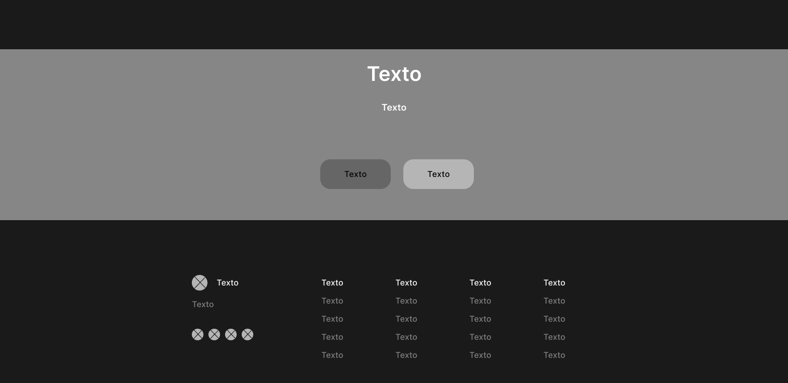

# Capítulo IV: Product Design

## 4.1. Style Guidelines.

En esta seccion se establecen las bases con las que realizaremos y organizaremos la presentacion de nuestro proyecto. Se incluyen los General Style Guidelines y los Web Style Guidelines.

### 4.1.1. General Style Guidelines.

Esta sección define los lineamientos visuales fundamentales del proyecto, incluyendo la paleta de colores, tipografías y elementos gráficos.

#### Colores Cromáticos:

Nuestra paleta de colores se ha seleccionado para proyectar serenidad, salud y confianza, elementos clave en una plataforma de salud. Los tonos se eligen para ser suaves a la vista, manteniendo un entorno claro y profesional.

- #3498DB (Azul de Confianza - Principal): Este color es el pilar de nuestra identidad visual. Un azul medio y profesional que evoca confianza, estabilidad y seriedad. Es perfecto para fondos, encabezados y componentes principales, creando un ambiente de seguridad y fiabilidad para el usuario.

- #6CB7B0 (Verde Aqua Suave - Acento / Diabetes-friendly): Este tono de verde es un verde azulado suave, que evoca frescura, calma y limpieza. Es un color que se asocia con el bienestar y la gestión de la salud, y su matiz lo hace un excelente complemento para el azul principal. Se usará estratégicamente para botones de acción principales, iconos de éxito, gráficos de progreso y elementos que representen la gestión de la salud o la conciencia de la diabetes.
#### Colores Acromáticos: 

Los colores neutros son la base de la legibilidad y la estructura de la aplicación. Su uso garantiza que el contenido sea el protagonista, permitiendo que la interfaz sea funcional y no cause fatiga visual.

- #FFFFFF (Blanco Puro): El color de fondo principal de la plataforma. Proporciona una sensación de limpieza, amplitud y claridad, permitiendo que el contenido y los datos de salud sean fácilmente legibles.

- #F5F8F9 (Gris Claro de Fondo): Utilizado para fondos de tarjetas, contenedores de información y áreas que necesitan una diferenciación sutil. Su objetivo es segmentar visualmente el contenido sin crear un contraste brusco.

- #95A5A6 (Gris de Referencia): Un gris medio que se usa para textos secundarios, iconos inactivos y descripciones. Ofrece un contraste adecuado sin ser tan dominante como el texto principal.

- #2C3E50 (Gris Oscuro de Contenido): Un gris casi negro que se utiliza para títulos, textos de gran importancia y elementos que requieren la máxima legibilidad. Proporciona un contraste óptimo para el cuerpo de texto, reduciendo la tensión en la vista.

#### Tipografía

Para la tipografía, se han elegido fuentes sans-serif que son conocidas por su excelente legibilidad en pantalla. Las fuentes seleccionadas proyectan un tono profesional y accesible, crucial para la confianza en una aplicación de salud.

- Open Sans: Una fuente muy legible y versátil, ideal para el cuerpo de texto. Su diseño neutro y limpio garantiza que la información se transmita de manera clara y directa, desde reportes médicos hasta posts de la comunidad.

- Roboto: Una fuente moderna y amigable que combina la legibilidad con un toque técnico. Es perfecta para encabezados, títulos y botones de acción, donde su estructura geométrica aporta un estilo limpio y organizado.

#### Icono/Logotipo:

### 4.1.2. Web Style Guidelines
## 4.2. Information Architecture

En esta seccion mostramos las decisiones de Arquitectura de Informacion para organizar el contenido de nuestra aplicacion de tal manera que los usuarios puedan tener una experiencia eficiente. Se incluyen las secciones de Organization Systems, Labeling Systems, Navigation Systems y Searching Systems.

### 4.2.1. Organization Systems

En este punto se mostraran los tipos de estructura visual que tendra cada grupo de informacion con respecto al segmento objetivo y al tipo de categorización que se usará

Segmento Objetivo 1: Usuarios con Diabetes 

### 4.2.2. Labeling Systems

Al acceder a la plataforma web de Diabelife, los usuarios (pacientes y profesionales de la salud) pueden iniciar sesión, registrarse para crear una nueva cuenta, o recuperar su contraseña. La página principal y sus secciones están diseñadas para informar sobre los beneficios de la aplicación y convertir a los visitantes en suscriptores.

### 4.2.3. SEO Tags and Meta Tags
### 4.2.4. Searching Systems
### 4.2.5. Navigation Systems
## 4.3. Landing Page UI Design

En esta seccion se indicaran los bocetos iniciales de media y alta fidelidad de nuestra landing page usando las herramientas de Wireframes y Mock-ups. Para este boceto hemos considerado las elecciones de color conforme a nuestro Landing. Ademas, hemos considerado dentro de nuestra seccion de Productos las distintas funciones a las que se puede acceder segun los Organization y Navigation Systems.

Navbar (Menú Principal):

"Inicio": Redirige a la página principal de bienvenida.

"Características": Muestra en detalle las funcionalidades clave de Diabelife (monitoreo IoT, comunidad, reportes, etc.).

"Cómo Funciona": Explica el proceso desde la suscripción hasta la sincronización del glucómetro y el seguimiento.

"Planes y Precios": Detalla los planes de suscripción (Básico y Premium) y sus beneficios correspondientes.

"Para Profesionales": Una sección dedicada a los médicos, explicando cómo pueden usar la plataforma para gestionar a sus pacientes.

"Contacto": Proporciona acceso directo a los canales de comunicación.

### 4.3.1. Landing Page Wireframe

Esta sección presenta el esquema visual inicial de la landing page en baja fidelidad, definiendo la disposición básica de los elementos clave como encabezado, secciones informativas, navegación y llamado a la acción, alineados con la identidad del proyecto.

### 4.3.2. Landing Page Mock-up

La estructura del mockup destaca un encabezado claro con el logo y menú de navegación, seguido de una sección principal con mensaje de bienvenida y llamado a la acción. Se incluyen bloques informativos sobre los servicios, testimonios y beneficios, todos organizados en tarjetas o secciones bien diferenciadas. Los botones y elementos interactivos emplean el verde para resaltar acciones importantes. El diseño prioriza la legibilidad, el espacio en blanco y la accesibilidad, asegurando una experiencia de usuario amigable y profesional tanto en escritorio como en dispositivos móviles.

## 4.4. Web Applications UX/UI Design
### 4.4.1. Web Applications Wireframes
### 4.4.2. Web Applications Wireflow Diagrams
### 4.4.2. Web Applications Mock-ups
### 4.4.3. Web Applications User Flow Diagrams
## 4.5. Web Applications Prototyping
## 4.6. Domain-Driven Software Architecture
### 4.6.1. Design-Level Event Storming
### 4.6.2. Software Architecture Context Diagram
### 4.6.3. Software Architecture Container Diagrams
### 4.6.4. Software Architecture Components Diagrams
## 4.7. Software Object-Oriented Design
### 4.7.1. Class Diagrams
## 4.8. Database Design
### 4.8.1. Database Diagrams