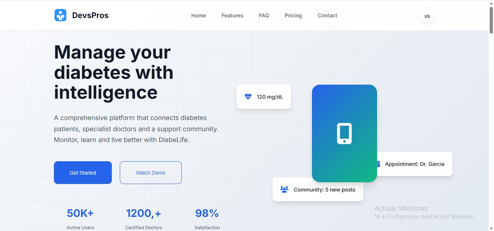
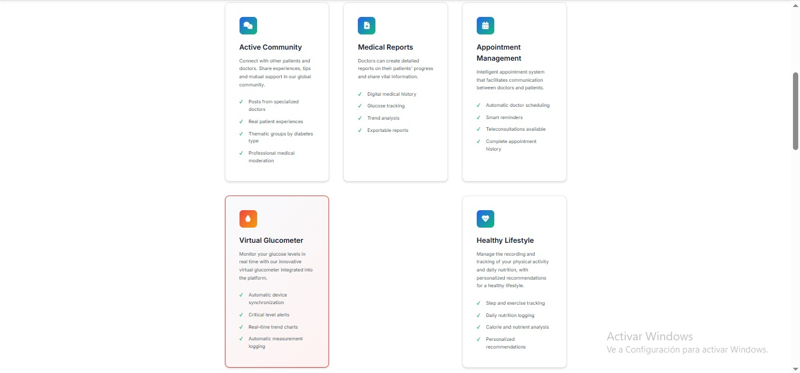
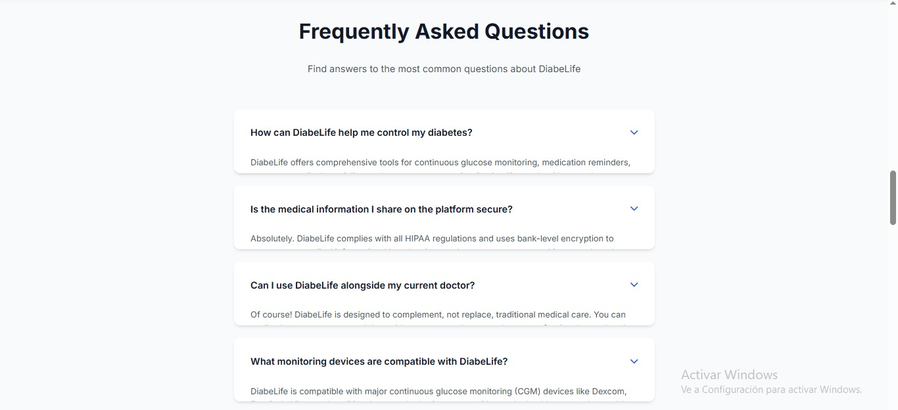
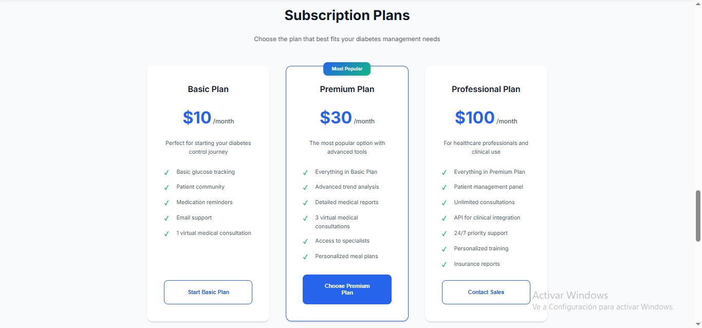
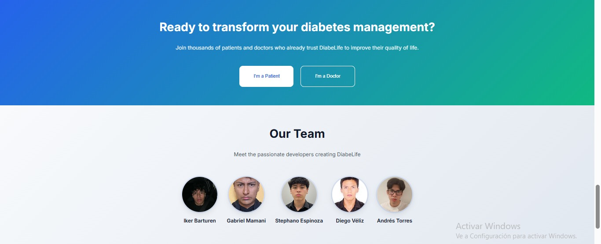
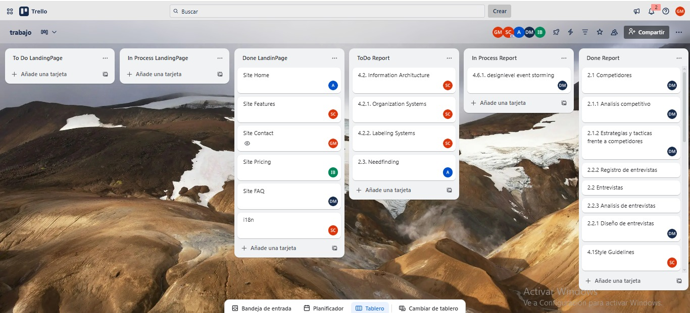
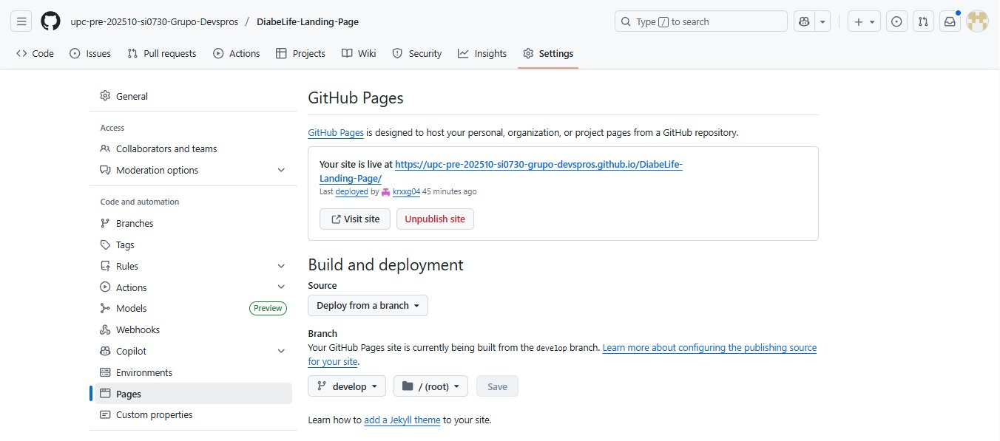
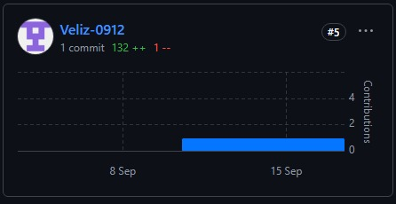
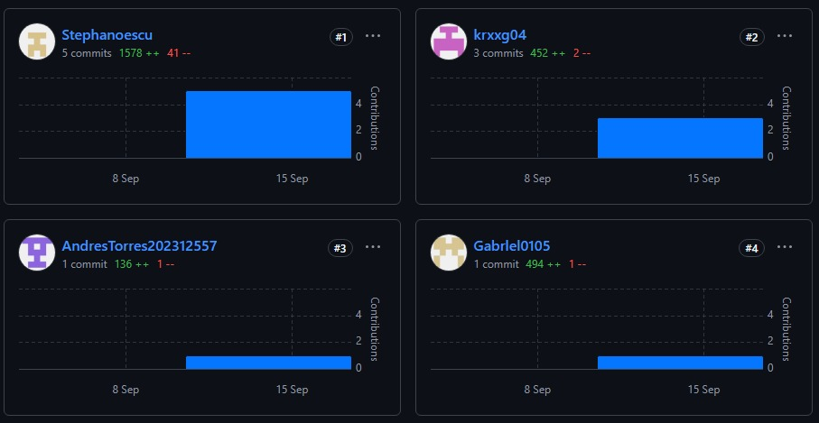

# Capítulo V: Product Implementation, Validation & Deployment.

En esta sección se describen las decisiones y lineamientos que garantizan consistencia en el desarrollo del proyecto.

# 5.1. Software Configuration Management.

En esta sección se presentan los productos de software empleados en el proyecto, cuyos enlaces correspondientes se encuentran disponibles en los anexos

# 5.1.1. Software Development Environment Configuration.

##### Project Management:

- Trello: Es una herramienta de gestión de proyectos basada en el método Kanban, utilizada para planificar tareas y asignar responsabilidades al equipo. Permite organizar el trabajo en tableros, listas y tarjetas, lo que facilita la visualización del flujo de actividades, el seguimiento del progreso de cada tarea y la colaboración en tiempo real entre los miembros del equipo. Además, se emplea para documentar los Sprint Backlogs, asignar responsables, establecer fechas de entrega y mantener la trazabilidad de las User Stories y tareas durante el desarrollo del proyecto.

##### Product UX/UI Design:

- Figma: Herramienta colaborativa utilizada para el diseño de wireframes, mock-ups y prototipos interactivos de las interfaces web.
- PlantUML: Utilizado para la elaboración de diagramas de clases, permitiendo representar la estructura del sistema, sus clases, atributos, métodos y las relaciones entre ellas de manera clara y estandarizada.
- Uxpressia: UXPressia: Herramienta utilizada para la creación de User Personas, Empathy Maps, Journey Maps e Impact Maps. Facilita la representación de perfiles de usuarios, sus motivaciones, necesidades y puntos de dolor, así como la visualización del recorrido del usuario y el impacto de las decisiones de diseño en la experiencia global del sistema.
-  Structurizr: Utilizado para la elaboración de diagramas del C4 Model en los niveles Context, Container y Component, con el fin de representar de manera clara la arquitectura del sistema y la relación entre sus elementos principales.
-  Lucidchart: Utilizado para la creación de diagramas de base de datos, facilitando la representación de entidades, atributos y relaciones entre tablas, así como la validación visual del modelo de datos.

#### Software Development

- JetBrains Rider: IDE que se usará para el desarrollo del backend en C# de nuestra aplicación.
- WebStorm: IDE especializado para el desarrollo frontend. Se utilizará para la creación de la Landing Page y el frontend de la aplicación en Vue.js.
- Visual Studio Code: Editor utilizado únicamente para la exportación del reporte de formato markdown a PDF.
- GitHub: Plataforma de control de versiones y colaboración.

#### Software Deployment

- GitHub Pages: Servicio de despliegue de aplicaciones web estáticas desde repositorios GitHub.
- Netlify: Plataforma que se utilizará para el despliegue del frontend de nuestra aplicación web.
- Azure: Plataforma en la nube que se utilizará para el despliegue del backend de la aplicación desarrollado en .NET en futuros sprints.

# 5.1.2. Source Code Management.

Para administrar el código fuente, se empleará GitHub como herramienta principal de control de versiones y espacio de colaboración entre los integrantes del equipo. Se han configurado repositorios independientes para cada uno de los productos del proyecto, cuyos enlaces pueden consultarse en la sección de anexos.

- **Organización en GitHub:** [https://github.com/upc-pre-202510-si0730-Grupo-Devspros](https://github.com/upc-pre-202510-si0730-Grupo-Devspros)
- **Repositorio del informe final:** [https://github.com/upc-pre-202510-si0730-Grupo-Devspros/Diabelife-Proyect-Report](https://github.com/upc-pre-202510-si0730-Grupo-Devspros/Diabelife-Proyect-Report)
- **Repositorio de la Landing Page:** [https://github.com/upc-pre-202510-si0730-Grupo-Devspros/Diabelife-Landing-Page](https://github.com/upc-pre-202510-si0730-Grupo-Devspros/Diabelife-Landing-Page)

### Modelo de ramificación: GitFlow

Se optó por utilizar GitFlow como estrategia de ramificación para el desarrollo. Este enfoque brinda una organización clara de las ramas y favorece el trabajo colaborativo entre los desarrolladores.

En el repositorio destinado al informe final se establecieron las siguientes ramas:

- dev: Rama central de desarrollo, en la que se unificarán todas las nuevas funcionalidades y ajustes de errores.

- chapter-1: Rama destinada a la elaboración del capítulo 1 del informe.

- chapter-2: Rama destinada a la elaboración del capítulo 2 del informe.

- chapter-3: Rama destinada a la elaboración del capítulo 3 del informe.

- chapter-4: Rama destinada a la elaboración del capítulo 4 del informe.

- chapter-5: Rama destinada a la elaboración del capítulo 5 del informe.

### Estilo de commits: Conventional Commits

Con el fin de mantener mensajes de commits claros y consistentes, se adoptará la convención Conventional Commits. Algunos ejemplos de uso son:

- feat: Add search by name functionality
- fix: Correct form validation error
- docs: Update installation instructions
- refactor: Simplify calculation logic

Los prefijos de categoría se emplearán con el siguiente significado:

- feat: A new feature
- fix: A bug fix
- docs: Documentation only changes
- style: Changes that do not affect the meaning of the code (formatting, missing semicolons, etc.)
- refactor: A code change that neither fixes a bug nor adds a feature
- test: Adding missing tests or correcting existing ones
- chore: Changes to the build process or auxiliary tools

# 5.1.3. Source Code Style Guide & Conventions.
En esta sección se definen las convenciones de nombres y codificación adoptadas por el equipo para los lenguajes utilizados en el proyecto: HTML, CSS, JavaScript y C#. El idioma estándar para todo el código (nombres de variables, funciones, clases, archivos, etc.) es el inglés.

#### Principios generales

- Idioma estándar: Todo el código fuente debe escribirse en inglés, incluyendo nombres de archivos, clases, variables y funciones.

- Prioridad a la legibilidad: Se privilegia el uso de nombres claros y descriptivos por encima de abreviaturas o tecnicismos innecesarios.

- Formato consistente: Se mantiene un estilo uniforme en todo el equipo y en todos los lenguajes, apoyado por herramientas automáticas.

- Nombres semánticos: Los sustantivos se emplean para clases, componentes y archivos, mientras que los verbos se utilizan en funciones o métodos.

- Indentación: 2 espacios para HTML, CSS y JavaScript; 4 espacios para C#.

### HTML5 y CSS3

**HTML5**

- Los archivos deben tener la extensión .html.

- Se recomienda el uso de etiquetas semánticas como header, section, nav, footer, entre otras.

- Todas las imágenes deben contar con el atributo alt, y se utilizan atributos aria-* para garantizar accesibilidad.

- Los atributos se escriben siempre entre comillas dobles (").

- Para los identificadores (id) se aplica camelCase, mientras que para las clases se emplea kebab-case.

- La indentación establecida es de 2 espacios.

**CSS3**

- Los archivos deben guardarse con la extensión .css.

- Los nombres de clases y archivos siguen la convención kebab-case, por ejemplo: main-header, product-card, login-form.

- Los estilos relacionados se organizan en bloques y se separan mediante comentarios para facilitar la lectura.

**JavaScript**

- Los archivos deben guardarse con la extensión .js.

- Para variables y funciones se emplea la convención camelCase, por ejemplo: userName, getUserData().

- Las clases y componentes utilizan PascalCase, como UserProfile o LoginForm.

- Se prioriza el uso de const y let en lugar de var.

- Se recomienda utilizar funciones flecha (=>) y nombres claros y descriptivos.

- Cada archivo debe enfocarse en una sola responsabilidad o componente

Basado en:
- [Guía de estilo JavaScript de Google](https://google.github.io/styleguide/jsguide.html?utm_source=chatgpt.com)
**C#**

- Los archivos deben tener la extensión .cs.

- Las clases y componentes utilizan PascalCase, por ejemplo: UserService o OrderController.

- Los métodos y variables se escriben en camelCase, como getUserById() o userEmail.

- Las constantes se definen en UPPER_SNAKE_CASE, por ejemplo: MAX_ATTEMPTS.

- Se recomienda una clase pública por archivo.

- Los métodos y clases públicas deben incluir documentación mediante XML comments (///) para mantener buenas prácticas de documentación.

Basado en:

- [Guía de estilo C# de Microsoft](https://learn.microsoft.com/en-us/dotnet/csharp/fundamentals/coding-style/coding-conventions?utm_source=chatgpt.com)
- [Buenas prácticas para .NET](https://learn.microsoft.com/en-us/dotnet/standard/design-guidelines/)

# 5.1.4. Software Deployment Configuration.
En esta sección se detalla la configuración requerida para desplegar la Landing Page del proyecto. El propósito es asegurar que, a partir del código fuente disponible en los repositorios, se pueda realizar una publicación funcional y accesible para los usuarios.

#### Despliegue de Landing Page

La Landing Page fue desarrollada utilizando HTML, CSS y JavaScript, y se publicó mediante GitHub Pages, un servicio gratuito para alojar sitios web estáticos.

#### Pasos para el despliegue:

- Se creó un repositorio llamado landing-page en GitHub.

- Se subieron los archivos del proyecto, incluyendo código HTML, CSS, JavaScript y recursos estáticos.

- En la configuración del repositorio, se habilitó GitHub Pages, seleccionando la rama main y la carpeta raíz (/).

- GitHub generó automáticamente una URL pública donde el sitio quedó accesible para los usuarios.

**Repositorio:** [https://github.com/upc-pre-202510-si0730-Grupo-Devspros/Diabelife-Landing-Page)   
**URL desplegada:** [https://upc-pre-202510-si0730-grupo-devspros.github.io/Diabelife-Landing-Page/)

# 5.2. Landing Page, Services & Applications Implementation.
En esta sección se describe y documenta la implementación correspondiente a cada uno de los entregables del proyecto DiabeLife

#### Landing page: 

La Landing Page fue desarrollada de manera colaborativa por el equipo y posteriormente publicada utilizando GitHub Pages. A continuación, se presentan imágenes de referencia que evidencian su correcta implementación.

# 5.2.1. Sprint 1
# 5.2.1.1. Sprint Planning 1.
A continuación se presenta el acta de planificación correspondiente al primer sprint, en la cual se establecieron los objetivos y las actividades a ejecutar.

<table>
<tr>
    <th colspan="5">Sprint 1</th>
    <th colspan="9">Sprint 1</th>
  </tr>
      <tr>
    <td colspan="13">Sprint Planning Background</td>
  </tr>
  <tr>
    <td colspan="5">Date</td>
    <td colspan="8">16/09/2025</td>
</tr>
  <tr>
    <td colspan="5">Time</td>
    <td colspan="8">5:00 pm</td>
  </tr>
  <tr>
    <td colspan="5">Location</td>
    <td colspan="8">Via Discord</td>
<tr>
    <td colspan="5">Prepared By</td>
    <td colspan="8">Gabriel Cristian Mamani Marca</td>
</tr>
<tr>
    <td colspan="5">Attendees (to planning meeting)</td>
    <td colspan="8">Barturen Panez Iker Gabriel, Mamani Marca Gabriel Cristian, Espinoza Cueva Stephano Jose, Torres Lavandera Andres Rodrigo,Véliz Martínez Diego Alonso   .</td>
</tr>
<tr>
    <td colspan="5">Sprint  1 Review Summary</td>
    <td colspan="8">En esta reunión se planificaron las tareas a realizar para el desarrollo de la landing page de Diabelife.Tambien, se establecieron fechas limite  para la entrega,con el fin reservar tiempo para realizar el despliegue .</td>
</tr>
<tr>
    <td colspan="5">Sprint 1 Retrospective Summary</td>
    <td colspan="8">Durante la retrospectiva, los integrantes identificaron fortalezas y oportunidades de mejora relacionadas con la organización del equipo y la distribución de tareas. Se destacó la importancia de mantener una comunicación clara y constante para optimizar el trabajo colaborativo.  
 

.</td>
</tr>
<tr>
    <td colspan="13">Sprint Goal & User Stories</td>
</tr>
<tr>
    <td colspan="5">Sprint 1 Goal</td>
    <td colspan="8">El objetivo de este sprint fue implementar la **landing page de Diabelife**, asegurando que los visitantes pudieran navegar fácilmente por sus secciones principales (Home, Features, FAQs, Pricing y Contact), además de incluir la opción de cambio de idioma. El éxito se mide cuando los usuarios pueden visualizar la página en su totalidad y acceder a la información de manera clara y accesible.  

 </td>
<tr>
    <td colspan="5">Sprint 1 Velocity</td>
    <td colspan="8">4 story points </td>>.  

 </td>
</tr>

<tr>
    <td colspan="5">Sum of Story Points</td>
    <td colspan="8">4 story points </td>>.  

 </td>
</tr>
</table>

# 5.2.1.2. Aspect Leaders and Collaborators.
En este punto presentan los responsables asignados a cada área. En este primer Sprint, los entregables se han organizado en tres aspectos diferenciados.

| Team member (LastName, First Name) | GitHub UserName | Aspect 1: Landing Page Leader (L) / Collaborator (C) | Aspect 2: Diseños Figma: Leader (L) / Collaborator (C) | Aspect 3: Reporte (L) / Collaborator (C) |
|------------------------------------|-----------------|------------------------------------------------------|--------------------------------------------------------|------------------------------------------|
| Veliz Diego                        | Veliz-0912     | C                                                    | C                                                      | L                                        |
| Torres Andres                      | AndresTorres202312557        | C                                                    | L                                                      | L                                        |
| Barturen Iker                      | krxxg04    | C                                                    | L                                                      | L                                        |
| Espinoza Estephano                 | Stephanoescu          | L                                                    | C                                                      | L                                        |
| Mamani Gabriel                     | Gabriel0105     | C                                                    | C                                                      | L                                        |

# 5.2.1.3. Sprint Backlog 1.

Para el primer sprint se definieron las siguientes historias de usuario y tareas relacionadas con el desarrollo de la landing page. De igual forma, se llevará a cabo un seguimiento constante mediante la herramienta de gestión Trello, con el fin de asegurar que cada tarea avance según lo planificado y, en caso de ser necesario, reubicar esfuerzos para cumplir con los objetivos del sprint

Enlace al tablero de Trello: https://trello.com/invite/b/68ba56b96241329abc59b401/ATTI528666f0209960f1918524c186fbce0252B7B4BA/trabajo

|  Sprint 1  |            Sprint 1             |     |                              |                                                                     |                    |             |                                                |
|:----------:|:-------------------------------:|:---:|:----------------------------:|:-------------------------------------------------------------------:|:------------------:|:-----------:|:----------------------------------------------:|
| User Story |        Work-Item / Task         |     |                              |                                                                     |                    |             |                                                |
|     Id     |              Title              | Id  |            Title             |                             Description                             | Estimation (Hours) | Assigned To | Status (To do / In process / To review / Done) |
|    US01    |    Visualización de Home        | W01 | Crear vista Home             | Diseñar y programar la página principal con enlaces a secciones.    |         3          |   Andres    |                     To do                      |
|    US02    | Visualización de Features       | W02 | Sección de características   | Implementar sección con las funcionalidades principales.            |         3          |  Estephano  |                     To do                      |
|    US03    | Visualización de FAQs           | W03 | Sección de preguntas frecuentes | Mostrar listado de FAQs con respuestas comunes.                   |         2          |    Diego    |                     To do                      |
|    US04    | Visualización de Pricing        | W04 | Sección de precios           | Implementar vista con planes y costos de Diabelife.                 |         2          |    Iker     |                     To do                      |
|    US05    | Visualización de Contact        | W05 | Formulario de contacto       | Crear sección de contacto con formulario validado.                  |         3          |   Gabriel   |                     To do                      |
|    US06    | Cambio de idioma                | W06 | Selector de idioma           | Implementar cambio de idioma en toda la landing page.               |         4          |  Estephano  |                     To do                      |

# 5.2.1.4. Development Evidence for Sprint Review.

En este apartado se muestran los commits que evidencian los principales progresos en la implementación. Estos registros provienen del repositorio de la landing page de la organización en GitHub.

Enlace al repositorio de la Landing Page: https://github.com/upc-pre-202510-si0730-Grupo-Devspros/DiabeLife-Landing-Page

| Repository                           | Branch | Commit Id                                 | Commit Message                  | Commit Message Body | Commited on (Date) |
|--------------------------------------|--------|-------------------------------------------|---------------------------------|---------------------|--------------------|
| DiabeLife-Landing-Page  | main   | e3082abc16feaa4001d28334605dd02384e4fbc2  | docs: create markdown file for report     |                     | 28/08/2025         |
|DiabeLife-Landing-Page  | main   | 9b540c74e24b9b76c98007a60bc96afa1983cdf0  | docs: update report |                     | 30/08/2025         |
| DiabeLife-Landing-Page  | main   | ec31cacf3783d3a3e46baf6b129fc8758dd56828  | docs: add tittle             |                     | 05/09/2025         |

# 5.2.1.5. Execution Evidence for Sprint Review.

En este sprint nos enfocamos exclusivamente en la landing page, la cual fue desarrollada en el repositorio "Diabelife-Landing-Page". Asimismo, se aplicó la metodología GitFlow como parte de las buenas prácticas de desarrollo.

# 5.2.1.6. Services Documentation Evidence for Sprint Review.

En este primer sprint, el alcance se centró únicamente en el desarrollo de la Landing Page de Diabelife, por lo que no se incluyó la implementación ni documentación de Web Services mediante OpenAPI.
Por tal motivo, no se registran endpoints documentados en esta iteración. La documentación de servicios web se abordará en los siguientes sprints, una vez que se inicie el desarrollo de la API backend y sus integraciones.
En esta etapa, el esfuerzo del equipo estuvo dirigido al diseño, maquetación y despliegue de la Landing Page, asegurando la correcta visualización de las secciones definidas en las historias de usuario (Home, Features, FAQs, Pricing, Contact) y el cambio de idioma.

# 5.2.1.7. Software Deployment Evidence for Sprint Review.

Durante este Sprint se finalizó la implementación de la Landing Page y se llevó a cabo su publicación a través de GitHub Pages, aprovechando esta plataforma gratuita de despliegue. Con ello, se logró disponer de una versión inicial disponible en línea, con el propósito de facilitar su evaluación y recibir comentarios de mejora.

Actividades realizadas: Se creó el repositorio en GitHub: https://github.com/upc-pre-202510-si0730-Grupo-Devspros

Se realizó la carga del código fuente de la Landing Page, incorporando los archivos necesarios en HTML, CSS y JavaScript para garantizar su funcionamiento.

Posteriormente, se habilitó la opción de GitHub Pages desde la sección Settings > Pages, configurando la rama principal como fuente de despliegue y utilizando la carpeta raíz del repositorio.

Finalmente, se validó que la publicación de la Landing Page estuviera disponible de forma correcta a través de la siguiente URL:

Landing Page desplegada: https://upc-pre-202510-si0730-grupo-devspros.github.io/DiabeLife-Landing-Page/ 
**Evidencia del despliegue:**

# 5.2.1.8. Team Collaboration Insights during Sprint.

En este apartado se presenta la participación de cada miembro en el repositorio de la Landing Page.

Todos los integrantes del equipo aportaron al desarrollo de la página, generando commits y pull requests para incorporar distintas secciones y funcionalidades. A continuación, se detallan algunos aportes destacados:

- Gabriel Mamani: Desarrolló la vista de Contacto con Soporte, donde el usuario puede comunicarse a través de redes sociales como Facebook, Twitter, Instagram y LinkedIn.

- Iker Barturen: Implementó la vista de Pricing, que muestra los planes disponibles en la landing page.

- Andrés Torres: Se encargó del desarrollo de la vista Home.

- Stephano Espinoza: Desarrolló la sección de i18n y Features, brindando información detallada sobre la aplicación Diabelife.

- Diego Veliz: Implementó la vista de FAQ (Preguntas Frecuentes).

**Capturas de Insights del repositorio:**

# Conclusiones

- Alta demanda y pertinencia social: Existe una necesidad creciente de soluciones tecnológicas en salud diabetica, y Diabelife responde eficazmente a este contexto, con potencial de expansión a otras áreas de la salud digital.
- Propuesta diferenciada frente a competidores: A diferencia de muchas soluciones actuales, Diabelife ofrece un sistema integral con manejo eficiente de datos médicos, comunicación directa con especialistas, herramientas de seguimiento clínico y comunicación activa con diferentes personas.
- Base académica con visión tecnológica clara: Desarrollado por estudiantes universitarios, el proyecto se sustenta en una visión clara: empoderar mediante la tecnología a personas con diabetes.

# Bibliografía

- Mozilla Developer Network (MDN) Web Docs. (n.d.). HTML: HyperText Markup Language. Recuperado de: https://developer.mozilla.org/es/docs/Web/HTML
- Mozilla Developer Network (MDN) Web Docs. (n.d.). JavaScript. Recuperado de https://developer.mozilla.org/es/docs/Web/JavaScript
- Mozilla Developer Network (MDN) Web Docs. (n.d.). CSS: Cascading Style Sheets. Recuperado de https://developer.mozilla.org/es/docs/Web/CSS

# Anexos

- Organización en GitHub: https://github.com/upc-pre-202510-si0730-Grupo-Devspros
- Repositorio del Reporte: https://github.com/upc-pre-202510-si0730-Grupo-Devspros/Diabelife-Proyect-Report
- Repositorio de la Landing Page: https://github.com/upc-pre-202510-si0730-Grupo-Devspros/DiabeLife-Landing-Page

- Figma: https://www.figma.com/design/yHXZMjHYcbiC9xrET2grdI/DiabeLife?node-id=1401-1984&t=BkvR6ijXb0SUvfDB-1
- Miro: https://miro.com/welcomeonboard/dmFBK2oycWg5aXM5S2w3Z2RIVVVvTlM5MlVmVmw1RDdSQituMGVrRVl3YmZ1RlZQdFZSNDI5OU52SVp2UTJ3V0NicngwMFVCd0dkU3g2dGNRY0crUm1EeEl2VkdPN3lqWTJZNE50NXZmVEFDL25LSGxRckc1cUhXUExtUzhtRGFBd044SHFHaVlWYWk0d3NxeHNmeG9BPT0hdjE=?share_link_id=453032230713

