# Capítulo V: Product Implementation, Validation & Deployment.

En esta sección se describen las decisiones y lineamientos que garantizan consistencia en el desarrollo del proyecto.

# 5.1. Software Configuration Management.

En esta sección se presentan los productos de software empleados en el proyecto, cuyos enlaces correspondientes se encuentran disponibles en los anexos

# 5.1.1. Software Development Environment Configuration.

##### Project Management:

- Trello: Es una herramienta de gestión de proyectos basada en el método Kanban, utilizada para planificar tareas y asignar responsabilidades al equipo. Permite organizar el trabajo en tableros, listas y tarjetas, lo que facilita la visualización del flujo de actividades, el seguimiento del progreso de cada tarea y la colaboración en tiempo real entre los miembros del equipo. Además, se emplea para documentar los Sprint Backlogs, asignar responsables, establecer fechas de entrega y mantener la trazabilidad de las User Stories y tareas durante el desarrollo del proyecto.

##### Product UX/UI Design:

- Figma: Herramienta colaborativa utilizada para el diseño de wireframes, mock-ups y prototipos interactivos de las interfaces web.
- PlantUML: Utilizado para la elaboración de diagramas de clases, permitiendo representar la estructura del sistema, sus clases, atributos, métodos y las relaciones entre ellas de manera clara y estandarizada.
- Uxpressia: UXPressia: Herramienta utilizada para la creación de User Personas, Empathy Maps, Journey Maps e Impact Maps. Facilita la representación de perfiles de usuarios, sus motivaciones, necesidades y puntos de dolor, así como la visualización del recorrido del usuario y el impacto de las decisiones de diseño en la experiencia global del sistema.
-  Structurizr: Utilizado para la elaboración de diagramas del C4 Model en los niveles Context, Container y Component, con el fin de representar de manera clara la arquitectura del sistema y la relación entre sus elementos principales.
-  Lucidchart: Utilizado para la creación de diagramas de base de datos, facilitando la representación de entidades, atributos y relaciones entre tablas, así como la validación visual del modelo de datos.

#### Software Development

- JetBrains Rider: IDE que se usará para el desarrollo del backend en C# de nuestra aplicación.
- WebStorm: IDE especializado para el desarrollo frontend. Se utilizará para la creación de la Landing Page y el frontend de la aplicación en Vue.js.
- Visual Studio Code: Editor utilizado únicamente para la exportación del reporte de formato markdown a PDF.
- GitHub: Plataforma de control de versiones y colaboración.

#### Software Deployment

- GitHub Pages: Servicio de despliegue de aplicaciones web estáticas desde repositorios GitHub.
- Netlify: Plataforma que se utilizará para el despliegue del frontend de nuestra aplicación web.
- Azure: Plataforma en la nube que se utilizará para el despliegue del backend de la aplicación desarrollado en .NET en futuros sprints.


# 5.1.2. Source Code Management.

Para administrar el código fuente, se empleará GitHub como herramienta principal de control de versiones y espacio de colaboración entre los integrantes del equipo. Se han configurado repositorios independientes para cada uno de los productos del proyecto, cuyos enlaces pueden consultarse en la sección de anexos.

- **Organización en GitHub:** [https://github.com/upc-pre-202510-si0730-Grupo-Devspros](https://github.com/upc-pre-202510-si0730-Grupo-Devspros)
- **Repositorio del informe final:** [https://github.com/upc-pre-202510-si0730-Grupo-Devspros/Diabelife-Proyect-Report](https://github.com/upc-pre-202510-si0730-Grupo-Devspros/Diabelife-Proyect-Report)
- **Repositorio de la Landing Page:** [https://github.com/upc-pre-202510-si0730-Grupo-Devspros/Diabelife-Landing-Page](https://github.com/upc-pre-202510-si0730-Grupo-Devspros/Diabelife-Landing-Page)

### Modelo de ramificación: GitFlow

Se optó por utilizar GitFlow como estrategia de ramificación para el desarrollo. Este enfoque brinda una organización clara de las ramas y favorece el trabajo colaborativo entre los desarrolladores.

En el repositorio destinado al informe final se establecieron las siguientes ramas:

- dev: Rama central de desarrollo, en la que se unificarán todas las nuevas funcionalidades y ajustes de errores.

- chapter-1: Rama destinada a la elaboración del capítulo 1 del informe.

- chapter-2: Rama destinada a la elaboración del capítulo 2 del informe.

- chapter-3: Rama destinada a la elaboración del capítulo 3 del informe.

- chapter-4: Rama destinada a la elaboración del capítulo 4 del informe.

- chapter-5: Rama destinada a la elaboración del capítulo 5 del informe.


### Estilo de commits: Conventional Commits

Con el fin de mantener mensajes de commits claros y consistentes, se adoptará la convención Conventional Commits. Algunos ejemplos de uso son:

- feat: Add search by name functionality
- fix: Correct form validation error
- docs: Update installation instructions
- refactor: Simplify calculation logic

Los prefijos de categoría se emplearán con el siguiente significado:

- feat: A new feature
- fix: A bug fix
- docs: Documentation only changes
- style: Changes that do not affect the meaning of the code (formatting, missing semicolons, etc.)
- refactor: A code change that neither fixes a bug nor adds a feature
- test: Adding missing tests or correcting existing ones
- chore: Changes to the build process or auxiliary tools

# 5.1.3. Source Code Style Guide & Conventions.
En esta sección se definen las convenciones de nombres y codificación adoptadas por el equipo para los lenguajes utilizados en el proyecto: HTML, CSS, JavaScript y C#. El idioma estándar para todo el código (nombres de variables, funciones, clases, archivos, etc.) es el inglés.

#### Principios generales

- Idioma estándar: Todo el código fuente debe escribirse en inglés, incluyendo nombres de archivos, clases, variables y funciones.

- Prioridad a la legibilidad: Se privilegia el uso de nombres claros y descriptivos por encima de abreviaturas o tecnicismos innecesarios.

- Formato consistente: Se mantiene un estilo uniforme en todo el equipo y en todos los lenguajes, apoyado por herramientas automáticas.

- Nombres semánticos: Los sustantivos se emplean para clases, componentes y archivos, mientras que los verbos se utilizan en funciones o métodos.

- Indentación: 2 espacios para HTML, CSS y JavaScript; 4 espacios para C#.

### HTML5 y CSS3

**HTML5**

- Los archivos deben tener la extensión .html.

- Se recomienda el uso de etiquetas semánticas como header, section, nav, footer, entre otras.

- Todas las imágenes deben contar con el atributo alt, y se utilizan atributos aria-* para garantizar accesibilidad.

- Los atributos se escriben siempre entre comillas dobles (").

- Para los identificadores (id) se aplica camelCase, mientras que para las clases se emplea kebab-case.

- La indentación establecida es de 2 espacios.

**CSS3**

- Los archivos deben guardarse con la extensión .css.

- Los nombres de clases y archivos siguen la convención kebab-case, por ejemplo: main-header, product-card, login-form.

- Los estilos relacionados se organizan en bloques y se separan mediante comentarios para facilitar la lectura.

**JavaScript**

- Los archivos deben guardarse con la extensión .js.

- Para variables y funciones se emplea la convención camelCase, por ejemplo: userName, getUserData().

- Las clases y componentes utilizan PascalCase, como UserProfile o LoginForm.

- Se prioriza el uso de const y let en lugar de var.

- Se recomienda utilizar funciones flecha (=>) y nombres claros y descriptivos.

- Cada archivo debe enfocarse en una sola responsabilidad o componente

Basado en:
- [Guía de estilo JavaScript de Google](https://google.github.io/styleguide/jsguide.html?utm_source=chatgpt.com)
**C#**

- Los archivos deben tener la extensión .cs.

- Las clases y componentes utilizan PascalCase, por ejemplo: UserService o OrderController.

- Los métodos y variables se escriben en camelCase, como getUserById() o userEmail.

- Las constantes se definen en UPPER_SNAKE_CASE, por ejemplo: MAX_ATTEMPTS.

- Se recomienda una clase pública por archivo.

- Los métodos y clases públicas deben incluir documentación mediante XML comments (///) para mantener buenas prácticas de documentación.

Basado en:

- [Guía de estilo C# de Microsoft](https://learn.microsoft.com/en-us/dotnet/csharp/fundamentals/coding-style/coding-conventions?utm_source=chatgpt.com)
- [Buenas prácticas para .NET](https://learn.microsoft.com/en-us/dotnet/standard/design-guidelines/)

# 5.1.4. Software Deployment Configuration.
En esta sección se detalla la configuración requerida para desplegar la Landing Page del proyecto. El propósito es asegurar que, a partir del código fuente disponible en los repositorios, se pueda realizar una publicación funcional y accesible para los usuarios.

#### Despliegue de Landing Page

La Landing Page fue desarrollada utilizando HTML, CSS y JavaScript, y se publicó mediante GitHub Pages, un servicio gratuito para alojar sitios web estáticos.

#### Pasos para el despliegue:

- Se creó un repositorio llamado landing-page en GitHub.

- Se subieron los archivos del proyecto, incluyendo código HTML, CSS, JavaScript y recursos estáticos.

- En la configuración del repositorio, se habilitó GitHub Pages, seleccionando la rama main y la carpeta raíz (/).

- GitHub generó automáticamente una URL pública donde el sitio quedó accesible para los usuarios.

**Repositorio:** [https://github.com/upc-pre-202510-si0730-Grupo-Devspros/Diabelife-Landing-Page)  <br>
**URL desplegada:** [https://upc-pre-202510-si0730-grupo-devspros.github.io/Diabelife-Landing-Page/)

# 5.2. Landing Page, Services & Applications Implementation.
En esta sección se describe y documenta la implementación correspondiente a cada uno de los entregables del proyecto DiabeLife

#### Landing page: 

La Landing Page fue desarrollada de manera colaborativa por el equipo y posteriormente publicada utilizando GitHub Pages. A continuación, se presentan imágenes de referencia que evidencian su correcta implementación.

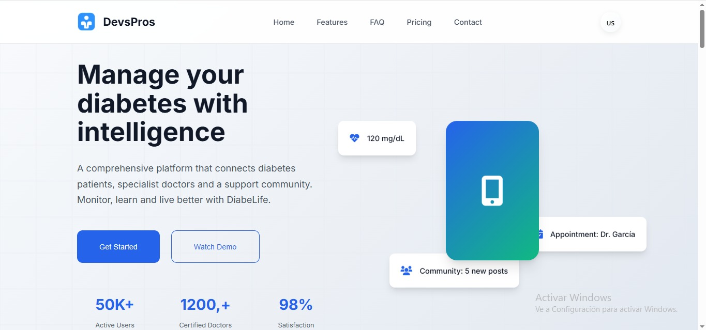
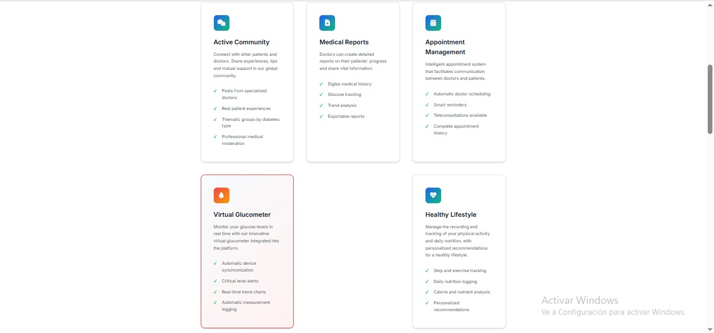
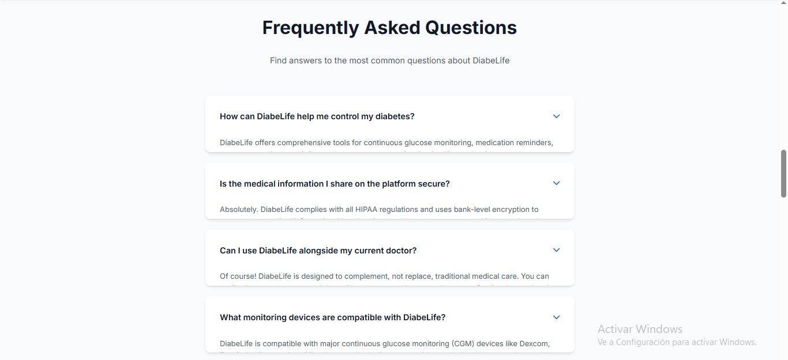
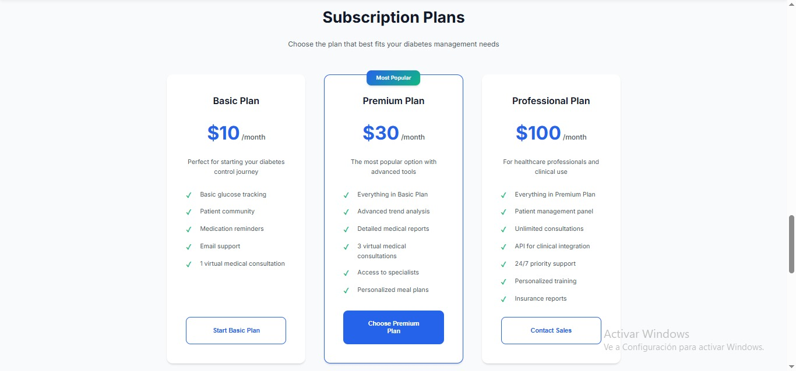
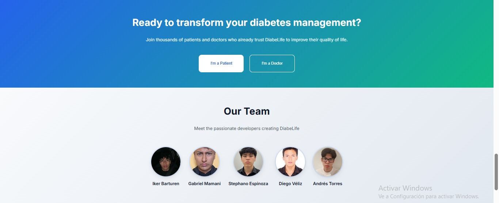


# 5.2.1. Sprint 1
# 5.2.1.1. Sprint Planning 1.
A continuación se presenta el acta de planificación correspondiente al primer sprint, en la cual se establecieron los objetivos y las actividades a ejecutar.

<table>
<tr>
    <th colspan="5">Sprint 1</th>
    <th colspan="9">Sprint 1</th>
  </tr>
      <tr>
    <td colspan="13">Sprint Planning Background</td>
  </tr>
  <tr>
    <td colspan="5">Date</td>
    <td colspan="8">16/09/2025</td>
</tr>
  <tr>
    <td colspan="5">Time</td>
    <td colspan="8">5:00 pm</td>
  </tr>
  <tr>
    <td colspan="5">Location</td>
    <td colspan="8">Via Discord</td>
<tr>
    <td colspan="5">Prepared By</td>
    <td colspan="8">Gabriel Cristian Mamani Marca</td>
</tr>
<tr>
    <td colspan="5">Attendees (to planning meeting)</td>
    <td colspan="8">Barturen Panez Iker Gabriel, Mamani Marca Gabriel Cristian, Espinoza Cueva Stephano Jose, Torres Lavandera Andres Rodrigo,Véliz Martínez Diego Alonso   .</td>
</tr>
<tr>
    <td colspan="5">Sprint  1 Review Summary</td>
    <td colspan="8">En esta reunión se planificaron las tareas a realizar para el desarrollo de la landing page de Diabelife.Tambien, se establecieron fechas limite  para la entrega,con el fin reservar tiempo para realizar el despliegue .</td>
</tr>
<tr>
    <td colspan="5">Sprint 1 Retrospective Summary</td>
    <td colspan="8">Durante la retrospectiva, los integrantes identificaron fortalezas y oportunidades de mejora relacionadas con la organización del equipo y la distribución de tareas. Se destacó la importancia de mantener una comunicación clara y constante para optimizar el trabajo colaborativo.  
 <div class=". ."></div>.</td>
</tr>
<tr>
    <td colspan="13">Sprint Goal & User Stories</td>
</tr>
<tr>
    <td colspan="5">Sprint 1 Goal</td>
    <td colspan="8">El objetivo de este sprint fue implementar la **landing page de Diabelife**, asegurando que los visitantes pudieran navegar fácilmente por sus secciones principales (Home, Features, FAQs, Pricing y Contact), además de incluir la opción de cambio de idioma. El éxito se mide cuando los usuarios pueden visualizar la página en su totalidad y acceder a la información de manera clara y accesible.  

 </td>
<tr>
    <td colspan="5">Sprint 1 Velocity</td>
    <td colspan="8">4 story points </td>>.  

 </td>
</tr>

<tr>
    <td colspan="5">Sum of Story Points</td>
    <td colspan="8">4 story points </td>>.  

 </td>
</tr>
</table>


# 5.2.1.2. Aspect Leaders and Collaborators.
En este punto presentan los responsables asignados a cada área. En este primer Sprint, los entregables se han organizado en tres aspectos diferenciados.

| Team member (LastName, First Name) | GitHub UserName | Aspect 1: Landing Page Leader (L) / Collaborator (C) | Aspect 2: Diseños Figma: Leader (L) / Collaborator (C) | Aspect 3: Reporte (L) / Collaborator (C) |
|------------------------------------|-----------------|------------------------------------------------------|--------------------------------------------------------|------------------------------------------|
| Veliz Diego                        | Veliz-0912     | C                                                    | C                                                      | L                                        |
| Torres Andres                      | AndresTorres202312557        | C                                                    | L                                                      | L                                        |
| Barturen Iker                      | krxxg04    | C                                                    | L                                                      | L                                        |
| Espinoza Estephano                 | Stephanoescu          | L                                                    | C                                                      | L                                        |
| Mamani Gabriel                     | Gabriel0105     | C                                                    | C                                                      | L                                        |

# 5.2.1.3. Sprint Backlog 1.

Para el primer sprint se definieron las siguientes historias de usuario y tareas relacionadas con el desarrollo de la landing page. De igual forma, se llevará a cabo un seguimiento constante mediante la herramienta de gestión Trello, con el fin de asegurar que cada tarea avance según lo planificado y, en caso de ser necesario, reubicar esfuerzos para cumplir con los objetivos del sprint

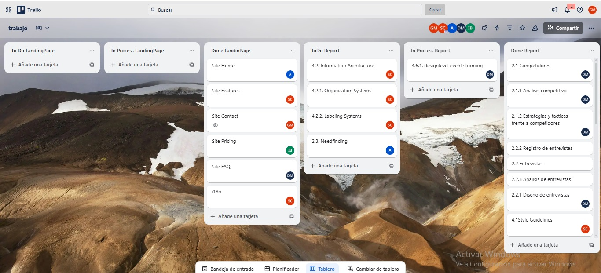

Enlace al tablero de Trello: https://trello.com/invite/b/68ba56b96241329abc59b401/ATTI528666f0209960f1918524c186fbce0252B7B4BA/trabajo

|  Sprint 1  |            Sprint 1             |     |                              |                                                                     |                    |             |                                                |
|:----------:|:-------------------------------:|:---:|:----------------------------:|:-------------------------------------------------------------------:|:------------------:|:-----------:|:----------------------------------------------:|
| User Story |        Work-Item / Task         |     |                              |                                                                     |                    |             |                                                |
|     Id     |              Title              | Id  |            Title             |                             Description                             | Estimation (Hours) | Assigned To | Status (To do / In process / To review / Done) |
|    US01    |    Visualización de Home        | W01 | Crear vista Home             | Diseñar y programar la página principal con enlaces a secciones.    |         3          |   Andres    |                     To do                      |
|    US02    | Visualización de Features       | W02 | Sección de características   | Implementar sección con las funcionalidades principales.            |         3          |  Stephano   |                     To do                      |
|    US03    | Visualización de FAQs           | W03 | Sección de preguntas frecuentes | Mostrar listado de FAQs con respuestas comunes.                   |         2          |    Diego    |                     To do                      |
|    US04    | Visualización de Pricing        | W04 | Sección de precios           | Implementar vista con planes y costos de Diabelife.                 |         2          |    Iker     |                     To do                      |
|    US05    | Visualización de Contact        | W05 | Formulario de contacto       | Crear sección de contacto con formulario validado.                  |         3          |   Gabriel   |                     To do                      |
|    US06    | Cambio de idioma                | W06 | Selector de idioma           | Implementar cambio de idioma en toda la landing page.               |         4          |  Estephano  |                     To do                      |

# 5.2.1.4. Development Evidence for Sprint Review.

En este apartado se muestran los commits que evidencian los principales progresos en la implementación. Estos registros provienen del repositorio de la landing page de la organización en GitHub.

Enlace al repositorio de la Landing Page: https://github.com/upc-pre-202510-si0730-Grupo-Devspros/DiabeLife-Landing-Page

| Repository                           | Branch | Commit Id                                 | Commit Message                  | Commit Message Body | Commited on (Date) |
|--------------------------------------|--------|-------------------------------------------|---------------------------------|---------------------|--------------------|
| DiabeLife-Landing-Page  | main   | e3082abc16feaa4001d28334605dd02384e4fbc2  | docs: create markdown file for report     |                     | 28/08/2025         |
|DiabeLife-Landing-Page  | main   | 9b540c74e24b9b76c98007a60bc96afa1983cdf0  | docs: update report |                     | 30/08/2025         |
| DiabeLife-Landing-Page  | main   | ec31cacf3783d3a3e46baf6b129fc8758dd56828  | docs: add tittle             |                     | 05/09/2025         |


# 5.2.1.5. Execution Evidence for Sprint Review.

En este sprint nos enfocamos exclusivamente en la landing page, la cual fue desarrollada en el repositorio "Diabelife-Landing-Page". Asimismo, se aplicó la metodología GitFlow como parte de las buenas prácticas de desarrollo.


# 5.2.1.6. Services Documentation Evidence for Sprint Review.

En este primer sprint, el alcance se centró únicamente en el desarrollo de la Landing Page de Diabelife, por lo que no se incluyó la implementación ni documentación de Web Services mediante OpenAPI.
Por tal motivo, no se registran endpoints documentados en esta iteración. La documentación de servicios web se abordará en los siguientes sprints, una vez que se inicie el desarrollo de la API backend y sus integraciones.
En esta etapa, el esfuerzo del equipo estuvo dirigido al diseño, maquetación y despliegue de la Landing Page, asegurando la correcta visualización de las secciones definidas en las historias de usuario (Home, Features, FAQs, Pricing, Contact) y el cambio de idioma.

# 5.2.1.7. Software Deployment Evidence for Sprint Review.

Durante este Sprint se finalizó la implementación de la Landing Page y se llevó a cabo su publicación a través de GitHub Pages, aprovechando esta plataforma gratuita de despliegue. Con ello, se logró disponer de una versión inicial disponible en línea, con el propósito de facilitar su evaluación y recibir comentarios de mejora.

Actividades realizadas: Se creó el repositorio en GitHub: https://github.com/upc-pre-202510-si0730-Grupo-Devspros

Se realizó la carga del código fuente de la Landing Page, incorporando los archivos necesarios en HTML, CSS y JavaScript para garantizar su funcionamiento.

Posteriormente, se habilitó la opción de GitHub Pages desde la sección Settings > Pages, configurando la rama principal como fuente de despliegue y utilizando la carpeta raíz del repositorio.

Finalmente, se validó que la publicación de la Landing Page estuviera disponible de forma correcta a través de la siguiente URL:

Landing Page desplegada: https://upc-pre-202510-si0730-grupo-devspros.github.io/DiabeLife-Landing-Page/ 
**Evidencia del despliegue:**

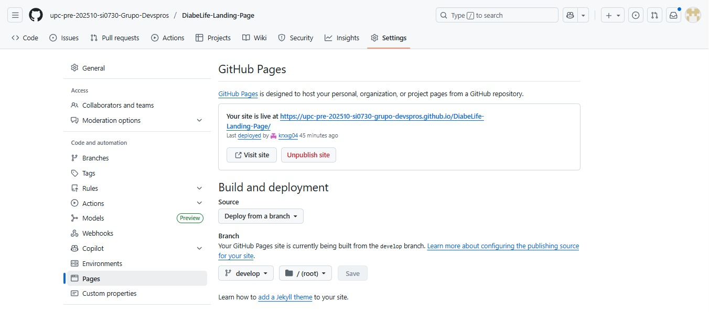

# 5.2.1.8. Team Collaboration Insights during Sprint.

En este apartado se presenta la participación de cada miembro en el repositorio de la Landing Page.

Todos los integrantes del equipo aportaron al desarrollo de la página, generando commits y pull requests para incorporar distintas secciones y funcionalidades. A continuación, se detallan algunos aportes destacados:

- Gabriel Mamani: Desarrolló la vista de Contacto con Soporte, donde el usuario puede comunicarse a través de redes sociales como Facebook, Twitter, Instagram y LinkedIn.

- Iker Barturen: Implementó la vista de Pricing, que muestra los planes disponibles en la landing page.

- Andrés Torres: Se encargó del desarrollo de la vista Home.

- Stephano Espinoza: Desarrolló la sección de i18n y Features, brindando información detallada sobre la aplicación Diabelife.

- Diego Veliz: Implementó la vista de FAQ (Preguntas Frecuentes).

**Capturas de Insights del repositorio:**

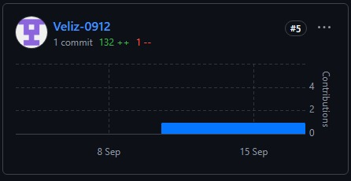
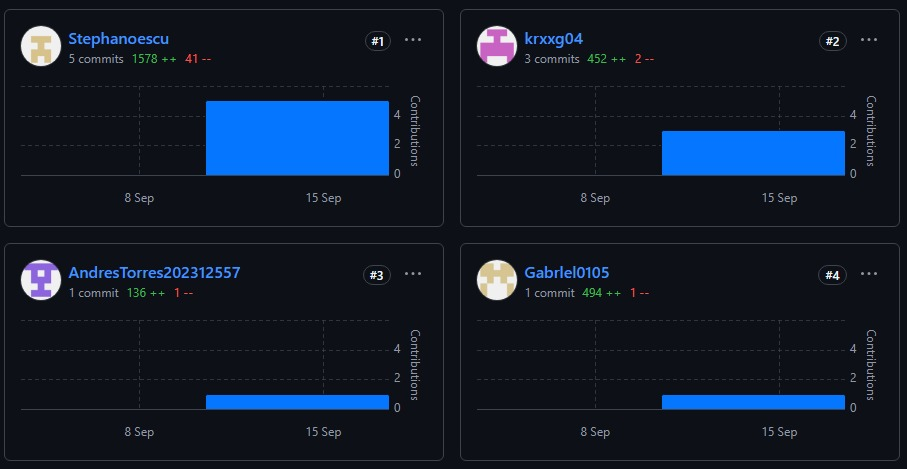

# 5.2.2. Sprint 2
# 5.2.2.1. Sprint Planning 2.
A continuación se presenta el acta de planificación correspondiente al segundo sprint, en la cual se establecieron los objetivos y las actividades a ejecutar.

<table>
<tr>
    <th colspan="5">Sprint 2</th>
    <th colspan="9">Sprint 2</th>
  </tr>
      <tr>
    <td colspan="13">Sprint Planning Background</td>
  </tr>
  <tr>
    <td colspan="5">Date</td>
    <td colspan="8">08/10/2025</td>
</tr>
  <tr>
    <td colspan="5">Time</td>
    <td colspan="8">6:59 pm</td>
  </tr>
  <tr>
    <td colspan="5">Location</td>
    <td colspan="8">Via Discord</td>
<tr>
    <td colspan="5">Prepared By</td>
    <td colspan="8">Gabriel Cristian Mamani Marca</td>
</tr>
<tr>
    <td colspan="5">Attendees (to planning meeting)</td>
    <td colspan="8">Barturen Panez Iker Gabriel, Mamani Marca Gabriel Cristian, Espinoza Cueva Stephano Jose, Torres Lavandera Andres Rodrigo,Véliz Martínez Diego Alonso   .</td>
</tr>
<tr>
    <td colspan="5">Sprint  2 Review Summary</td>
    <td colspan="8">En esta reunión se planificaron las tareas a realizar para el desarrollo del Frontend de Diabelife. Tambien, se establecieron fechas limite para cada boundend context y para la entrega,con el fin reservar tiempo para realizar el despliegue .</td>
</tr>
<tr>
    <td colspan="5">Sprint 2 Retrospective Summary</td>
    <td colspan="8">Durante la retrospectiva, los integrantes identificaron fortalezas y oportunidades de mejora relacionadas con la organización del equipo y la distribución de tareas. Se destacó la importancia de mantener una comunicación clara y constante para optimizar el trabajo colaborativo.  
 <div class=". ."></div>.</td>
</tr>
<tr>
    <td colspan="13">Sprint Goal & User Stories</td>
</tr>
<tr>
    <td colspan="5">Sprint 2 Goal</td>
    <td colspan="8">El objetivo de este sprint fue implementar el **FrontEnd de Diabelife**, asegurando que los visitantes pudieran navegar fácilmente por sus principales boundend context (Glucometer, Comunnity, Reports, Appoiments y Healthy life), además de incluir la opción de cambio de idioma. El éxito se mide cuando los usuarios pueden visualizar la página en su totalidad y acceder a la información de manera clara y accesible.  

 </td>
<tr>
    <td colspan="5">Sprint 2 Velocity</td>
    <td colspan="8"> 5 story points </td>>.  

 </td>
</tr>

<tr>
    <td colspan="5">Sum of Story Points</td>
    <td colspan="8">5 story points </td>>.  

 </td>
</tr>
</table>


# 5.2.2.2. Aspect Leaders and Collaborators.
En este punto presentan los responsables asignados a cada área. En este primer Sprint, los entregables se han organizado en tres aspectos diferenciados.

| Team member (LastName, First Name) | GitHub UserName | Aspect 1: Glucometer Leader (L)/ Collaborator (C) | Aspect 2: Reports: Leader (L) / Collaborator (C) | Aspect 3: Comunnity (L) / Collaborator (C) | Aspect 4: Appointments (L/C) | Aspect 5: Healthy Life (L/C) |
|------------------------------------|-----------------|-------------------------------------------------|--------------------------------------------------|--------------------------------------------|------------------------------|------------------------------|
| Veliz Diego                        | Veliz-0912      | L                                               | C                                                | C                                          | C                            | C                            |
| Torres Andres                      | AndresTorres202312557 | C                                               | C                                                | C                                          | L                            | C                            |
| Barturen Iker                      | krxxg04         | C                                               | C                                                | C                                          | C                            | L                            |
| Espinoza Estephano                 | Stephanoescu    | C                                               | L                                                | C                                          | C                            | C                            |
| Mamani Gabriel                     | Gabriel0105     | C                                               | C                                                | L                                          | C                            | C                            |

# 5.2.2.3. Sprint Backlog 2.

|  Sprint 2  |               Sprint 2                |     |                                       |                                                                                                                      |                    |             |                                                |
|:----------:|:-------------------------------------:|:---:|:-------------------------------------:|:--------------------------------------------------------------------------------------------------------------------:|:------------------:|:-----------:|:----------------------------------------------:|
| User Story |           Work-Item / Task            |     |                                       |                                                                                                                      |                    |             |                                                |
|     Id     |                 Title                 | Id  |                 Title                 |                                                     Description                                                      | Estimation (Hours) | Assigned To | Status (To do / In process / To review / Done) |
|    US34    |       Consulta médica en línea        | W01 |       Crear vista appointments        | Diseñar y programar la pantalla de appointments con una calendario, las citas visibles y opciones para añadir citas. |         3          |   Andres    |                     To do                      |
|    US33    |        Exportación de reportes        | W02 |          Sección de reports           |             Implementar sección con las que los usuarios podrán exportar los reportes para compartirlos.             |         3          |  Stephano   |                     To do                      |
|    US16    |       Visualización de glucosa        | W03 |           Sección dashboard           |         Mostrar un "dashboard" completo donde se verán los datos principales del paciente.                           |         2          |    Diego    |                     To do                      |
|    US19    |      Registro de signos vitales       | W04 | Sección de registro de signos vitales |         Implementar una opcion en la que el usario pueda registrar sus datos en la aplicacion de Diabelife.          |         3          |    Iker     |                     To do                      |
|    US35    |   Comunidad de pacientes diabeticos   | W05 |           Sección Community           |              Crear sección de "community" donde los usarios podrán compartir y interactuar entre ellos.              |         3          |   Gabriel   |                     To do                      |
|    US30    | Notificaciones de control de glucosa  | W06 |       Pantalla de Notifications       |      Implementar pantalla de "notifications" la cual te muestra los datos de todas las notificaciones emitidas.      |         1          |   Gabriel   |                     To do                      |

# 5.2.2.4. Development Evidence for Sprint Review.

En esta sección se presentan los commits que reflejan los avances más importantes durante la implementación. Los registros provienen del repositorio del frontend de la organización en GitHub.

Enlace del repositorio  del frontend: https://github.com/upc-pre-202510-si0730-Grupo-Devspros/DiabeLife-Frontend

| Repository           | Branch                 | Commit Id                                | Commit Message                           | Commit Message Body   | Commited on (Date) |
|----------------------|-----------------------|------------------------------------------|-----------------------------------------|---------------------|------------------|
| DiabeLife-Frontend   | feature/glucometer    | b3847df749e1c99c327fdc242af118fe55901065 | feat: "glucometer"                       | Diego Véliz         | - |
| DiabeLife-Frontend   | main                  | e2ed74f9d351344971fa34f2de662b51715f6a11 | feat: add appointment application        | AndresTorres202312557 | - |
| DiabeLife-Frontend   | main                  | c014981dd7ce612214b9cbf480fdb5f61dd1dd93 | feat: add NewReportSection                | Stephanoescu         | - |
| DiabeLife-Frontend   | main                  | 8de8643a37edf59c7674d5dcd02ab1b925ffbeef | fead: add food consumed                   | krxxg04             | - |
| DiabeLife-Frontend   | main                  | 4c21990ed60a5c73bae8d8e40e24320948db8ffb | feat: add profile component               | Gabrlel0105         | - |
| DiabeLife-Frontend   | main                  | efba505440a8263e03139c2e32022c6ecc90a919 | feat: add user management bc              | Gabrlel0105         | - |


# 5.2.2.5. Execution Evidence for Sprint Review.

Durante este sprint se implementó la primera versión del frontend utilizando el framework Vue. A continuación, se muestran capturas que ilustran la interfaz desarrollada.
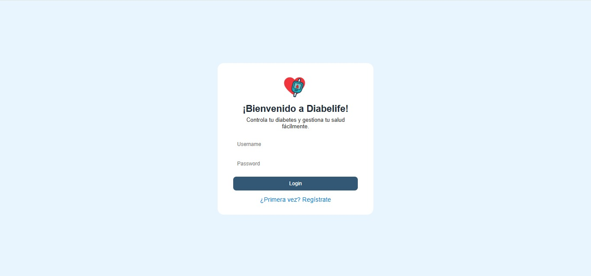
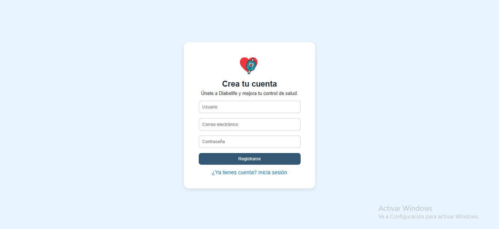
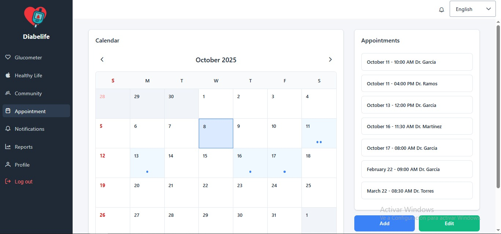
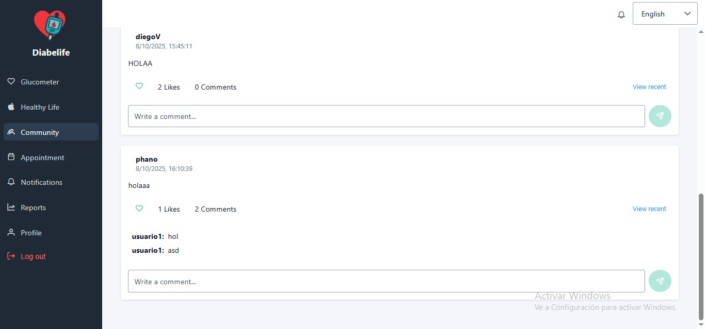
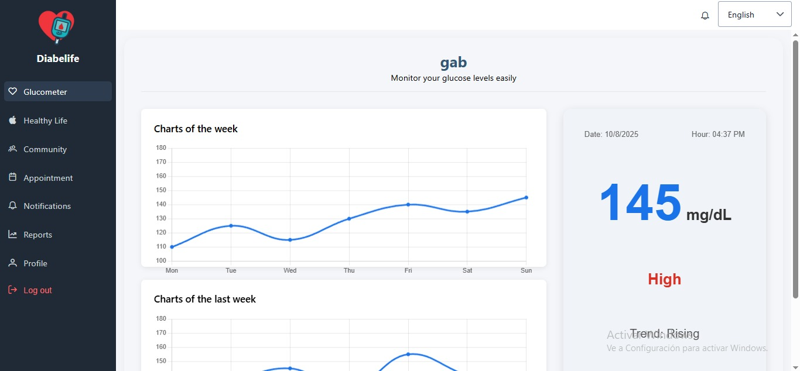
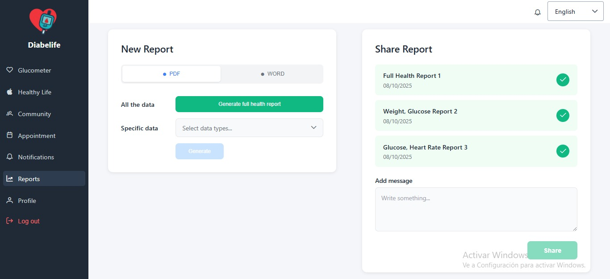
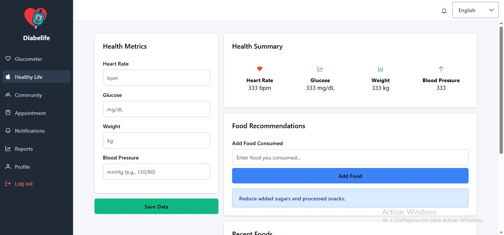
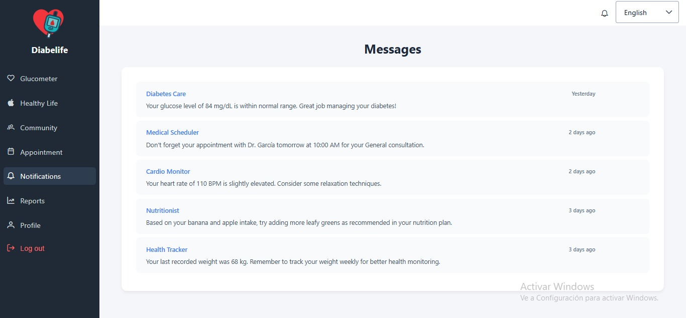
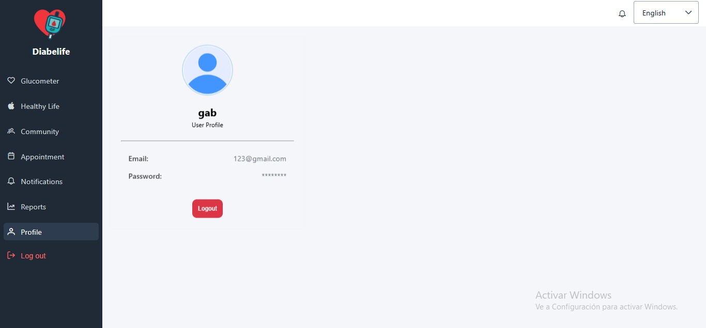

# 5.2.2.6. Services Documentation Evidence for Sprint Review.


Durante este Sprint, se desarrolló y documentó la capa de Web Services del proyecto **DiabeLife**, una aplicación web construida con **Vue.js**, orientada a brindar soporte integral a personas con diabetes mediante funcionalidades de monitoreo de glucosa, gestión de citas, interacción social y promoción de hábitos saludables.

Dado que el backend aún se encuentra en desarrollo parcial, se utilizó **JSON Server** para simular los servicios REST, permitiendo así un entorno funcional que responde a peticiones HTTP (**GET, POST, PUT, DELETE, PATCH**) sobre los distintos **Backends (BC)**: **community**, **notification**, **appointments**, **glucometer**, **healthy-life**. Para el despliegue del `db.json` y la simulación de la API en un entorno accesible, se utilizó **Render**, lo que permitió que el frontend pudiera consumir los servicios simulados de manera remota y funcional. Esto facilitó el desarrollo, pruebas y validación de las interfaces de usuario, manteniendo la arquitectura desacoplada y preparada para integrarse con los servicios reales en el futuro.

La documentación de Web Services para este Sprint se realizó siguiendo la especificación **OpenAPI**, incluyendo los endpoints asociados al alcance definido. Cada endpoint está descrito con las acciones soportadas, los verbos HTTP correspondientes, parámetros de entrada, ejemplos de request y response, y la explicación de los datos devueltos. Además, se incluyen capturas de pantalla de las interacciones utilizando datos de prueba, mostrando la correcta integración de los servicios simulados con el frontend.

## Logros alcanzados

- Se documentaron todos los **endpoints de los BC**:
    - **community**: posts, comentarios, likes, interacciones sociales.
    - **notification**: notificaciones de usuario, alertas de salud y recordatorios.
    - **appointments**: gestión de citas médicas para pacientes y doctores.
    - **glucometer**: registro y monitoreo de mediciones de glucosa enviadas por dispositivos IoT.
    - **healthy-life**: recomendaciones de hábitos saludables, seguimiento de actividad física y nutrición.

- Cada endpoint incluye:
    - **Acción soportada**: GET, POST, PUT, DELETE, PATCH.
    - **Sintaxis de llamada**: URL local (`http://localhost:3000/<endpoint>`) o URL de **Render** donde se despliega la API simulada.
    - **Parámetros**: Query params, path params y body (cuando aplica).
    - **Ejemplos de request y response** con datos de muestra.
    - **Explicación del response**, indicando estructura de datos y significado de cada campo.

- Se añadieron capturas de pantalla mostrando:
    - La creación, actualización, consulta y eliminación de recursos para cada BC.
    - Interacciones reales con el frontend de Vue utilizando los servicios simulados desplegados en Render.

## Repositorio y commits

- **Repositorio:** (https://github.com/upc-pre-202510-si0730-Grupo-Devspros/DiabeLife-Frontend)
- **Commits relacionados con la documentación del Sprint:** `b3847df`, `e92ac3b`, `f7d2a1c`

Esta documentación proporciona una referencia clara y completa para la integración futura con el backend real, asegurando que el frontend pueda funcionar correctamente y facilitando la transición hacia servicios desplegados en producción.


# 5.2.2.7. Software Deployment Evidence for Sprint Review.

# Frontend Web Application

El frontend de **DiabeLife** se desplegó utilizando la plataforma **Render**, asegurando que la aplicación web fuera accesible de manera remota y funcional durante el desarrollo y pruebas. Para mantener la arquitectura desacoplada, primero se desplegó la API simulada (`db.json`) y luego se configuró el frontend para consumir los endpoints remotos.

## Pasos de despliegue detallados

### 1. Despliegue del `db.json` en Render
1. Preparar el archivo `db.json` con los datos simulados para los backends: **community, notification, appointments, glucometer, healthy-life**.
2. Crear un nuevo **Web Service** en Render:
    - Click en **"New" → "Web Service"**.
    - Conectar con un repositorio de GitHub que contenga el `db.json`.
    - Seleccionar la rama correspondiente (`develop`) y configurar el servicio.
3. Configurar build y publicación:
    - **Build Command:** `npx json-server --watch db.json --port 10000`  
      *(esto inicia el JSON Server en Render para simular la API REST)*
    - Render asigna una URL pública (por ejemplo: `https://diabelife-db.onrender.com`) donde los endpoints están disponibles.
4. Verificar que los endpoints (`/community`, `/notification`, `/appointments`, `/glucometer`, `/healthy-life`) respondan correctamente mediante un navegador o Postman.

### 2. Preparación del frontend para producción
1. Abrir el proyecto **DiabeLife-Frontend**.
2. Ejecutar el build de producción: 
   ```bash
   npm run build
   

Repositorio: https://github.com/upc-pre-202510-si0730-Grupo-Devspros/DiabeLife-Frontend
Url Desplegada: https://diabelife-frontend.netlify.app/

# 5.2.2.8. Team Collaboration Insights during Sprint.

En este apartado se presenta la participación de cada miembro en el repositorio de la Landing Page.

Todos los integrantes del equipo aportaron al desarrollo de la página, generando commits y pull requests para incorporar distintas secciones y funcionalidades. A continuación, se detallan algunos aportes destacados:

- Gabriel Mamani: Desarrolló la vista de Contacto con Soporte, donde el usuario puede comunicarse a través de redes sociales como Facebook, Twitter, Instagram y LinkedIn.

- Iker Barturen: Implementó la vista de Pricing, que muestra los planes disponibles en la landing page.

- Andrés Torres: Se encargó del desarrollo de la vista Home.

- Stephano Espinoza: Desarrolló la sección de i18n y Features, brindando información detallada sobre la aplicación Diabelife.

- Diego Veliz: Implementó la vista de FAQ (Preguntas Frecuentes).

**Capturas de Insights del repositorio:**

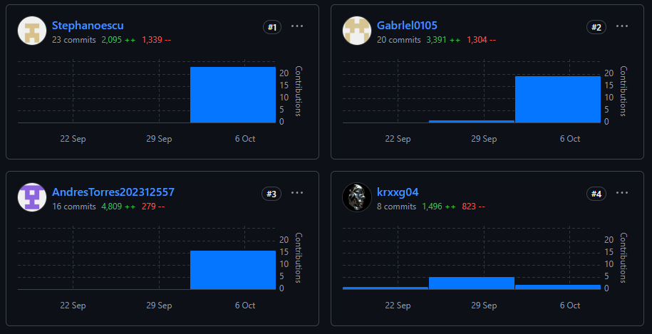

# 5.2.3. Sprint 3
# 5.2.3.1.Spring Planning 3.

A continuación se presenta el acta de planificación correspondiente al segundo sprint, en la cual se establecieron los objetivos y las actividades a ejecutar.

<table>
<tr>
    <th colspan="5">Sprint 3</th>
    <th colspan="9">Sprint 3</th>
  </tr>
      <tr>
    <td colspan="13">Sprint Planning Background</td>
  </tr>
  <tr>
    <td colspan="5">Date</td>
    <td colspan="8">2/11/2025</td>
</tr>
  <tr>
    <td colspan="5">Time</td>
    <td colspan="8">1:30 pm</td>
  </tr>
  <tr>
    <td colspan="5">Location</td>
    <td colspan="8">Via Discord</td>
<tr>
    <td colspan="5">Prepared By</td>
    <td colspan="8">Iker Gabriel Barturen Panez</td>
</tr>
<tr>
    <td colspan="5">Attendees (to planning meeting)</td>
    <td colspan="8">Barturen Panez Iker Gabriel, Mamani Marca Gabriel Cristian, Espinoza Cueva Stephano Jose, Torres Lavandera Andres Rodrigo,Véliz Martínez Diego Alonso   .</td>
</tr>
<tr>
    <td colspan="5">Sprint  3 Review Summary</td>
    <td colspan="8">En esta reunión se planificaron las tareas a realizar para el desarrollo del Backend de Diabelife. Tambien, se establecieron fechas limite para cada boundend context y para la entrega,con el fin reservar tiempo para realizar el despliegue .</td>
</tr>
<tr>
    <td colspan="5">Sprint 3 Retrospective Summary</td>
    <td colspan="8">Durante la reunión colaborativa, los integrantes identificaron fortalezas y oportunidades de mejora relacionadas con la organización del equipo y la distribución de tareas. Se destacó la importancia de la responsabilidad y la comunicación efectiva para el éxito del proyecto.  
 <div class=". ."></div>.</td>
</tr>
<tr>
    <td colspan="13">Sprint Goal & User Stories</td>
</tr>
<tr>
    <td colspan="5">Sprint 3 Goal</td>
    <td colspan="8">El objetivo de este sprint fue implementar el Backend de DiabeLife, y asegurar que el frontend esté completamente conectado a él para que los visitantes puedan navegar por los bounded contexts principales (Glucometer, Community, Reports, Appointments, Healthy life) y cambiar el idioma. El éxito se mide cuando los usuarios pueden ver la página completa y acceder a la información de forma clara y fiable.

 </td>
<tr>
    <td colspan="5">Sprint 3 Velocity</td>
    <td colspan="8"> 5 story points </td>>.  

 </td>
</tr>

<tr>
    <td colspan="5">Sum of Story Points</td>
    <td colspan="8">5 story points </td>>.  

 </td>
</tr>
</table>

# 5.2.3.2. Aspect Leaders and Collaborators.

En este punto presentan los responsables asignados a cada área. En este primer Sprint, los entregables se han organizado en tres aspectos diferenciados.

| Team member (LastName, First Name) | GitHub UserName         | Aspect 1: Glucometer Leader (L)/ Collaborator (C) | Aspect 2: Reports: Leader (L) / Collaborator (C) | Aspect 3: Comunnity (L) / Collaborator (C) | Aspect 4: Appointments (L/C) | Aspect 5: Healthy Life (L/C) |
|------------------------------------|-------------------------|-------------------------------------------------|--------------------------------------------------|--------------------------------------------|------------------------------|------------------------------|
| Veliz Diego                        | Veliz-0912              | L                                               | C                                                | C                                          | C                            | C                            |
| Torres Andres                      | AndresTorres202312557   | C                                               | C                                                | C                                          | L                            | C                            |
| Barturen Iker                      | krxxg04                 | C                                               | C                                                | C                                          | C                            | L                            |
| Espinoza Estephano                 | Stephanoescu            | C                                               | L                                                | C                                          | C                            | C                            |
| Mamani Gabriel                     | Gabriel0105             | C                                               | C                                                | L                                          | C                            | C                            |

# 5.2.3.3.Sprint Backlog 3.

|  Sprint 3  |                Sprint 3                |     |                                                                       |                                                                                                                                  |                    |             |                                                |
|:----------:|:--------------------------------------:|:---:|:---------------------------------------------------------------------:|:--------------------------------------------------------------------------------------------------------------------------------:|:------------------:|:-----------:|:----------------------------------------------:|
| User Story |            Work-Item / Task            |     |                                                                       |                                                                                                                                  |                    |             |                                                |
|     Id     |                 Title                  | Id  |                                 Title                                 |                                                           Description                                                            | Estimation (Hours) | Assigned To | Status (To do / In process / To review / Done) |
|    US07    |          Registro de usuario           | W01 | Registrar nuevo usuarios y guardar su informacion en la base de datos |     Implementar endpoint POST /users para registro de pacientes; validaciones, hash de contraseña, y persistencia en MySQL.      |         4          |    Iker     |                     To do                      |
|    US19    |       Registro de signos vitales       | W02 |         Registro de signos vitales con actualizacion de datos         |    Crear endpoints CRUD para signos vitales (presión, frecuencia cardíaca, peso, glucosa puntual) y relaciones con paciente.     |         3          |    Iker     |                     To do                      |
|    US21    |         Registro de alimentos          | W03 |                Registro de alimentos consumidos al día                |  Implementar endpoint para registrar ingestas (alimentos), campos nutricionales básicos y asociación con mediciones y usuario.   |         3          |   Gabriel   |                     To do                      |
|    US30    |  Notificaciones de control de glucosa  | W04 |             Notificaciones sobre el control de mi glucosa             |                        Diseñar lógica de alertas por umbrales, endpoint para crear/listar notificaciones.                        |         4          |  Stephano   |                     To do                      |
|    US32    | Visualización de gráficos de evolución | W05 |                  Visualización de series y agregados                  | Endpoints para consultar series temporales de glucosa (GET /glucometer/series) y agregaciones (diarias/semanales) para gráficas. |         3          |    Diego    |                     To do                      |
|    US45    |        Registro de cita médica         | W06 |       Registro de citas médicas con el doctor de mi preferencia       | Endpoints CRUD para citas médicas, gestión de disponibilidad de doctores y relación paciente-cita; incluir validaciones básicas. |         3          |   Andres    |                     To do                      |

# 5.2.3.4.Development Evidence for Sprint Review.

En esta sección se presentan los commits que reflejan los avances más importantes durante la implementación. Los registros provienen del repositorio del frontend de la organización en GitHub.

Enlace del repositorio  del frontend: https://github.com/upc-pre-202510-si0730-Grupo-Devspros/DiabeLife-Backend

| Repository         | Branch                      | Commit Id                                | Commit Message                                   | Commit Message Body   | Commited on (Date) |
|--------------------|-----------------------------|------------------------------------------|--------------------------------------------------|-----------------------|--------------------|
| DiabeLife-Backend  | feature/glucometer          | 476e4e92ca45f7057af4bd9c968f7ee42ff5410e | feat:"glucometer"                                | Diego Véliz           | 12/11/2025         |
| DiabeLife-Backend  | feature/notifications       | 4b0133cd645bccbd7be670db77bc71fdbbb9fa6d | feat: add appointment application                | AndresTorres202312557 | 12/11/2025         |
| DiabeLife-Backend  | feature/reports             | 32609f09cff1996ab2ac1eef4784b4814afbb74b | feat: add UpdateReportDto                        | Stephanoescu          | 13/11/2025         |
| DiabeLife-Backend  | feature/update-healthy-life | e97f9dea4555d35cc55cbc31ebf3b523a4e907a3 | feat:update healthy life                         | krxxg04               | 08/11/2025         |
| DiabeLife-Backend  | feature/update-port         | 7a06aee143f13e151f67d63317cc48b47a66d4e1 | feat: update port                                | krxxg04               | 14/11/2025         |
| DiabeLife-Backend  | feature/community           | 43f19f34b08e84b36a7d545edd56e3f8092d3d3f | feat: import Community BC from feature/community | Gabrlel0105           | 13/11/2025         |

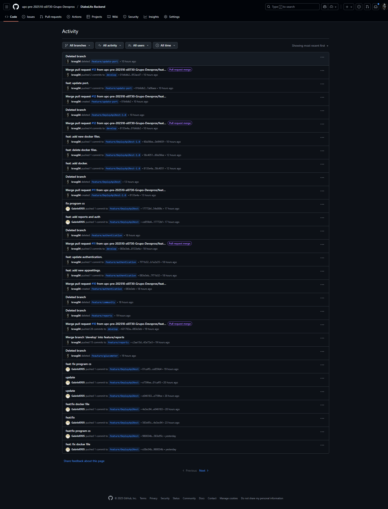 
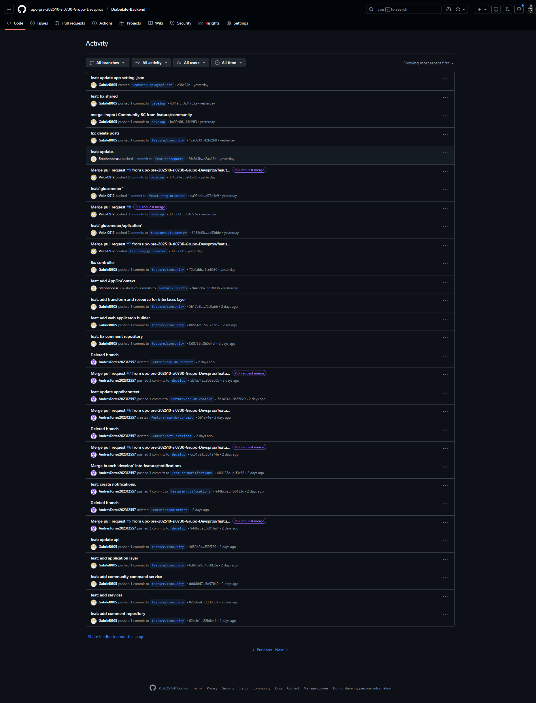 
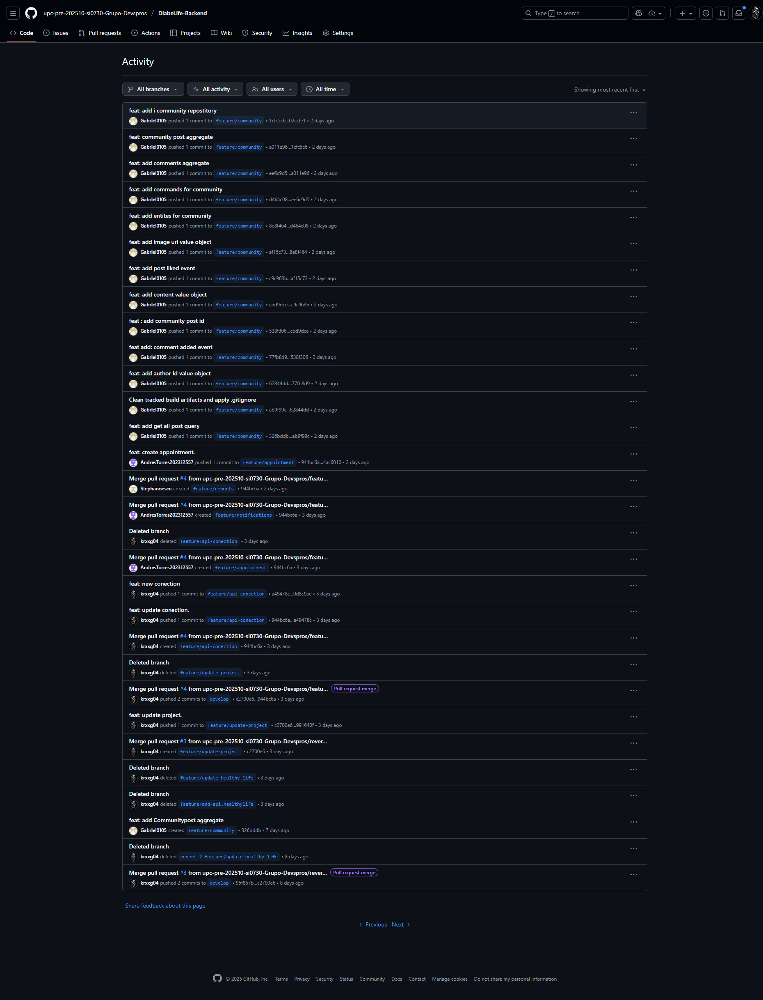 
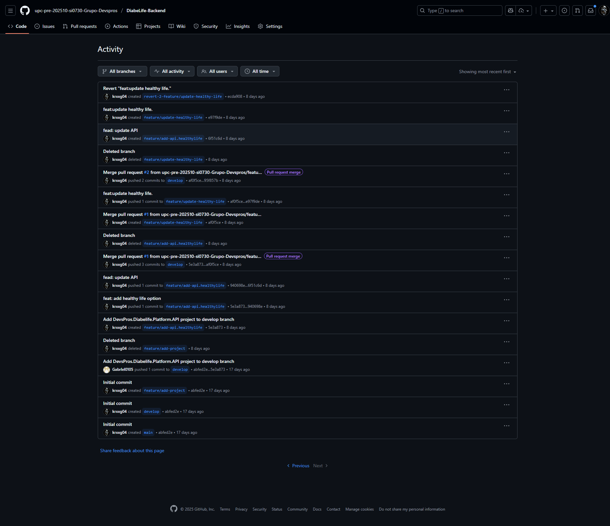

# 5.2.3.5.Execution Evidence for Sprint Review.

Durante este sprint se implementó la primera versión del frontend utilizando el framework Vue. Además, se inició e implementó la primera iteración del backend usando C# y ASP.NET Core. El backend incluye: endpoints REST para los bounded contexts (glucometer, community, reports, appointments, healthy-life), persistencia con Entity Framework Core sobre MySQL, autenticación con JWT, documentación OpenAPI/Swagger.

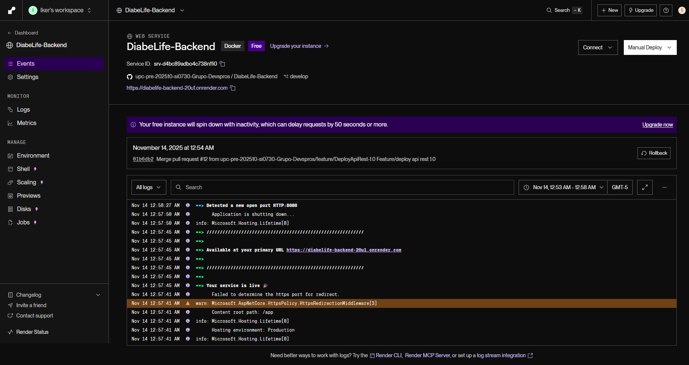
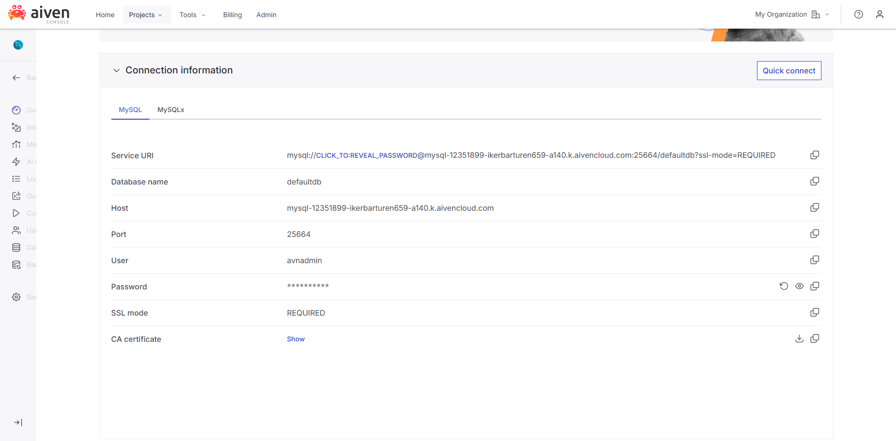
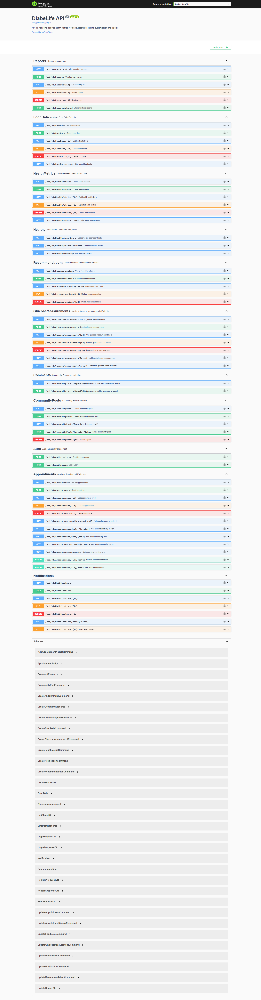

# 5.2.3.6.Services Documentation Evidence for Sprint Review.

Durante este Sprint, se continuó y formalizó la implementación de la capa de Web Services del proyecto **DiabeLife** con un backend real desarrollado en **C# y ASP.NET Core (Web API)**. Este backend provee endpoints REST para los bounded contexts **community**, **notification**, **appointments**, **glucometer** y **healthy-life**, con persistencia gestionada por **Entity Framework Core** sobre **MySQL**. Se integró autenticación y autorización basada en **JWT** con roles (patient), junto con documentación automática con **OpenAPI/Swagger**.

El backend de Sprint 3 fue desplegado en Render y está disponible públicamente en: `https://diabelife-backend-20u1.onrender.com`. La documentación Swagger se puede consultar en: `https://diabelife-backend-20u1.onrender.com/swagger/index.html`.

La documentación de Web Services para Sprint 3 se generó a partir de los contratos reales del backend en C#. Cada endpoint incluye la especificación de las acciones soportadas (GET, POST, PUT, DELETE, PATCH), parámetros (query/path/body), ejemplos de request/response, y la explicación de la estructura de los datos. Además, se incluyen capturas de pantalla y trazas que muestran interacciones reales entre el frontend y el backend desplegado, evidenciando la correcta integración y la ejecución de flujos end-to-end en staging.

## Logros alcanzados

- Se documentaron todos los **endpoints principales** del backend real, agrupados por contexto (Bounded Context):

**Reports**
    - GET `/api/v1/Reports` : Obtener todos los reportes
    - POST `/api/v1/Reports` : Crear nuevo reporte
    - PUT `/api/v1/Reports/{id}` : Actualizar reporte
    - DELETE `/api/v1/Reports/{id}` : Eliminar reporte

**FoodData**
    - GET `/api/v1/FoodData` : Listar alimentos
    - POST `/api/v1/FoodData` : Registrar alimento
    - PUT `/api/v1/FoodData/{id}` : Actualizar alimento
    - DELETE `/api/v1/FoodData/{id}` : Eliminar alimento

**HealthMetrics**
    - GET `/api/v1/HealthMetrics` : Listar métricas de salud
    - POST `/api/v1/HealthMetrics` : Registrar métrica
    - PUT `/api/v1/HealthMetrics/{id}` : Actualizar métrica
    - DELETE `/api/v1/HealthMetrics/{id}` : Eliminar métrica

**Healthy**
    - GET `/api/v1/Healthy` : Listar hábitos saludables
    - POST `/api/v1/Healthy` : Registrar hábito
    - PUT `/api/v1/Healthy/{id}` : Actualizar hábito
    - DELETE `/api/v1/Healthy/{id}` : Eliminar hábito

**Recommendations**
    - GET `/api/v1/Recommendations` : Listar recomendaciones
    - POST `/api/v1/Recommendations` : Registrar recomendación
    - PUT `/api/v1/Recommendations/{id}` : Actualizar recomendación
    - DELETE `/api/v1/Recommendations/{id}` : Eliminar recomendación

**GlucoseMeasurements**
    - GET `/api/v1/GlucoseMeasurements` : Listar mediciones de glucosa
    - POST `/api/v1/GlucoseMeasurements` : Registrar medición
    - PUT `/api/v1/GlucoseMeasurements/{id}` : Actualizar medición
    - DELETE `/api/v1/GlucoseMeasurements/{id}` : Eliminar medición

**Comments**
    - GET `/api/v1/community-posts/{postId}/comments` : Listar comentarios de un post
    - POST `/api/v1/community-posts/{postId}/comments` : Crear comentario en un post

**CommunityPosts**
    - GET `/api/v1/community-posts` : Listar posts de la comunidad
    - POST `/api/v1/community-posts` : Crear post
    - PUT `/api/v1/community-posts/{id}` : Actualizar post
    - DELETE `/api/v1/community-posts/{id}` : Eliminar post

**Auth**
    - POST `/api/v1/Auth/register` : Registrar nuevo usuario
    - POST `/api/v1/Auth/login` : Login de usuario

**Appointments**
    - GET `/api/v1/Appointments` : Listar citas médicas
    - POST `/api/v1/Appointments` : Registrar cita médica
    - PUT `/api/v1/Appointments/{id}` : Actualizar cita
    - DELETE `/api/v1/Appointments/{id}` : Eliminar cita

**Notifications**
    - GET `/api/v1/Notifications` : Listar notificaciones
    - POST `/api/v1/Notifications` : Crear notificación
    - PUT `/api/v1/Notifications/{id}` : Actualizar notificación
    - DELETE `/api/v1/Notifications/{id}` : Eliminar notificación

- Cada endpoint incluye:
        - **Acción soportada**: GET, POST, PUT, DELETE, PATCH.
        - **Sintaxis de llamada**: URL local del backend (`http://localhost:5000/<endpoint>` o `https://localhost:5001/<endpoint>`), o la URL del backend desplegado: `https://diabelife-backend-20u1.onrender.com/<endpoint>`.
        - **Parámetros**: Query params, path params y body (cuando aplica).
        - **Ejemplos de request y response** con datos de muestra.
        - **Explicación del response**, indicando estructura de datos y significado de cada campo.

- Se añadieron capturas de pantalla mostrando:
        - La creación, actualización, consulta y eliminación de recursos para cada BC.
        - Interacciones reales con el frontend de Vue utilizando el backend real desplegado en: `https://diabelife-backend-20u1.onrender.com`.

## Repositorio y commits

- **Repositorio:** (https://github.com/upc-pre-202510-si0730-Grupo-Devspros/DiabeLife-Backend)
- **Commits relacionados con la documentación del Sprint:** `7a06aee`, `54e006c`, `9a560c9`

Esta documentación proporciona una referencia clara y completa de la integración realizada con el backend real desplegado, asegurando que el frontend funcione correctamente y evidenciando la transición exitosa hacia servicios en producción.

# 5.2.3.7.Software Deployment Evidence for Sprint Review.

Backend Web Application

El backend de **DiabeLife** se desplegó utilizando la plataforma **Render**, permitiendo que los servicios REST estén disponibles de manera remota y funcional para el frontend y otros clientes. La arquitectura desacoplada facilita la integración y escalabilidad del sistema.

## Pasos de despliegue detallados

1. Desarrollar el backend en **C# y ASP.NET Core (Web API)**, implementando los endpoints REST para los bounded contexts: **community, notification, appointments, glucometer, healthy-life**, y gestionando la persistencia con **Entity Framework Core** sobre **MySQL**.
2. Configurar el proyecto para producción, asegurando la correcta gestión de variables de entorno, cadenas de conexión y autenticación JWT.
3. Crear un nuevo **Web Service** en Render:
    - Click en **"New" → "Web Service"**.
    - Conectar con el repositorio de GitHub que contiene el backend.
    - Seleccionar la rama correspondiente (`main` o `develop`) y configurar el servicio.
4. Configurar build y publicación:
    - **Build Command:** `dotnet publish`
    - **Start Command:** `dotnet run` 
    - Render asigna una URL pública (por ejemplo: `https://diabelife-backend-20u1.onrender.com`) donde los endpoints están disponibles.
5. Verificar que los endpoints respondan correctamente mediante Swagger, Postman o el frontend.

**Repositorio:** https://github.com/upc-pre-202510-si0730-Grupo-Devspros/DiabeLife-Backend
**URL desplegada:** https://diabelife-backend-20u1.onrender.com
**Swagger:** https://diabelife-backend-20u1.onrender.com/swagger/index.html

# 5.2.3.8.Team Collaboration Insights during Sprint.

En este apartado se presenta la participación de cada miembro en el repositorio del Backend de DiabeLife.

Todos los integrantes del equipo aportaron al desarrollo del backend, generando commits y pull requests para implementar los distintos bounded contexts y funcionalidades clave. A continuación, se detallan algunos aportes destacados:

- Gabriel Mamani: Implementó el bounded context de Community, desarrollando endpoints para posts, comentarios y gestión de interacciones sociales.

- Iker Barturen: Desarrolló la lógica y endpoints para el registro de usuarios y métricas de salud, incluyendo validaciones y persistencia en MySQL.

- Andrés Torres: Se encargó de la gestión de citas médicas (Appointments), creando endpoints para Notification y Appointments.

- Stephano Espinoza: Implementó el bounded context de Reports, desarrollando la lógica de reports y endpoints para la gestión de reportes de salud.

- Diego Veliz: Desarrolló el bounded context de Glucometer, implementando endpoints para el registro y consulta de mediciones de glucosa, así como la visualización de series temporales.

**Capturas de Insights del repositorio:**

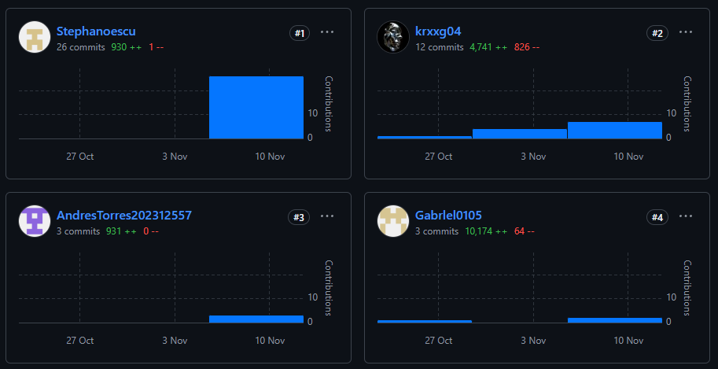
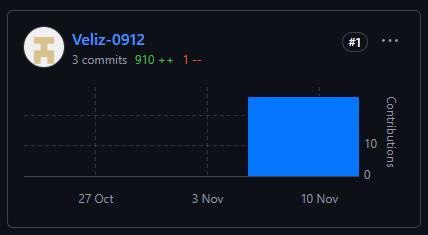

# 5.3. Validation Interviews.

En esta sección se registran y explican las actividades de entrevistas de validación realizadas durante el proyecto. Se llevaron a cabo entrevistas de validación donde usuarios de los segmentos objetivo interactuaron tanto con la landing page como con la aplicación web de Diabelife. El objetivo es validar la usabilidad, funcionalidad y experiencia de usuario de nuestros productos digitales.

## 5.3.1. Diseño de Entrevistas.

En esta sección se establecen los elementos a incluir en las sesiones de validación para cada segmento objetivo.

### Segmento #1: Pacientes con diabetes.

**Objetivo de la validación:** Evaluar la usabilidad y funcionalidad de la landing page y la aplicación web desde la perspectiva de pacientes diabéticos, validando que les permita gestionar eficientemente su información de salud y comunicarse con profesionales médicos.

**Preguntas específicas para pacientes diabéticos:**

**Usabilidad y Navegación:**

1. ¿Qué tan fácil le resultó encontrar información sobre el manejo de la diabetes en la landing page?
2. ¿Pudo registrar sus datos de salud (glucosa, insulina, presión) sin dificultades?
3. ¿Considera que la aplicación es intuitiva para el monitoreo diario de su diabetes?
4. ¿Qué tan sencillo fue configurar los recordatorios de medicamentos?

**Funcionalidad Específica:**

5. ¿Las funciones de registro de glucosa e insulina funcionaron como esperaba?
6. ¿Experimentó problemas al generar reportes de su historial médico?
7. ¿Qué tan útiles encontró los gráficos de evolución de sus datos de salud?
8. ¿Pudo interactuar exitosamente con otros usuarios?

**Experiencia Personal:**

9. ¿Recomendaría esta aplicación a otros pacientes diabéticos?
10. ¿Qué funcionalidad considera más valiosa para el control de su diabetes?
11. ¿Qué mejoraría para que la aplicación se adapte mejor a sus necesidades diarias?
12. ¿Se siente seguro compartiendo sus datos médicos a través de la plataforma?

**Utilidad Clínica:**

13. ¿Considera que esta aplicación le ayudaría a controlar mejor su diabetes?
14. ¿Qué tan probable es que use esta aplicación como parte de su rutina de autocuidado?
15. ¿Cree que facilitaría la comunicación con su médico endocrinólogo?

## 5.3.2. Registro de Entrevistas.

**Link: https://youtu.be/KH_EUY301LA** 

#### PACIENTES DIABETICOS

ENTREVISTA 1

Inicia: 0:01

Duración: 4:24

Nombre: Victor Snayder Damian Inga

Edad: 25

Distrito: La Victoria

Resumen:

Victor Damian es un contador de 25 años. Según el entrevistado, la landing page tiene una estructura clara. Además, no presentó problemaas al momento de registrar datos sobre su salud. También, considera que la aplicación es atractiva e intuitiva. Según sus propias palabras, el sistema de generación de reportes no presentó errores y exportaba de manera adecuada. Asimismo, fue posible interactuar con otros usuarios mediante el apartado de Comunidad. Además, considera buena idea el compartir la aplicación con otros usuarios. Como sugerencia, le gustaría la implementación de el registro de alimentos considerando datos importantes como los carbohidratos. Finalmente, considera que la aplicación le ayudaría a controlar mejor su diabetes y facilitaría la comunicación con su médico.

---

ENTREVISTA 2

Inicia: 00:01

Duración:5:43

Nombre: Gabriel Ricardo Satornicio Ramirez      

Edad: 24

Distrito: San Borja 

Resumen: Gabriel Saturnicio, una persona con diabetes, realizó una prueba de la aplicación Diabelife. Encontró la aplicación "muy sencilla" e "intuitiva" en general. Específicamente, mencionó que la información es fácil de encontrar en la pestaña "Vida Saludable" y que el módulo "Glucómetro" es "bastante intuitivo". Demostró con éxito cómo registrar sus métricas de salud (frecuencia cardíaca, glucosa, peso, presión arterial) y vio cómo el "Resumen de salud" se actualizaba correctamente tras guardar los datos. También confirmó que la generación de reportes es "bastante sencillo y rápido". Gabriel consideró que los gráficos de evolución son "bastante útiles" para ver el progreso de su salud y que la sección de "Comunidad" es intuitiva para interactuar con otros.

Mencionó que sí recomendaría la aplicación a otros pacientes por la cantidad de información que se puede registrar. Identificó la funcionalidad más valiosa como "el tema del registro de las métricas de salud". Como sugerencia de mejora, le gustaría que la sección de alimentos tuviera un historial y una función de planificación para controlar mejor su dieta a futuro. Finalmente, afirmó que la aplicación le ayudaría a controlar su diabetes y facilitaría la comunicación con su doctor, destacando la utilidad de la sección de "Citas".

---

ENTREVISTA 3

Inicia: 0:01

Duración: 4:45

Nombre: Hannah Ruffner

Edad: 19

Distrito: La victoria

Resumen:

El feedback del usuario sobre la aplicación es abrumadoramente positivo. Destaca su alta usabilidad y navegación intuitiva, señalando que la información está bien organizada y que el registro de sus datos fue accesible. 
Las funciones específicas, como el monitoreo de glucosa e insulina y la generación de reportes, funcionaron correctamente y fueron valoradas. A nivel personal, el usuario recomendaría la aplicación, se siente seguro compartiendo sus datos y considera el registro diario como la herramienta más valiosa, aunque sugiere incorporar más recomendaciones personalizadas. Finalmente, percibe una alta utilidad clínica, creyendo que la app le ayudará a un mejor autocuidado y facilitará la comunicación con su endocrinólogo.

---
ENTREVISTA 4

Inicia 5:24

Nombre: Estephno Moscoso

Edad: 21

Distrito: La victoria

Resumen:

Angelo Moscoso, estudiante de Ingeniería de 21 años diagnosticado con diabetes tipo 1, debe medir su glucosa varias veces al día y normalmente registra sus niveles en la app de notas de su iPhone por motivos económicos. Tras probar la aplicación, comenta que le resultó muy usable, con navegación intuitiva y buena organización de la información. Destaca que el registro de datos, el monitoreo de glucosa e insulina y los reportes funcionaron correctamente. Se siente seguro compartiendo sus datos, recomendaría la app y considera el registro diario como la función más útil, aunque sugiere añadir más recomendaciones personalizadas. Según él, la aplicación tiene alta utilidad clínica y facilitará su comunicación con su endocrinólogo.

## 5.3.3. Evaluaciones según heurísticas.

### Anexo D. Formato para Evaluación de User Experience según Heurísticas
**UX Heuristics & Principles Evaluation**
**Usability – Inclusive Design – Information Architecture**

---

| **CARRERA** | Ingeniería de Software |
| :--- | :--- |
| **CURSO** | Aplicaciones Web |
| **SECCIÓN** | 7470 |
| **PROFESORES** | Rafael Oswaldo Castro Veramendi |
| **AUDITOR** | Devspro |
| **CLIENTE(S)**| paciente con diabetes |

---

### SITE o APP A EVALUAR:

**Diabelife (https://webapplication-diabelife.netlify.app/auth/login)**

### TAREAS A EVALUAR:

El alcance de esta evaluación incluye la revisión de la usabilidad de las siguientes tareas:

1.  **Registro de un usuario nuevo (paciente)**
2.  **Inicio de sesión (Login) de usuario**
3.  **Recuperar contraseña**
4.  **Configurar perfil de usuario (Ej. actualizar datos personales, tipo de diabetes, etc.)**
5.  **Registrar un nuevo control de glucosa**
6.  **Ver el historial/dashboard de mediciones de glucosa**
7.  **Registrar una dosis de medicamento o insulina**
8.  **Registrar una comida**

### No están incluidas en esta versión de la evaluación las siguientes tareas:

1.  **Funcionalidades del perfil "Doctor" (Ej. Ver pacientes, asignar tratamientos)**
2.  **Agendar o ver citas médicas**
3.  **Generar y exportar reportes (Ej. PDF para el doctor)**
4.  **Ver artículos educativos o sección de noticias**
5.  **Sincronización con dispositivos (glucometros)**

---

### ESCALA DE SEVERIDAD (SEVERITY RATING)

| Severidad | Descripción |
| :--- | :--- |
| **0** | No es un problema de usabilidad. |
| **1** | Problema cosmético: no necesita ser arreglado a menos que se disponga de tiempo. |
| **2** | Problema de usabilidad Menor: arreglarlo tendría baja prioridad. |
| **3** | Problema de usabilidad Mayor: importante de arreglar, alta prioridad. |
| **4.0** | Catástrofe de Usabilidad: imperativo arreglarlo antes de lanzar el producto. |

---

### DETALLE DE HALLAZGOS (Los "Cuadros")

| TAREA                                     | HEURÍSTICA (Jakob Nielsen) | HALLAZGO (Finding) | DESCRIPCIÓN (Description) | SEVERIDAD (0-4) | RECOMENDACIÓN (Recommendation) |
|:------------------------------------------| :--- | :--- | :--- | :--- | :--- |
| **Tarea 1: Registro de usuario**          | **H5: Prevención de errores** | **Se permiten fechas de nacimiento imposibles** | El campo "Fecha de Nacimiento" permite al usuario seleccionar una fecha en el futuro (ej. año 2028) o una fecha irreal (ej. año 1850). | **3** | Limitar el selector de fechas (datepicker) a un rango lógico (ej. desde 1920 hasta la fecha actual). |
| **Tarea 2: Registrar control de glucosa** | **H2: Relación entre el sistema y el mundo real** | **Términos médicos confusos** | La app pregunta si la medición es "Pre-prandial" o "Post-prandial". Un paciente nuevo puede no entender esto. | **3** | Cambiar las etiquetas a un lenguaje claro: "Antes de comer" (con un ícono de plato vacío) y "Después de comer" (con un ícono de plato lleno). |
| **Tarea 3: Configurar perfil**            | **H3: Control y libertad del usuario** | **No hay botón "Cancelar" al editar el perfil** | Si un usuario entra a "Editar Perfil" y hace cambios por error, no hay un botón "Cancelar" para descartar. Solo hay "Guardar". | **2** | Añadir un botón "Cancelar" junto al botón "Guardar" que descarte los cambios no guardados. |
| **Tarea 4: Ver historial**                | **H1: Visibilidad del estado del sistema** | **No hay "feedback" al guardar un dato nuevo** | Después de registrar una medición (Tarea 5), al volver al dashboard no hay mensaje que diga "Medición guardada". El usuario duda si se guardó. | **2** | Añadir un mensaje de confirmación temporal (toast notification) "Medición registrada" cada vez que se guarda un dato exitosamente. |
| **Tarea 5: Recuperar contraseña**         | **H9: Ayudar a recuperarse de errores** | **Mensaje de recuperación ambiguo** | El sistema dice "Se ha enviado un email si el correo existe". El usuario no sabe si escribió mal el correo o si debe esperar. | **2** | Usar un solo mensaje claro siempre: "Si tu correo está registrado, recibirás un email de recuperación en los próximos 5 minutos". |
| **Tarea 6: Inicio de sesión**             | **H8: Estética y diseño minimalista** | **Pantalla de login sobrecargada** | La pantalla de login tiene (además de los campos) banners de noticias y anuncios, distrayendo al usuario de la tarea de ingresar. | **1** | Limpiar la pantalla de login, dejando solo el logo, campos de ingreso, enlace a "Recuperar contraseña" y "Registrarse". |
---

### RESUMEN DE HALLAZGOS

| HEURÍSTICA | # HALLAZGOS (Findings) |
| :--- | :--- |
| H1: Visibilidad del estado del sistema | 1 |
| H2: Relación entre el sistema y el mundo real | 1 |
| H3: Control y libertad del usuario | 1 |
| H4: Consistencia y estándares | 0 |
| H5: Prevención de errores | 1 |
| H6: Reconocimiento en lugar de recuerdo | 0 |
| H7: Flexibilidad y eficiencia de uso | 0 |
| H8: Estética y diseño minimalista | 1 |
| H9: Ayudar a los usuarios a reconocer, diagnosticar y recuperarse de errores | 1 |
| H10: Ayuda y documentación | 0 |
| **TOTAL** | **6** |
| **PROMEDIO SEVERIDAD** | **2.16** (13 puntos / 6 hallazgos) |

---

### DESCRIPCIÓN DETALLADA DE PROBLEMAS Y CONCLUSIONES

*(Esta sección se usa para detallar los hallazgos más críticos (Severidad 3 y 4) y dar una conclusión general.)*

#### Hallazgos Críticos (Severidad 3 y 4)

**1. Términos médicos confusos (H2) en el registro de glucosa**
* **Tarea:** Tarea 5: Registrar un nuevo control de glucosa
* **Heurística:** H2: Relación entre el sistema y el mundo real
* **Problema:** La aplicación utiliza jerga médica ("Pre-prandial", "Post-prandial") que no es universalmente entendida por todos los pacientes, especialmente los recién diagnosticados. Esto puede llevar a que el paciente abandone el registro o, peor aún, que registre datos en la categoría incorrecta, afectando su seguimiento.
* **Recomendación:** Reemplazar la terminología técnica con lenguaje simple y universal. Usar "Antes de comer" y "Después de comer", reforzados con íconos visuales (ej. un plato vacío y un plato lleno) para eliminar cualquier ambigüedad.

**2. Se permiten fechas de nacimiento imposibles (H5) en el registro**
* **Tarea:** Tarea 1: Registro de usuario nuevo
* **Heurística:** H5: Prevención de errores
* **Problema:** La falta de validación en el campo de fecha de nacimiento permite datos absurdos (como nacer en el futuro). Esto genera datos basura en la base de datos y da una imagen poco profesional de la aplicación.
* **Recomendación:** Implementar una validación estricta en el componente `datepicker` (selector de fecha) para que solo permita seleccionar fechas desde un año lógico (ej. 1920) hasta el día actual.


#### Conclusión General

La aplicación "Diabelife" presenta una base funcional sólida, pero la evaluación ha revelado **6 hallazgos** de usabilidad con un **promedio de severidad de 2.16**. Esto indica que existen problemas menores (Severidad 2) y mayores (Severidad 3) que deben ser priorizados.

Los problemas más críticos están relacionados con la **Prevención de Errores (H5)** y el uso de **Lenguaje Claro (H2)**. Se recomienda enfocar los esfuerzos de desarrollo en simplificar el lenguaje técnico y añadir validaciones más robustas (como en el registro de fechas) para prevenir errores antes de que ocurran y mejorar la confianza del paciente en la herramienta.
# Conclusiones

- El equipo logró implementar y desplegar el backend real de Diabelife usando C# y ASP.NET Core, permitiendo la integración completa con el frontend y habilitando funcionalidades clave como registro de usuarios, métricas de salud, reportes, comunidad y citas médicas.
- Se validó la correcta comunicación entre el frontend y el backend desplegado en Render, evidenciando flujos end-to-end funcionales y la persistencia de datos en MySQL.
- Se aplicaron buenas prácticas de gestión de proyectos, control de versiones y desarrollo colaborativo, lo que permitió una organización eficiente y una comunicación clara entre los miembros durante la implementación de los bounded contexts y servicios REST.
- El uso de herramientas como Trello, Figma, GitHub, Render y metodologías como GitFlow y Conventional Commits contribuyó a la calidad, trazabilidad y despliegue exitoso de los entregables.
- La documentación y evidencia presentada demuestran el avance y cumplimiento de los objetivos del Sprint 3, incluyendo la integración de la API real, la autenticación JWT y la documentación OpenAPI/Swagger.
- El trabajo realizado en este sprint permitió validar la arquitectura desacoplada del sistema, la escalabilidad y la capacidad de extender nuevas funcionalidades, sentando las bases para la evolución futura del producto.

- About the team: https://www.youtube.com/watch?v=Oo1iA90Pi_w
- About the team: https://upcedupe-my.sharepoint.com/:v:/g/personal/u202220659_upc_edu_pe/IQDwww2swbyUT4GMyxLpbu-0AUYBaKaFExjID93MnZGx6bU?nav=eyJyZWZlcnJhbEluZm8iOnsicmVmZXJyYWxBcHAiOiJTdHJlYW1XZWJBcHAiLCJyZWZlcnJhbFZpZXciOiJTaGFyZURpYWxvZy1MaW5rIiwicmVmZXJyYWxBcHBQbGF0Zm9ybSI6IldlYiIsInJlZmVycmFsTW9kZSI6InZpZXcifX0%3D&e=dWQvy0

# Video About the Team

- Link Youtube: https://www.youtube.com/watch?v=Oo1iA90Pi_w
- Link Microsoft Stream: https://upcedupe-my.sharepoint.com/:v:/g/personal/u202220659_upc_edu_pe/IQDwww2swbyUT4GMyxLpbu-0AUYBaKaFExjID93MnZGx6bU?nav=eyJyZWZlcnJhbEluZm8iOnsicmVmZXJyYWxBcHAiOiJTdHJlYW1XZWJBcHAiLCJyZWZlcnJhbFZpZXciOiJTaGFyZURpYWxvZy1MaW5rIiwicmVmZXJyYWxBcHBQbGF0Zm9ybSI6IldlYiIsInJlZmVycmFsTW9kZSI6InZpZXcifX0%3D&e=dWQvy0

### Inicio de cada integrante:

Inicio Andrés Torres: 0:00  
Inicio Iker Barturen: 1:59  
Inicio Gabriel Mamani: 4:01  
Inicio Stephano Espinoza: 4:29  
Inicio Diego Veliz: 5:45

# Bibliografía

- Mozilla Developer Network (MDN) Web Docs. (n.d.). HTML: HyperText Markup Language. Recuperado de: https://developer.mozilla.org/es/docs/Web/HTML
- Mozilla Developer Network (MDN) Web Docs. (n.d.). JavaScript. Recuperado de: https://developer.mozilla.org/es/docs/Web/JavaScript
- Mozilla Developer Network (MDN) Web Docs. (n.d.). CSS: Cascading Style Sheets. Recuperado de: https://developer.mozilla.org/es/docs/Web/CSS

# Anexos
- Organización en GitHub: https://github.com/upc-pre-202510-si0730-Grupo-Devspros
- Repositorio del Reporte: https://github.com/upc-pre-202510-si0730-Grupo-Devspros/Diabelife-Proyect-
- Repositorio de la Landing Page: https://github.com/upc-pre-202510-si0730-Grupo-
- Repositorio del Frontend: https://github.com/upc-pre-202510-si0730-Grupo-Devspros/DiabeLife-Frontend
- Landing page deployado: https://upc-pre-202510-si0730-grupo-devspros.github.io/DiabeLife-Landing-Page/
- Frontend deployado: https://diabelifee.netlify.app/
- Backend deployado: https://diabelife-backend-20u1.onrender.com
- Figma: https://www.figma.com/design/yHXZMjHYcbiC9xrET2grdI/DiabeLife?node-id=14011984&t=BkvR6ijXb0SUvfDB-1
- Miro: https://miro.com/welcomeonboard/dmFBK2oycWg5aXM5S2w3Z2RIVVVvTlM5MlVmVmw1RDdSQituMGVrRVl3YmZ1RlZQdFZSNDI5OU52SVp2UTJ3V0NicngwMFVCd0dkU3g2dGNRY0crUm1EeEl2VkdPN3lqWTJZNE50NXZmVEFDL25LSGxRckc1cUhXUExtUzhtRGFBd044SHFHaVlWYWk0d3NxeHNmeG9BPT0hdjE=?share_link_id=453032230713
- Link de entrevistas en youtube: https://youtu.be/KH_EUY301LA
- Link de entrevistas en microsoft stream: https://upcedupe-my.sharepoint.com/:v:/g/personal/u202220659_upc_edu_pe/IQBPkYrNt_0JRq61Lz-OJX8TAUoHh85mX4Btan6hDXHRRG8?nav=eyJyZWZlcnJhbEluZm8iOnsicmVmZXJyYWxBcHAiOiJTdHJlYW1XZWJBcHAiLCJyZWZlcnJhbFZpZXciOiJTaGFyZURpYWxvZy1MaW5rIiwicmVmZXJyYWxBcHBQbGF0Zm9ybSI6IldlYiIsInJlZmVycmFsTW9kZSI6InZpZXcifX0%3D&e=akC9VD
- About the team Youtube: https://www.youtube.com/watch?v=Oo1iA90Pi_w
- About the team Microsoft: https://upcedupe-my.sharepoint.com/:v:/g/personal/u202220659_upc_edu_pe/IQDwww2swbyUT4GMyxLpbu-0AUYBaKaFExjID93MnZGx6bU?nav=eyJyZWZlcnJhbEluZm8iOnsicmVmZXJyYWxBcHAiOiJTdHJlYW1XZWJBcHAiLCJyZWZlcnJhbFZpZXciOiJTaGFyZURpYWxvZy1MaW5rIiwicmVmZXJyYWxBcHBQbGF0Zm9ybSI6IldlYiIsInJlZmVycmFsTW9kZSI6InZpZXcifX0%3D&e=dWQvy0
- About the product Youtube: https://youtu.be/MBNFpJ1MNGU?si=e_TfUh0YcOeAdScC
- About the product Microsoft Stream: https://upcedupe-my.sharepoint.com/:v:/g/personal/u202312629_upc_edu_pe/IQAeqcaqSHTcQqP9z2bWgbUTASLqPQic4q6ZxxuEU9EGYeg?nav=eyJyZWZlcnJhbEluZm8iOnsicmVmZXJyYWxBcHAiOiJTdHJlYW1XZWJBcHAiLCJyZWZlcnJhbFZpZXciOiJTaGFyZURpYWxvZy1MaW5rIiwicmVmZXJyYWxBcHBQbGF0Zm9ybSI6IldlYiIsInJlZmVycmFsTW9kZSI6InZpZXcifX0%3D&e=DcUODR